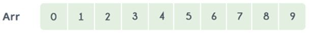
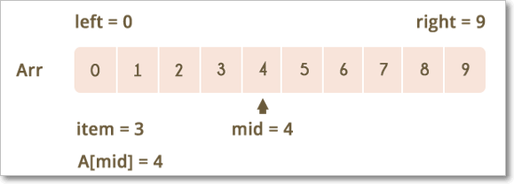

Searching Algorithms
=======================

Well, to search an element in a given array, there are two popular algorithms
available:

1.  Linear Search

2.  Binary Search

<br>

### 1.Linear Search

Linear search is a very basic and simple search algorithm. In Linear search, we
search an element or value in a given array by traversing the array from the
starting, till the desired element or value is found.

For example, consider the following image:


If you want to determine the positions of the **occurrence of the number 7** in
this array. To determine the positions, every element in the array from start to
end, i.e., from index 1 to index 10 will be compared with number 7, to check
which element matches the number 7.

<u>Linear Search Algorithim( Array A, Value x)</u>

Step 1: Set i to 1

Step 2: if i > n then go to step 7

Step 3: if A[i] = x then go to step 6

Step 4: Set i to i + 1

Step 5: Go to Step 2

Step 6: Print Element x Found at index i and go to step 8

Step 7: Print element not found

Step 8: Exit

### 2.Binary Search Algorithm

Binary Search is applied on the sorted array or list of large size. It's time
complexity of **O(log n)** makes it very fast as compared to other sorting
algorithms. The only limitation is that the array or list of elements must be
sorted for the binary search algorithm to work on it.

Binary search works only on a sorted set of elements. To use binary search on a
collection, the collection must first be sorted.

When binary search is used to perform operations on a sorted set, the number of
iterations can always be reduced on the basis of the value that is being
searched.

Let us consider the following array:



By using linear search, the position of element 8 will be determined in
the 9th iteration.

In BSA, Before we start the search, we need to know the start and end of the
range. Let’s call them **Low and High**.
```dos
Low = 0
High = n-1
median = (Low+High)/2;
```

<br>

**We need to search for value 3**



Referring to the image above, the lower bound is 0 and the upper bound is 9. The
median of the lower and upper bounds is (lower_bound + upper_bound) / 2 = 4.
Here a[4] = 4.

The value 4>2, which is not the value that you are searching for. Therefore, we
do not need to conduct a search on any element beyond 4 as the elements beyond
it will obviously be greater than 2.

Therefore, we can always drop the upper bound of the array to the position of
element 4. Now, we follow the same procedure on the same array with the
following values:
```dos
Low: 0
High: 3
```


Repeat this procedure recursively until Low > High. If at any iteration, we
get a[mid]=key, we return value of mid. This is the position of key in the
array. If key is not present in the array, we return −1.
