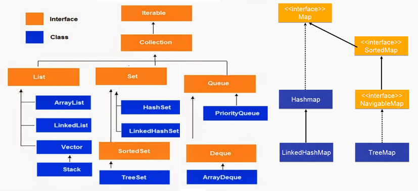
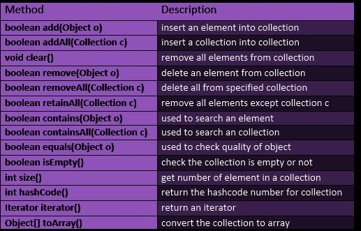

Java Collections Framework 
==============================

 

**Iterator interface:** provides the facility of iterating the elements in
forward direction only.

| 1 | **public boolean hasNext()** | It returns true if iterator has more elements.                            |
|---|------------------------------|---------------------------------------------------------------------------|
| 2 | **public Object next()**     | It returns the element and moves the cursor pointer to the next element.  |
| 3 | **public void remove()**     | It removes the last elements returned by the iterator. It is rarely used. |

 

**Collection Interface**:  Root interface with basic methods like `add(), remove(), contains(), isEmpty()`,etc

-   If you see above **only add, remove methods are there. get() is not there**.

-   **get()** methods are implemented based on underlying data Structure .

-   And **add(Object) method is Object based, not index**. Because these are
    generalized methods which will apply for all collection classes
