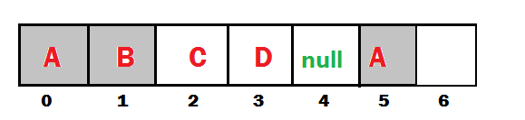

List
=======

1.  List is child interface of collection

2.  If we want to represent group of individual objects as a single entity
    where **duplicates are allowed & insertion order must be preserved,** then
    we should go for List

3.  We can **preserve insertion order via** **index & differentiate duplicate
    objects using** **index**

4.  **Index** will play very important role in List

| **Add / Remove**                                                                                       | **Find**                                                                                             | **Special**                     |
|--------------------------------------------------------------------------------------------------------|------------------------------------------------------------------------------------------------------|---------------------------------|
| **Boolean add(int index, Object o)   Boolean addAll(int index,Collection c)    Boolean remove(int index)**  | **Object get(int index)    Object set(int Object new)    int indexOf(Object c) int lastIndexOf(Object c)** | **ListIterator listIterator()** |
