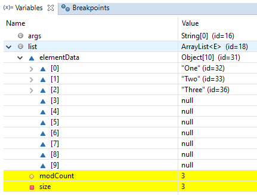

ArrayList – Internal implementation 
=========================================

-   The underlying data structure is **ResizableArray** or **Growable** Array

-   **Duplicates** are **allowed**

-   **Insertion order** is preserved

-   **Heterogeneous** (different datatypes) Objects are allowed

-   **Null** is insertion is allowed

-   ArrayList implements **Serializable, Clonable & RandomAccess**

-   **Except TreeSet & TreeMap Everywhere Heterogeneous Objects are allowed**

```java
public class ArrayListDemo {
    public static void main(String[] args) {
        ArrayList l = new ArrayList<>();
        l.add("A");
        l.add(10);
        l.add("A");
        l.add(null);
        System.out.println(l); // [A, 10, A, null]
        l.remove(2);
        System.out.println(l); // [A, 10, null]
        l.add(2, "M");
        System.out.println(l); // [A, 10, M, null]

        l.add("N");
        System.out.println(l); // [A, 10, M, null, N]
    }
}
```


### Internal implementation
 1.ArrayList grows dynamically as the elements are added to it. Internally an ArrayList uses an Object[] Array.
```java
private transient Object[] elementData;
```


2.When an object of ArrayList is created without initial capacity, the default
constructor of the ArrayList class is invoked. default capacity of 10 is
assigned at a time of empty initialization of ArrayList.
```java
public ArrayList() {
	this(10);
}
```


3.In the **add(Object),** the capacity of the ArrayList will be checked before adding a new element
```java
public boolean add(E e) {
    ensureCapacity(size + 1);  // Increments modCount!!
    elementData[size++] = e;
    return true;
}
public void ensureCapacity(int minCapacity) {
		 
		if (minCapacity > oldCapacity) {			 
			int newCapacity = (oldCapacity * 3) / 2 + 1;			
			elementData = Arrays.copyOf(elementData, newCapacity);
		}
}
```


4.If size of the  filled elements is greater than the  maximum size of the
array then increase the size of array by using below formulae, Then elements
will copy to old Array to New Array
```java
Till Java 6	:  int newCapacity = (oldCapacity * 3)/2 + 1;
From Java 7	:  int newCapacity = oldCapacity + (oldCapacity >> 1);  (50% of old)
```


5.If elements are adding in the middle index, **Array Elements will shifted to
Right**

-   **Adding NOT good `o(n)`**

-   **Get(by index) Good `o(1)`**

<br>

**Interviewer : What is the runtime performance of the get() method in ArrayList
, where n represents the number of elements ?**  
get() ,set() , size() operations run in constant time i.e O(1)  
add()  operation runs in amortized constant time , i.e adding n elements require
O(n) time. 
```java
public class ArrayListDemo {
public static void main(String[] args) {
	/*1.ArrayList With Defalut Capacity 10 is created 
	 * & assiged values as null
	 * elemetntdata = [null, null, null,....10 Objects]
	 * modcount = 0, no modifications performed
	 * size=0
	 * 	 */	
	ArrayList<String> list = new ArrayList<>();
	
	/*adding first element, add("one");
	 * elementdata=["one,null, null, null ....."]
	 * modcount = 1
	 * Size = 1	 * 
	 * */
	list.add("One");
	list.add("Two");
	list.add("Three");
	System.out.println(list);
}
}
```



-   Usually we use collections to **hold & transfer objects from one location to
    another location**. To provide support for this requirement every collection
    class implements **Serializable & Clonable interfaces**

-   **ArrayList and Vector classes** implements RandomAccess interface, so that
    any random element we can access with same speed. **RandomAccess is a marker
    interface** & doesn’t have any methods

-   **Insertion/Deletion** is middle ArrayList is the **Worst choice**.
    For **retrieval** **Best Choice**

-   In every collection class **toString() is overridden** to print data
    readable format **[ob1, ob2, ob3]**
