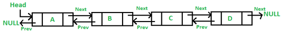
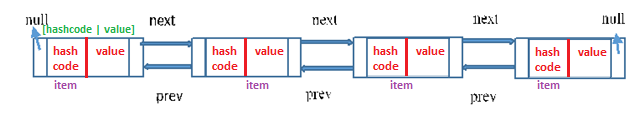
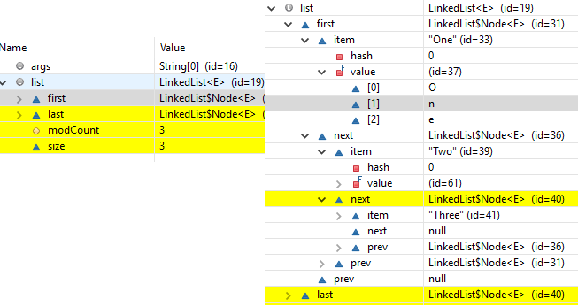

LinkedList– Internal implementation
========================================

-   Underlying data structure is **DoubleLinkedList**

-   **Insertion** order is preserved

-   **Duplicates** are **allowed**

-   **Heterogeneous** objects are **allowed**

-   **Null** insertion is **allowed**

-   LinkedList **implements Serializable & Clonable interfaces but
    not** **RandomAccess**

-   **Best Choice for Insertion/Deletion, Worst for Retrieval operation**

| **void addFirst(Object o)** <br> **void addLast(Object o)**| **Object getFirst()** <br> **Object getLast()**| **Object removeFirst()**<br>**Object removeLast()** |
|-----------------------------|-----------------------|--------------------------|



```java
public class LinkedListDemo {
    public static void main(String[] args) {
        LinkedList l = new LinkedList<>();
        l.add("A");
        l.add(10);
        l.add("A");
        l.add(null);
        System.out.println(l); // [A, 10, A, null]
        l.set(0, "Satya"); // replaces
        System.out.println(l); // [Satya, 10, A, null]
        l.add(0, "Johnny"); // just add
        System.out.println(l); // [Johnny, Satya, 10, A, null]
        l.removeFirst();
        System.out.println(l); // [Satya, 10, A, null]
        System.out.println(l.getFirst());// Satya
    }
}
```

<br>


## Implementation

1.LinkedList class in Java implements **List and Deque interfaces** and
LinkedList implements it using **Doubly LinkedList**

2.In the implementation of the LinkedList class in Java there is a **private
class Node** which provides the structure for a node in a doubly linked list.

-   It has “**item"** variable for holding the value

-   and **two reference** to Node class itself for connecting to **next** and
    **previous** nodes.

```java
private static class Node<E> {
    E item;
    Node<E> next;
    Node<E> prev;
    Node(Node<E> prev, E element, Node<E> next) {
        this.item = element;
        this.next = next;
        this.prev = prev;
    }
}
```




3.Reference to Previous Element of first node and Reference To Next Element of
last node are **null** as there will be no elements before the first node and
after the last node

4.**You can insert the elements at both the ends and also in the middle of the
LinkedList**. Below is the list of methods for insertion operations.

5.If you call the regular add() method or addLast() method internally
**linkLast()** method is called
```java
/** * Links e as last element.     */
    void linkLast(E e) {
        final Node<E> l = last;
        final Node<E> newNode = new Node<>(l, e, null);
        last = newNode;
        if (l == null)
            first = newNode;
        else
            l.next = newNode;
        size++;
        modCount++;
    }
```

6.If you call addFirst() method internally linkFirst() method is called. 
```java
private void linkFirst(E e) {
	        final Node<E> f = first;
	        final Node<E> newNode = new Node<>(null, e, f);
	        first = newNode;
	        if (f == null)
	            last = newNode;
	        else
	            f.prev = newNode;
	        size++;
```


7.**Insertion and removal operations in LinkedList are faster than** the
ArrayList. Because in LinkedList, there is no need to shift the elements after
each insertion and removal, because we only add elements at First or Last no
in-between. only references of next and previous elements need to be changed.

8.**Retrieval of the elements is very slow in** LinkedList as compared to
ArrayList. Because in LinkedList, **you should traverse from beginning or end**
(whichever is closer to the element) to reach the element.
```java
public class LinkedListDemo {
	public static void main(String[] args) {

 LinkedList<String> list = new LinkedList<>();
 list.add("One");
 list.add("Two");
 list.add("Three");
 System.out.println(list);
	}
}
```

