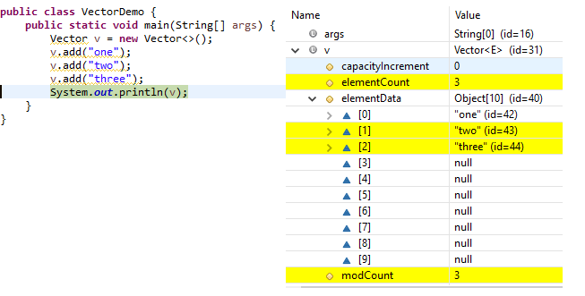

Vector– Internal implementation
=======================================================

-   The underlying data structure is **ResizableArray** or **Growable** Array

-   Duplicates are allowed

-   Insertion order is preserved

-   Heterogeneous (different datatypes) Objects are allowed

-   Null is insertion is allowed

-   Vector implements Serializable, Clonable & RandomAccess

-   **Vector is Synchronized**

| **Add / Remove**                                                                                | **Find**                                                                   | **Special**                                                                                    |
|-------------------------------------------------------------------------------------------------|----------------------------------------------------------------------------|------------------------------------------------------------------------------------------------|
| **addElement(Obejct o) <br> removeElement(Object o) <br>  removeElementAt(int index) <br>  removeAllElements()** | **Object elementAt(int index)  <br> Object firstElement() <br>  Object lastElemet()**  | **Int size()  <br> Int capacity()**//to know default/incremental capacity **Enumeration elements()** |



```java
public class VectorDemo {
public static void main(String[] args) {
    Vector v = new Vector();
    for (int i = 1; i <=10; i++) {
        v.addElement(i);
    }   
System.out.println("Before adding 11th element -Capacity:"+v.capacity()); //
    v.addElement("Satya");
    System.out.println(v);
System.out.println("After adding 11th element -Capacity:"+v.capacity());
    System.out.println("size : "+v.size());
}
}
Before adding 11th element -Capacity:10
[1, 2, 3, 4, 5, 6, 7, 8, 9, 10, Satya]
After adding 11th element -Capacity:20
size : 11
```
