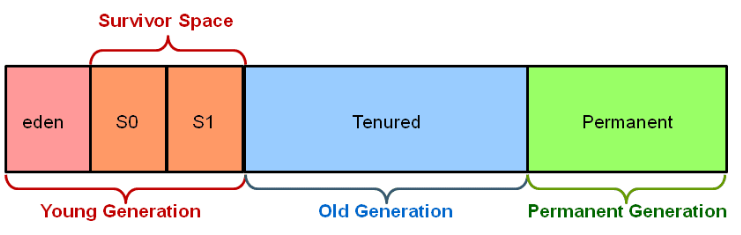

Fundamentals – Interview Questions
====================================

###### Difference between interpreter and JIT compiler?

The interpreter interprets the bytecode line by line and executes it
sequentially. It results in poor performance. JIT compiler add optimization to
this process by analyzing the code in blocks and then prepare more optimized
machine code.

###### Difference between JRE and JVM?

JVM is the specification for runtime environment which executes the Java
applications. Hotspot JVM is such one implementation of the specification. It
loads the class files and uses interpreter and JIT compiler to convert bytecode
into machine code and execute it.

###### Difference Between JVM & HotSpot VM

**JVM:** is a Specification, **HotSpot** : is a implementation of JVM.

[HotSpot](http://en.wikipedia.org/wiki/HotSpot)** **is an implementation of the
JVM concept, originally developed by Sun and now owned by Oracle.

There are other implementations of the JVM specification, like 

-   **Open JDK**

-   **IBM JVM**

-   **SUN JVM**

-   **JRockit**

-   **Blackdown**

-   **Kaffe**

JVM implementations can differ in the **way they implement JIT compiling,
optimizations, garbage collection, platforms supported, version of Java
supported**, etc

###### How does WeakHashMap work?

WeakHashMap operates like a normal HashMap but uses WeakReference for keys.
Meaning if the key object does not hold any reference then both key/value
mapping will become appropriate for garbage collection.

###### How do you locate memory usage from a Java program? 

You can use memory related methods from **java.lang.Runtime** class to get the
free memory, total memory and maximum heap memory in Java.

| **public static Runtime getRuntime()**       | returns the instance of Runtime class.        |
|----------------------------------------------|-----------------------------------------------|
| **public void exit(int status)**             | terminates the current virtual machine.       |
| **public void addShutdownHook(Thread hook)** | registers new hook thread.                    |
| **public Process exec(String command)**      | executes given command in a separate process. |
| **public int availableProcessors()**         | returns no. of available processors.          |
| **public long freeMemory()**                 | returns amount of free memory in JVM.         |
| **public long totalMemory()**                | returns amount of total memory in JVM.        |


```java
public class TestApp {
public static void main(String[] args) {

    Runtime r = Runtime.getRuntime();
    
    System.out.println(r.totalMemory()); //16252928
    System.out.println(r.freeMemory()); //15709576
    System.out.println(r.availableProcessors());//24
    
    r.gc();
 }
}
```


###### What is ClassLoader in Java?

When a Java program is converted into **.class** file by Java compiler which is
collection of byte code. **ClassLoader** is responsible to load that class file
from file system, network or any other location

-   Bootstrap ClassLoader - **JRE/lib/rt.jar**

-   Extension ClassLoader - **JRE/lib/ext** or any directory denoted
    by java.ext.dirs

-   Application ClassLoader - **CLASSPATH environment
    variable, -classpath or -cp option, Class-Path attribute of Manifest
    inside **[JAR
    file](http://javarevisited.blogspot.sg/2012/03/how-to-create-and-execute-jar-file-in.html)**.**

###### <br>Java heap memory

When a Java program started Java Virtual Machine gets some memory from Operating
System.

whenever we create an object using new operator or by any another means the
object is allocated memory from Heap and When object dies or garbage collected,
memory goes back to Heap space.

**How to increase heap size in Java**

Default size of Heap space in Java is 128MB on most of 32 bit
Sun's [JVM](http://javarevisited.blogspot.sg/2011/12/jre-jvm-jdk-jit-in-java-programming.html) but
its highly varies from JVM to JVM. change size of heap space by using JVM
**options -Xms and -Xmx**. Xms denotes starting size of Heap while -Xmx denotes
maximum size of Heap in Java.

**Java Heap and Garbage Collection**

As we know objects are created inside heap memory and Garbage Collection is a
process which removes dead objects from Java Heap space and returns memory back
to Heap in Java.

For the sake of Garbage collection Heap is divided into three main regions named
as **New Generation, Old Generation, and Perm space**



-   **New Generation** of Java Heap is part of Java Heap memory where a newly
    created object is stored,

-   **Old Generation** During the course of application many objects created and
    died but those remain live they got moved to Old Generation by Java Garbage
    collector thread

-   **Perm space** of Java Heap is where JVM stores Metadata about classes and
    methods, String pool and Class level details.

-   Perm Gen stands for permanent generation which holds the meta-data
    information about the classes.

-   Suppose if you create a class name A, it's instance variable will be stored
    in heap memory and class A along with static classloaders will be stored in
    permanent generation.

-   Garbage collectors will find it difficult to clear or free the memory space
    stored in permanent generation memory. Hence it is always recommended to
    keep the permgen memory settings to the advisable limit.

-   JAVA8 has introduced the concept called meta-space generation, hence permgen
    is no longer needed when you use jdk 1.8 versions.

**Garbage collection is performed by a daemon thread called Garbage
Collector(GC). This thread calls the finalize() method before object is garbage
collected.**

**The Garbage collector of JVM collects only those objects that are created by
new keyword. So if you have created any object without new, you can use finalize
method to perform cleanup processing (destroying remaining objects).**

**Neither finalization nor garbage collection is guaranteed.**

Data Types
----------

###### How do you convert bytes to String?

you can convert bytes to the string using string constructor which
accepts byte[], just make sure that right character encoding otherwise
platform's default character encoding will be used which may or may not be same.

String str = new String(bytes, "UTF-8");

**How do you convert bytes to long in Java**  
The byte takes 1 byte of memory and long takes 8 bytes of memory. Assignment 1
byte value to 8 bytes is done implicitly by the JVM.

**byte –> short –> int –> long –> float –> double**

The left-side value can be assigned to any right-side value and is done
implicitly. The reverse requires explicit casting.

 byte b1 = 10;                 // 1 byte  

 long l1 = b1;                 //  one byte to 8 bytes, assigned implicitly

###### Is ++ operator is thread-safe in Java?

No it's not a thread safe operator because its involve multiple instructions
like reading a value, incriminating it and storing it back into memory which can
be overlapped between multiple threads.

###### What will this return 3\*0.1 == 0.3? true or false?

Both are not equal, because floating point arithmetic has a certain precision.
Check the difference (a-b) it should be really small.

 In computer memory, floats and doubles are stored using [IEEE
754](https://en.wikipedia.org/wiki/IEEE_754) standard format. 

-   f1 = (0.1+0.1+0.1….11 times) = 1.0999999999999999

-   f2 = 0.1\*11 = 1.1

In [BigDecimal](https://docs.oracle.com/javase/7/docs/api/java/math/BigDecimal.html) class,
you can specify the rounding mode and exact precision which you want to use.
Using the exact precision limit, rounding errors are mostly solved. Best part is
that BigDecimal numbers are immutable i.e. if you create a BigDecimal BD with
value -1.23", that object will remain -1.23" and can never be changed. You can
use it’s .compareTo() method to compare to BigDecimal numbers

private static void testBdEquality()

{

     BigDecimal a = new BigDecimal("2.00");

     BigDecimal b = new BigDecimal("2.0");

 

     System.out.println(a.equals(b));           // false

 

     System.out.println(a.compareTo(b) == 0);   // true

}

**Which one will take more memory, an int or Integer? (answer)**  
An Integer object will take more memory an Integer is the an object and it
 store meta data overhead about the object and int is primitive type so its
takes less space.

###### How to convert Primitives to Wrapper & Wrapper to Primitive ??

// 1. using constructor

Integer i = new Integer(10);

 

// 2. using static factory method

Integer i = Integer.valueOf(10);

//3.wrapper to primitive

int val = i.intValue();    

###### Autoboxing and Unboxing?

If a **method(remember only method – not direct)** requires Integer Object
value, we can directly pass primitive value without issue. Autoboxing will take
care about these.

We can also do direct initializations (1.8 V)

Integer i = *10*;// it will create Integer value of 10 using Autoboxing

int j = *i*;// ;// it will convert Integer to int using Autoboxing

Previously it shows

Integer i = *10*;// it will create Integer value of 10 using Autoboxing

int j = *i*;//But we cant assign int to Integer Type mismatch: cannot convert
from Integer to int

###### what if I make main() private/protected ?

 if you do not make main() method public, there is no compilation error. You
will **runtime error** because matching main() method is not present. Remember
that whole syntax should match to execute main() method.

Error: Main method not found in class Main, please define the main method as:

   public static void main(String[] args)
