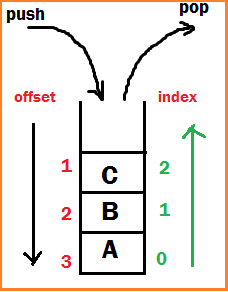
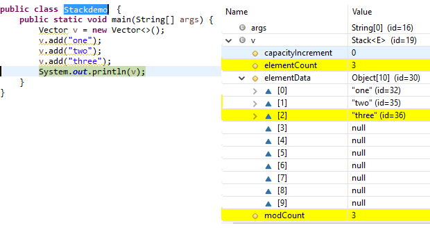
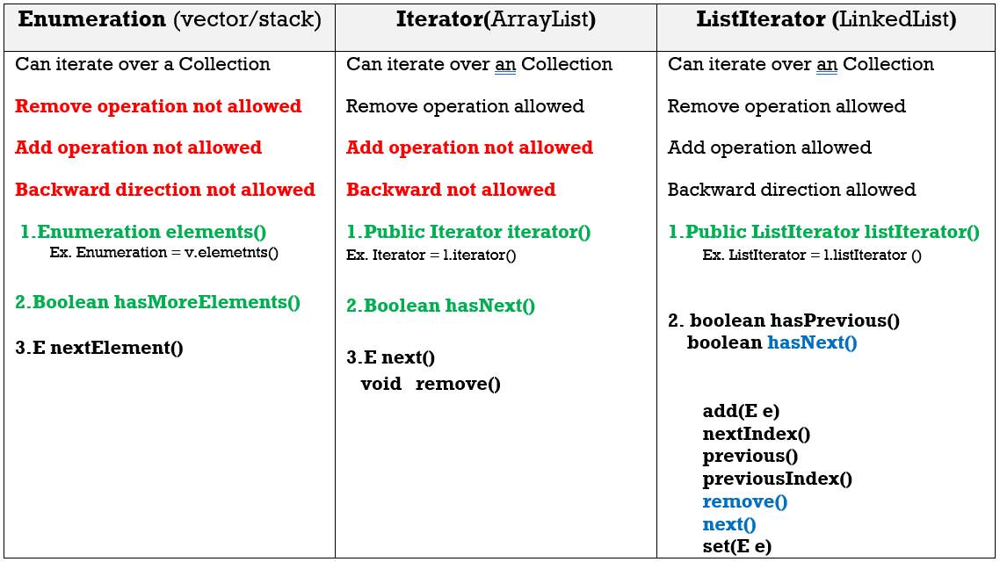

Stack– Internal implementation
==================================

The Stack class represents a **last-in-first-out (LIFO)** stack of objects. It
extends class Vector with **five operations**(below 5 methods) that allow a
vector to be treated as a stack




**Object push(Object o**) -Insert an object into top of the stack

**Object pop()** -Removes & returns from top of the stack

**Object peak()** -Just returns Object from top of the stack

**boolean empty()** -returns TRUE if stack is empty

**int search(Object o)** – returns offset if available otherwise -1

-   **Adding item** in Stack is called **PUSH.**

-   **Removing item** from stack is called **POP.**

-   **Push and pop** operations happen at **Top** of stack.

-   Stack follows **LIFO** (Last in first out) - means last added element is
    removed first from stack

-   Push - O(1) [as we push element at Top of Stack in java]

-   Pop - O(1) [as popping is also done at Top of Stack in java]

Uses Growable array, initial capacity as 10, same as ArrayList



```java
public class StackDemo {
    public static void main(String[] args) {
        Stack s = new Stack();
        s.push("A");
        s.push("B");
        s.push("C");
        System.out.println(s);// [A, B, C]

        System.out.println(s.search("A"));// 3
        System.out.println(s.search("X"));// -1
        
        s.pop();
        System.out.println(s);//[A, B]
    }
}
[A, B, C]
3
-1
```

<br>

### Cursors - Enumeration VS Iterator VS ListIterator
<hr>
ListIterator is subclass of List.so all the methods are available in
ListIterator.

**We have to follow 3 steps to use Cursors in our application**

1.  Get the all elements in a collection in Cursor Object

2.  Check is next/previous element is exist or not

3.  Get the element

