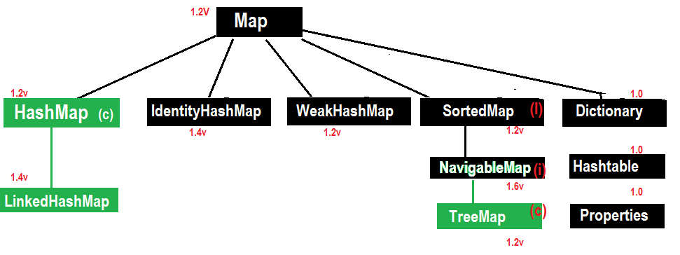
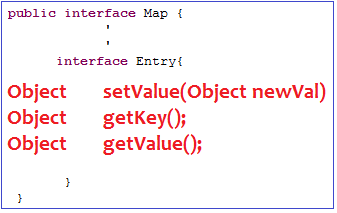
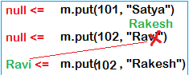

Map
======

-   **Entry Interface:** One Row (pair of <K,V>) treated as an Entry

    

-   **Object put(Object Key, Object value)  – To add one <key, value> pair to
    the Map.**

      
if the <key> is already present then oldvalue will be replaced with new
Value & returns old value.

-   **Object putAll(Map m)**

-   **Void putAll(Map m)**

-   **Object get(Object key)**

-   **Object remove(Obejct key)**

-   **boolean containsKey(Object Key)**

-   **boolean containsValue(Object value)**

-   **boolean isEmpty()**

-   **int size()**

-   **void clear**
