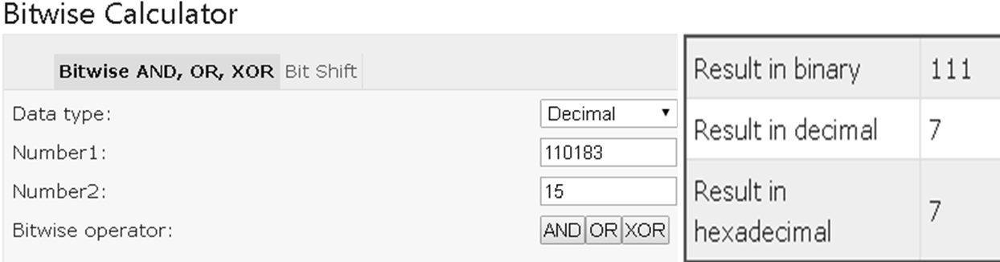

HashMap – Internal implementation (HashTable)
=================================================

-   The underlying datastructure is **Hashtable+LinkedList**

-   Insertion order is not preserved & it is based on **Hashcode of <Keys>**

-   Duplicate keys are NOT allowed, but values can be duplicated.

-   Heterogeneous objects are allowed for both Key & Value

-   **null is allowed for key (only once)**

-   **null is allowed for Values (any no. of times)**

-   HashMap implements **Serializable & Clonable interfaces** but **not
    RandomAccess**

-   HashMap is the best choice for **Searching** operations

<br>

**Constructors**

-   **HashMap h = new HashMap () //16 capacity, Def. fill ratio = 0.75**  
  Creates an empty Object with def. initial capacity 16 & def. fill ratio 0.75

-   **HashMap h = new HashMap (int intialcapacity) // Def. fill ratio = 0.75**

-   **HashMap h = new HashMap (int intialcapacity, float fillRatio)**

-   **HashMap h = new HashMap (Map m)**

```java
public class HashMapDemo {
    public static void main(String[] args) {
        HashMap h = new HashMap();
        h.put("one", "Satya");
        h.put("two", "Ravi");
        h.put("three", "Rakesh");
        h.put("four", "Surya");
        System.out.println(h);// No Insertion Order

    System.out.println("adding exsting key:" + h.put("two", "Madhu"));
        System.out.println("All keys : " + h.keySet());
        System.out.println("All Values : " + h.values());
        System.out.println("Both Key-Values\n---------");

        Set s = h.entrySet();
        Iterator it = s.iterator();
        while (it.hasNext()) {
            Map.Entry m = (Map.Entry) it.next();
            System.out.println(m.getKey() + "\t : " + m.getValue());
        }
    }
}
{four=Surya, one=Satya, two=Ravi, three=Rakesh}
adding exsting key:Ravi
All keys : [four, one, two, three]
All Values : [Surya, Satya, Madhu, Rakesh]
Both Key-Values
---------
four     : Surya
one  : Satya
two  : Madhu
three    : Rakesh
```


# HashMap Internal implementation

-   **Initial Capacity(16)**:  This is the capacity of HashMap to store number
    of key value pairs

-   **Load Factor/Fill ratio (0.75):** is a parameter responsible to determine
    when to increase size of HashMap

-   **Threshold value**(**cap\*0.75=12**): When number of key value pairs is
    more than threshold value, then HashMap is resized.

```java
public class HashMapDemo {
	public static void main(String[] args) {
 HashMap<String, String> map = new HashMap<>(); 

 map.put("one", "AAA");
 map.put("two", "BBB");
 map.put("three", "CCC");
 map.put("four", "DDD");
 System.out.println(map);
	}
}
```

**1.On this code it will creates the HashMap object with,**
```java
HashMap<String, String> map = new HashMap<>();
```


-   Default **Bucket size is 16, with Entry table[] of 16 buckets**

-   loadfactor as **0.75**

-   initializes with **null** values


2.Each entry into HashMap is an **Entry Object**, which contains **[hashcode,
key, value, next]** data fields.


```java
static class Entry<K,V> implements Map.Entry<K,V> {
        final int hash;
        final K key;
        V value;
        Entry<K,V> next;
        }
```
<br>

<u>put() method</u>

Now we are ready, by adding **map.put("one", "AAA");** following actions will be
performed
```java
public V put(K key, V value) 
{
    if (key == null)
       return putForNullKey(value);	 hascode =0, bucketlocation =0
    int hash = hash(key.hashCode());	 Gets hashcode
    int i = indexFor(hash, table.length);  Gets Bucket location
    for (Entry<K,V> e = table[i]; e != null; e = e.next) 
    {
        Object k;
        if (e.hash == hash && ((k = e.key) == key || key.equals(k))) 
         {
             V oldValue = e.value;
             e.value = value;
             e.recordAccess(this);
             return oldValue;
          }
     }
     modCount++;
     addEntry(hash, key, value, i);
     return null;
 }
```

<br>

**1.Using hashcode() method**

-   First, it checks for the if **the key given is null or not,** if the given
    **key is null** it will be stored in the **‘0’th position** as the hashcode
    of null will be 0**(hashcode=0), & if not null gets the hashcode of the
    Key**
    ```java
    static final int hash(Object key) {
            int h;
            return (key == null) ? 0 : (h = key.hashCode()) ^ (h >>> 16);
        }
    ```


-   Now *indexFor(hash, table.length)* function is called to calculate exact
    index(Bucket) position for storing the Entry object. It is a BitWise
    **&(and**) Operation , like **Bucket = (hashcode) & (tablecapacity), for the
    above code bkt = 110183 &15 = 7(7th bucket)**

-    Basically following operation is performed to calculate index.
    ```java
    index = hashCode(key) & (table.lenght)
    ```
    


**2.Using equals () method**

-   Now it compares the current key value with existed key values by
    **newkey.equals(oldkey) method,** if found it just updates the value & if
    not found it will create the new node by **addEntry(hash, key, value,
    i);**and add it to the calculated Bucket location(7)

<br>

<u>Get() method</u>

we already know how Entry objects are stored in a bucket and what happens in the
case of Hash Collision it is easy to understand what happens when key object is
passed in the **get()** method of the HashMap to retrieve a value.

Using the key (passed in the get() method) again hash value will be calculated
to determine the bucket where that Entry object is stored, in case there are
more than one Entry object with in the same bucket (stored as a
linked-list) **equals()** method will be used to find out the correct key. As
soon as the matching key is found get() method will return the value object
stored in the Entry object

```java
public V get(Object key) 
{
    if (key == null)
       return getForNullKey();
     int hash = hash(key.hashCode());
     for (Entry<K,V> e = table[indexFor(hash, table.length)];e != null;e = e.next) 
     {
         Object k;
         if (e.hash == hash && ((k = e.key) == key || key.equals(k)))
             return e.value;
     }
         return null;
 }
```


<br>

### Collision
<hr>

If two key objects are returns same hashcode, then which object should insert at
a given Bucket is known as -Collision". So, in case of collision, Entry objects
are stored in LinkedList form. The address of the next element will be stored in
previous element.

<u>Rehashing</u>

-   When the number of items in map, crosses the Load factor limit(**12** if
    size=16) at that time **hashmap doubles its capacity** and hashcode is
    re-calculated of already stored elements for even distribution of key-value
    pairs across new buckets.

-   So for each **existing key-value pairs, hashcode is calculated again with
    increased hashmap capacity** as a parameter, which results in either placing
    the item in same bucket or in different bucket.

-   Rehashing is done to distribute items across the new length hashmap, so that
    get and put operation time complexity remains **O(1).**

-   Hashmap maintain complexity of O(1) while inserting data in and getting data
    from hashmap,* *but for 13th key-value pair, put request will no longer be
    O(1), because as soon as map will realize that 13th element came in, that is
    75% of map is filled.


<u>Points to note -</u>

-   HashMap works on the principal of hashing.

-   HashMap uses the **hashCode()** method to calculate a hash value. Hash value
    is calculated using the key object. This hash value is used to find the
    correct bucket where Entry object will be stored.

-   HashMap uses the **equals()** method to find the correct key whose value is
    to be retrieved in case of get() and to find if that key already exists or
    not in case of put().

-   Hashing collision means more than one key having the same hash value, in
    that case Entry objects are stored as a linked-list with in a same bucket.

-   Within a bucket values are stored as Entry objects which contain both key
    and value.

-   On High hash Collisions, java people observed that LinkedList is very slow.

-   **In Java 8 hash collision uses BalancedTree instead of LinkedLists** after
    a certain threshold is reached while storing values. This improves the worst
    case performance from O(n) to O(log n).

<u>Improvements in Java 8</u>

-   There is a performance improvement for HashMap objects where there are lots
    of collisions in the keys by using balanced trees rather than linked lists
    to store map entries

-   The principal idea is that **once the number of items in a hash bucket grows
    beyond a certain threshold, that bucket will switch from using a linked list
    of entries to a balanced tree. In the case of high hash collisions, this
    will improve worst-case performance from O(n) to O(log n)**.
