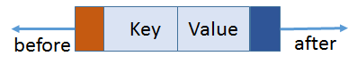
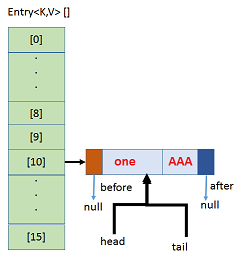
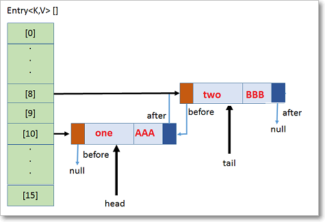
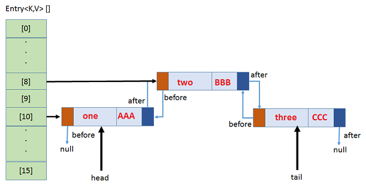

LinkedHashMap – Internal implementation
===========================================

-   [LinkedHashMap ](https://docs.oracle.com/javase/8/docs/api/java/util/LinkedHashMap.html)is
    just an extension
    of [HashMap](https://docs.oracle.com/javase/8/docs/api/java/util/HashMap.html) ,
    internally uses **HashTable+DoublyLinkedList**

-   It has two references **head** and **tail **which will keep track of the
    latest object inserted and the first object inserted

1.Each node in a LinkedHashMap needs to have information about previous node and
next node as the order in which they are accessed in important. The structure is
as follows.


```java
class Entry<K,V> extends HashMap.Node<K,V> {
        Entry<K,V> before, after;
        Entry(int hash, K key, V value, Node<K,V> next) {
            super(hash, key, value, next);
   }
```


2.After inserting map.put("one", "AAA");,Bucket with 16 capacity is created,
hashcode & index will be caluculated.Here **one** is
added, **head** and **tail** will refer to it.



3.On adding map.put("two", "BBB");, inserted in 8th bucket & it is next to
“one", so **head one, tail two**, **before** & **after** will linked, like this
all elements will be added & Insertion order will be marinated.



4.If any collision, new element will be added in same Bucket location with
LinkedList& points to next.



```java
public class HashMapDemo {

	public static void main(String[] args) {
		LinkedHashMap<String, String> map = new LinkedHashMap<>();
		map.put("one", "AAA"); //7 -> []
		map.put("two", "BBB"); // 
		map.put("two", "ZZZ");
		map.put("three", "CCC");
		map.put("four", "DDD");
		map.put(null, "XXX");	
		System.out.println(map);
	}
}
{one=AAA, two=ZZZ, three=CCC, four=DDD, null=XXX}
```

So here Insertion Order is preserved, elements the order they added, same order
they will store
```java
public class LinkedHashMapDemo {
    public static void main(String[] args) {
        LinkedHashMap h = new LinkedHashMap();
        h.put("one", "Satya");
        h.put("two", "Ravi");
        h.put("three", "Rakesh");
        h.put("four", "Surya");
        System.out.println(h);//  Insertion Order Preserved

    System.out.println("adding exsting key:" + h.put("two", "Madhu"));
        System.out.println("All keys : " + h.keySet());
        System.out.println("All Values : " + h.values());
        System.out.println("Both Key-Values\n---------");

        Set s = h.entrySet();
        Iterator it = s.iterator();
        while (it.hasNext()) {
            Map.Entry m = (Map.Entry) it.next();
            System.out.println(m.getKey() + "\t : " + m.getValue());
        }
    }
}
{one=Satya, two=Ravi, three=Rakesh, four=Surya}
adding exsting key:Ravi
All keys : [one, two, three, four]
All Values : [Satya, Madhu, Rakesh, Surya]
Both Key-Values
---------
one  : Satya
two  : Madhu
three    : Rakesh
```
