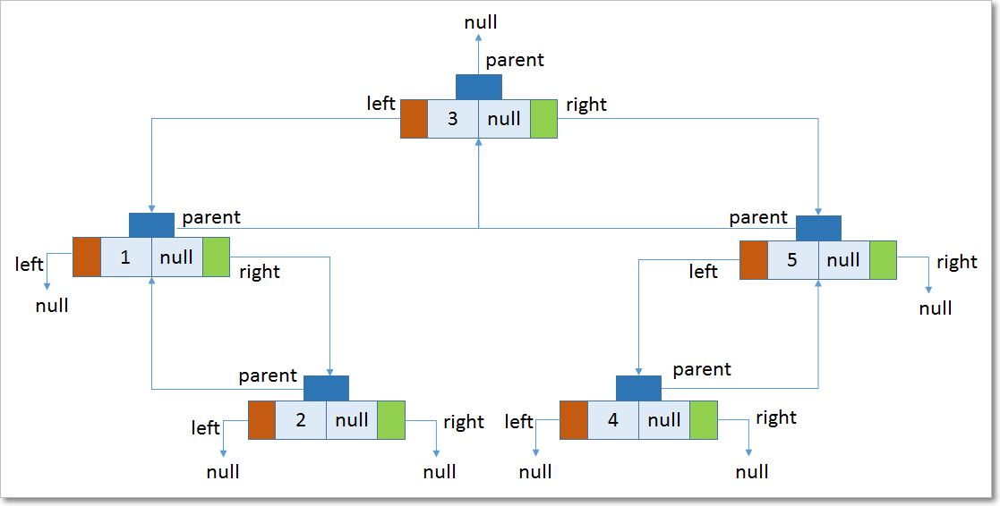

TreeMap – Internal implementation
=====================================

-   Underlying D.S is **RED-BLACK TREE**

-   **Insertion order is NOT preserved & it is based on some sorting order of
    KEYS**

-   **Duplicate** keys are **NOT allowed**, but **values** can be **duplicated**

-   If we are depending on default **Natural Sorting Order**, then **KEYS should
    be Homogeneous & Comparable** otherwise we will get Runtime exception
    saying **ClassCastException**

-   If we are defining our **Own Sorting Order by comparator**, then **KEYS
    should need not be Homogeneous & Comparable**. We can take Heterogeneous &
    non- comparable Objects also.


<br>

### Red-Black Tree

1.  Every node has a color either **red** or **black**.

2.  **Root** of tree is always **black**.

3.  No two adjacent red nodes (A red node cannot have a red parent or red
    child).

4.  Every path from **root to a NULL** node has same number of black nodes.


**Constructors**
- `TreeMap h = new TreeMap () //Default. Sorting Order`
Creates an Empty TreeMap Object, all elements inserted in Default Natural Sorting Order

- `TreeMap h = new TreeMap (Comparator c)` //Customized. Sorting Order
Creates an Empty TreeMap Object, all elements inserted in Customized Natural Sorting Order

- `TreeMap h = new TreeMap (Map c)`

- `TreeMap h = new TreeMap (SortedMap s)`


<br>

### TreeMap Implementation

1.TreeMap is based on tree data structure. Each node in tree will have three
references parent**(key,value)**, **right** and **left** element.


-   The **left** element will always be
    logically **less** than **parent** element.

-   The **right** element will always be logically greater than OR equal
    to **parent** element

    ```java
    static final class Entry<K,V> implements Map.Entry<K,V> {
         Entry<K,V> left;
         Entry<K,V> right;
         Entry<K,V> parent;
         K key;
         V value;         
         }
    ```

2.Comparison of Objects is done by natural order i.e. those object who
implement **Comparable(default)** interface and override **compareTo(Object
obj)** method. Based on the return value,

-   If **obj1.compareTo(obj2)** , if **obj<obj2** then returns negative number

-   If **obj1.compareTo(obj2),** if **obj>obj2** then returns positive number

-   If **obj1.compareTo(obj2)** , if **obj==obj2** then returns zero

3.When we use put(K,V) method it checks if root is pointing anywhere if no it
makes the instance of Entry<K,V> and point to root;

4.The constructor of Entry<K,V> takes key, value and parent. In this case
parent is null;

5.For the next time we enter using put(K,V) it first identifies the comparison
mechanism to use.

6.First it checks the Comparator class is present or not. This class is passed
when creating the instance of TreeMap. If not present it uses the Key's
Comparable implementation.

7.It then traverse through root and compares each node with the node entered and
depending upon the comparison places the node either left or right of the parent
node.

`**treeMap.put(1, "one"); //1**`  
there are no elements in it. So 1 is the first object being inserted as key.
This is treated as root node


`**treeMap.put(5, "five"); //2**`  
Now, **5** is logically greater than **1** and hence according to our rules,

-   **5** will be placed to the right of **1**.

-   **1** will be parent of **5.**


```java
treeMap.put(3, "three"); //3
treeMap.put(2, "two"); //4
treeMap.put(4, "four"); //5, after inserting all these final structure will be
```





