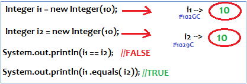

IdentityHashMap
===================

-   It is exactly same as HashMap (including methods&constructors) except
    following diffrences

-   In the case of Normal HashMap JVM will use **.equals()** method to identify
    Duplicate keys, which is ment for Content comparision

-   But, In the case of IdentityHashMap JVM will use **==** operator to identify
    Duplicate keys, which is ment **for reference comparision** or **address
    comparision**



> **==** is **for reference comparision** or **address comparision**
> 
> **.equals ()** is for **content comparision**

<u>HashMap Example</u>
```java
public class HashMapDemo {
 public static void main(String[] a) {
  HashMap m = new HashMap();
  m.put(new Integer(10), "Satya");
  m.put(new Integer(10), "Surya");
  System.out.println(m);
// {10=Surya}
}
}
---------------
{10=Surya}
```

<br>

<u>IdentityHashMap Example</u>

```java
public class IdentityHashMapDemo {
public static void main(String[] args) 
{
IdentityHashMap  m = new IdentityHashMap();
  m.put(new Integer(10), "Satya");
  m.put(new Integer(10), "Surya");
  System.out.println(m);
// {10=Satya, 10=Surya}
	}
}
-----------
{10=Satya, 10=Surya}
```


