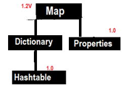
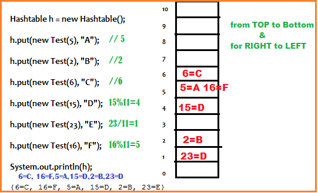
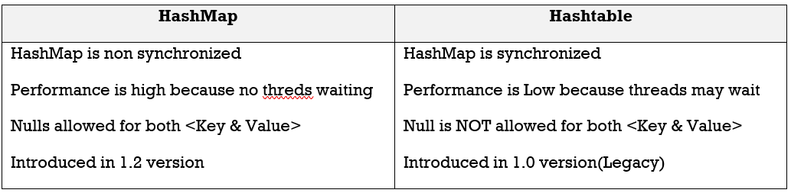

Legacy Classes on Map
========================



The **Dictionary** class is the abstract parent of any class, such as Hashtable,
which maps keys to values. Every key and every value is an object.

#### 1.Hashtable 

-   Underlying D.S Hashtable for is Hashtable

-   Insertion order is not preserved & it is based on Hashcode of keys

-   DUPLICATE keys are NOT allowed & Values can be duplicated

-   Hertogenious objects are allowed for both keys&values

-   Null is NOT allowed for both key& value.otherwise we will get
    NullPointerException at runtime

-   It implements Serializable, Clonable interfaces but not RandomAccess

-   All methods are Synchronized, so Hashtable is Thread-Safe

-   Hashtable is best choice for Search Operation

**1. Hashtable h = new Hashtable () //16 capacity, Def. fill ratio = 0.75**  
Creates an empty Object with def. initial capacity **11** & def. fill ratio 0.75

**2. Hashtable h = new Hashtable (int intialcapacity) // Def. fill ratio =
0.75**

**3. Hashtable h = new Hashtable (int intialcapacity, float fillRatio)**

**4. Hashtable h = new Hashtable (Map m)**

```java
class Test {
	int i;
	Test(int i) {
 this.i = i;
	}
	@Override
	public int hashCode() {
 return i;
	}
	@Override
	public String toString() {
 return i + "";
	}
}
public class HashtableDemo {
	public static void main(String[] args) {
 Hashtable h = new Hashtable();
 h.put(new Test(5), "A");
 h.put(new Test(2), "B");
 h.put(new Test(6), "C");
 h.put(new Test(15), "D");
 h.put(new Test(23), "E");
 h.put(new Test(16), "F");
 System.out.println(h);
	}
}
---------------------------
{6=C, 16=F, 5=A, 15=D, 2=B, 23=E}
```



By default HashMap is non-synchronized but we can get Sychronized version of
HashMap by usinh synchronizedMap () of collections class
```java
HashMap m = new HashMap()
Map m1 = Collections.synchronizedMap(m)
```

<br>

#### 2.Properties

In our if anything which changes frequently like Database names, username,
password etc we use properties file to store those & java programe used to read
properties file

**1. Properties p = new Properties ()**

KEY & Values must be String type

**Methods**

1.  **String getProperty(String name);**

2.  **String setProperty(String name, value);**

3.  **Enumaration propertyNames();**

4.  **void load(InputStream is)**  
    Load properties from properties file into java properties Object

5.  **void store(OutputStream is, String commet)**  
    Store java properties Object into properties file

```java
////abc.properties 
uname=satya  
port=8080
---------------------------------

public class PropertiesDemo {
public static void main(String[] args) throws  Exception {
	Properties p = new Properties();
	FileInputStream fis = new FileInputStream("abc.properties");
	p.load(fis);
	System.out.println(p);	
	System.out.println("Uname : "+p.getProperty("uname"));
	
	p.setProperty("port", "8080");
	FileOutputStream fos = new FileOutputStream("abc.properties");
	p.store(fos, "Port Number comment added");
}
}
-----------------------
#Port Number comment added //abc.properties After 
#Mon Sep 12 20:38:33 IST 2016
uname=satya
port=8080
pwd=smlcodes
```

```java
Multiple values in java.util.Properties
foo=1,2

String[] foos = properties.getProperty("foo").split(",");
```
