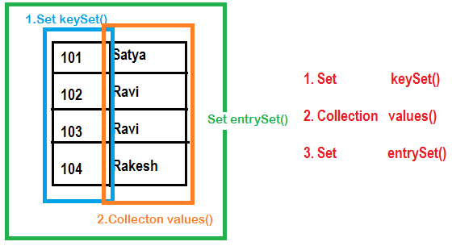

Set
======

-   Set is child interface of collection

-   If we want to represent group of individual objects as a single entity
    where **duplicates are Not allowed & insertion order Not be
    preserved,** then we should go for Set

-   Set **doesn’t have any new methods & we have to use collection interface
    methods only**.

-   In All **Hash related collections insertion** is based on **Hashcode**.so no
    insertion order preserved.

