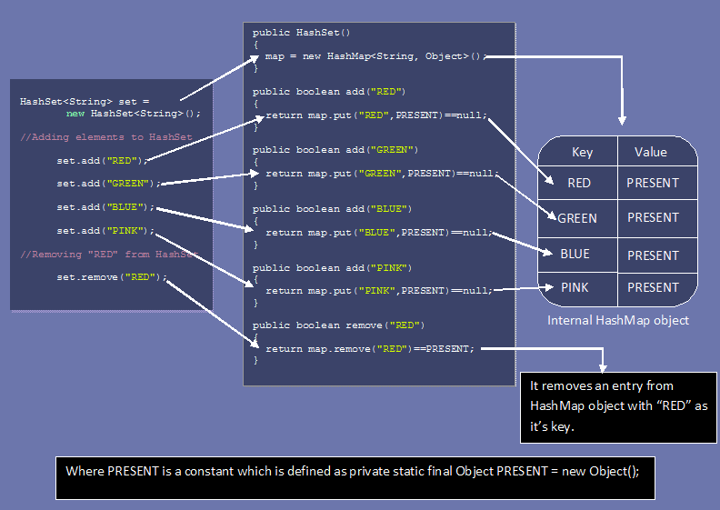

HashSet – Internal implementation
=====================================

-   The underlying data structure is **Hashtable, internally uses HashMap**

-   Duplicate Objects are Not Allowed

-   Insertion Order is Not preserved & it is based hash code of Objects

-   Null Insertion is possible (Only once), Heterogeneous Objects are allowed

-   Implements Serializable & Clonable but not RandomAccess Interface

-   HashSet is the Best Choice for Search Operation

-   **In HashSet Duplicates are not allowed. If we are trying to insert
    duplicates then it won’t get any Compile time or Runtime Error and add()
    method simply returns FALSE**

**Constructors**
- `HashSet h = new HashSet ()` //16 capacity, Def. fill ratio = 0.75
Creates an empty Object with def. initial capacity 16 & def. fill ratio 0.75

- `HashSet h = new HashSet (int intialcapacity)` // Def. fill ratio = 0.75

- `HashSet h = new HashSet (int intialcapacity, float fillRatio)`

- `HashSet h = new HashSet (Collection c)`

<br>


### Implementation
<hr>

**1.HashSet** uses HashMap internally to store it’s objects. Whenever you create
a HashSet object, one **HashMap** object associated with it is also created.
```csharp
public HashSet()
{
        map = new HashMap<>();          //Creating internally backing HashMap object
}  
public HashSet(int initialCapacity, float loadFactor)
{
        map = new HashMap<>(initialCapacity, loadFactor);  
}
```


2.The elements you add into HashSet are stored as **keys** of this HashMap
object. The value associated with those keys will be a **constant(PRESENT)**.

**Add Method**

-   **add()** method of HashSet class internally calls **put()** method of
    backing HashMap object by passing the element you have specified as a
    **key** and constant “**PRESENT**" as it’s value.
```java
private static final Object PRESENT = new Object();
public boolean add(E e)
{
return map.put(e, PRESENT)==null;
}
```


-   Here hash function is calculated using **value** we are trying to
    insert.that is why only unique values are stored in the HashSet.

-   When element is added to HashSet using add(E e) method internally HashSet
    calls put() method of the HashMap where the value passed in the add method
    becomes key in the put() method. A dummy value “PRESENT" is passed as value
    in the put() method.



```csharp
public class HashSetDemo {
public static void main(String[] args) {
    HashSet h = new HashSet();
    h.add("A");
    h.add("B");
    h.add("C");
    h.add(10);
    h.add(null);    
    System.out.println(h.add("A"));//False
    System.out.println(h);  
}
}
--------------------
false
[null, A, B, C, 10]
```
