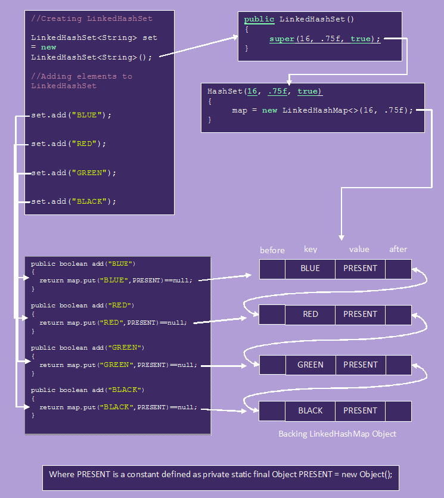

LinkedHashSet – Internal implementation
============================================

-   LinkedHashSet is an **extended version** of HashSet. HashSet doesn’t follow
    any order where as LinkedHashSet maintains **insertion order**

-   HashSet uses **HashMap object** internally to store its elements where as
    LinkedHashSet uses **LinkedHashMap object** internally to store and process
    it’s elements

-   LinkedHashSet, elements you insert are stored as **keys of
    LinkedHashMap** object. The values of these keys will be the same constant
    i.e -**PRESENT**-. 

-   The insertion order of elements into LinkedHashMap are maintained by adding
    two new fields to this class. They are **before** and **after**. These two
    fields hold the references to previous and next elements. These two fields
    make LinkedHashMap to function as a doubly linked list.

```csharp
public class HashSetDemo {
public static void main(String[] args) {
    LinkedHashSet h = new LinkedHashSet();
    h.add("A");
    h.add("B");
    h.add("C");
    h.add(10);
    h.add(null);    
    System.out.println(h.add("A"));
    System.out.println(h);  
}
}
-------------------------
false
[A, B, C, 10, null]
```





