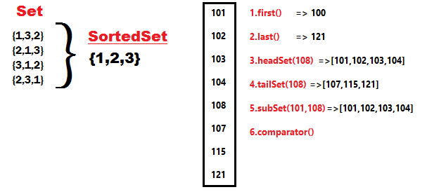

TreeSet – Internal implementation
=====================================

Set

\|

SortedSet

\|

TreeSet

#### java.util.SortedSet (Interface)

-   Is the child interface of Set

-   If we want to represent a group of individual objects according to some
    sorting order without duplicates then we should go for SortedSet

SortedSet Interface defines following 6 methods.



1.  **Object first( )**

2.  **Object last( )**

3.  **SortedSet headSet(Object obj)**

4.  **SortedSet tailSet(Object obj)**

5.  **SortedSet subSet(Object start, Object end)**

6.  **Comparator comparator()**  
    Used to get Default Natural sorting order
-   **Numbers** Ascending order [1, 2, 3, 4, 5….]
-   **Strings** Alphabetical Order [A, B, C, D, E…a,b,c,d …] (Unicode values)

<br>

### TreeSet Implementation

-   Underlying D.S is Red-Black Tree

-   Duplicate objects are Not Allowed

-   Insertion order Not Preserved but we can sort elements

-   Heterogeneous Objects are Not Allowed, if try it
    throws **ClassCastException** at Runtime

-   Null Insertion allowed (Only once)

-   TreeSet implements Serializable & Clonable but not RandomAccess

-   All objects are inserted based on some sorting order either default or
    customized sorting order

**Constructors**
- `TreeSet h = new TreeSet ()` //Default. SortingOrder
Creates an Empty TreeSet Object, all the elements inserted according to Default Natural SortingOrder

- `TreeSet h = new TreeSet (Comparator c)` //Customized. SortingOrder
Creates an Empty TreeSet Object, all the elements inserted according to Customized SortingOrder

- `TreeSet h = new TreeSet (Collection c)`

- `TreeSet h = new TreeSet (SortedSet s)`


```csharp
TreeSet h = new TreeSet (SortedSet s)
public class TreeSetDemo {
public static void main(String[] args) {
    TreeSet t = new TreeSet();
    t.add("A");
    t.add("N");
    t.add("Z");
    t.add("h");
    t.add("X");
    t.add("i"); 
    //t.add(10);
    //Exception in thread "main" java.lang.ClassCastException: 
    //java.lang.String cannot be cast to java.lang.Integer
    
    //t.add(null); // java.lang.NullPointerException
    System.out.println(t);
}
}
-----------------
[A, N, X, Z, h, i]
```


<u>IMPLEMENTATION</u>
- TreeSet is like HashSet which contains the unique elements only but in a sorted manner.
- TreeSet uses TreeMap internally to store its elements.

```csharp
public class TreeSet<E> extends AbstractSetimplements NavigableSet,Cloneable, Serializable
{	
	private static final Object PRESENT = new Object();

	public TreeSet() {
 this(new TreeMap<E, Object>());
	}
	public boolean add(E e) {
 return map.put(e, PRESENT) == null;
	}
}
```
