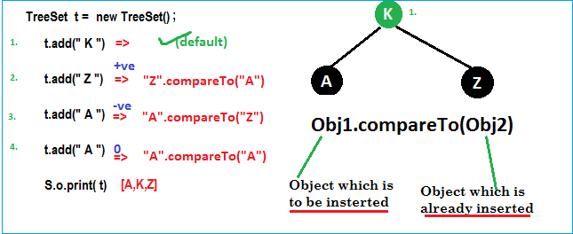
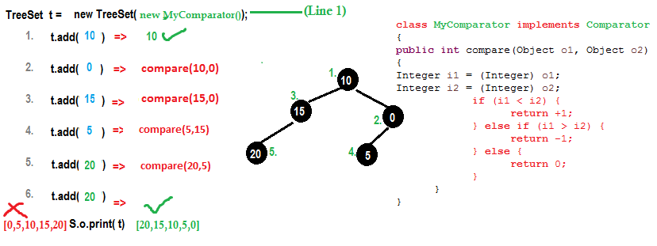
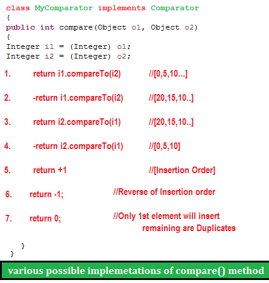
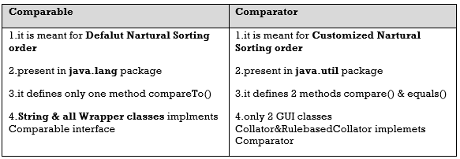

Comparable and Comparator
===========================
```csharp
public class TreeSetStringBuffer {
public static void main(String[] args) {
	TreeSet t = new TreeSet();
	t.add(new StringBuffer("A"));
	t.add(new StringBuffer("X"));
	t.add(new StringBuffer("O"));
	t.add(new StringBuffer("L"));
	System.out.println(t);
}
}
-------------------------------
Exception in thread "main" java.lang.ClassCastException: java.lang.StringBuffer cannot be cast to java.lang.Comparable
```

-   If we are depending on Def. Natural SortingOrder objects should be
    homogeneous & Comparable. Otherwise we will get Runtime Exception
    *java.lang.ClassCastException.*

-   An object is said to be comparable if and only if corresponding class
    implements Comparable interface

-   **Java.lang.String & all wrapper classes (Int, Float, Byte) already
    implements Comparable interface**
    ```java
    public final class java.lang.String implements java.io.Serializable,
       java.lang.Comparable
    ```


-   **Java.lang.StringBuffer doesn’t implements comparable interface**
    ```java
    public final class java.lang.StringBuffer extends java.lang.AbstractStringBuilder implements java.io.Serializable,java.lang.CharSequence
    -------------------------------
    So it throws Exception in thread "main" java.lang.ClassCastException: java.lang.StringBuffer cannot be cast to java.lang.Comparable
    ```

-   If we Take EmpBo , if we pass employee list Objects to the
    Collection.sort(EmpBo) method it will throws Error, because it only accepts
    objects of Comparable types only.
    ```java
    Exception in thread "main" java.lang.Error: Unresolved compilation problem: 
    	The method sort(List<T>) in the type Collections is not applicable for the arguments (List<Employee>)
    ```

-   We have Two ways to provide Sorting order for StringBuffer & Other classes
    which are not implementing Comparable Interface

    1.  Implement **java.lang.Comparable** interface & override **int
        compareTo(Object)**

    2.  Implement **java.util.Comparator** interface & override **int
        compare(Object,Object)**

<br>

# 1.Comparable interface

-   It provides single sorting sequence only i.e. you can sort the elements on
    based on single data member only. For example, it may be rollno, name, age
    or any one of them, not all else.

-   Comparable is an interface defining a strategy of comparing an object with
    other objects of the same type. This is called the class’s “natural
    ordering".so we need to define CompareTo() method

-   We use **public int compareTo(Object obj):** is used to compare the current
    object with the specified object.
```java
public class ComparableDemo {
	public static void main(String[] args) {
 System.out.println("A".compareTo("Z")); // 1-26 = -25
 System.out.println("Z".compareTo("C")); // 26-3 = 23
 System.out.println("A".compareTo("A")); // 1-1 = 0
 // System.out.println("A".compareTo(null)); //R.E NPE
	}
}
```


While adding Objects into TreeSet JVM will call compareTo() method



```java
public class Employee implements Comparable<Employee> {

	private int id;
	private String name;
	private double salary;
//Setters/getters

	public Employee(int id, String name, double salary) {
 super();
 this.id = id;
 this.name = name;
 this.salary = salary;
	}

	
	@Override
	public int compareTo(Employee o) {
 if (this.id < o.id) {
 	return -1;
 } else if (this.id > o.id) {
 	return 1;
 } else {
 	return 0;
 }
	}

	@Override
	public String toString() {
 return "Employee [id=" + id + ", name=" + name + ", salary=" + salary + "]";
	}

	public static void main(String[] args) {

 List<Employee> employees = new ArrayList<Employee>();
 employees.add(new Employee(105, "Satya", 3000));
 employees.add(new Employee(102, "RAJ", 2000));
 employees.add(new Employee(104, "Madhu", 5000));
 employees.add(new Employee(101, "Srini", 1000));
 employees.add(new Employee(103, "Vinod", 4000));

 System.out.println("Before : " + employees);
 //Untill here no sorting will be performed

 Collections.sort(employees);
 //Collection.sort(Comparable) method will interns call CompareTo, & it will compare each                                                              element with other & Sort the elements 
 
System.out.println("After : " + employees);
	}
}
--------------------------------------
Before : [Employee [id=105, name=Satya, salary=3000.0], Employee [id=102, name=RAJ, salary=2000.0], Employee [id=104, name=Madhu, salary=5000.0], Employee [id=101, name=Srini, salary=1000.0], Employee [id=103, name=Vinod, salary=4000.0]]

After : [Employee [id=101, name=Srini, salary=1000.0], Employee [id=102, name=RAJ, salary=2000.0], Employee [id=103, name=Vinod, salary=4000.0], Employee [id=104, name=Madhu, salary=5000.0], Employee [id=105, name=Satya, salary=3000.0]]
```

In above we sorted employes only on their ID type, but if we want to sort by
Name & Salary at a time it wont possible. It accepts only one variable
comparision at a time.

If we want to sort by Id, Name & Salary at a time, we can use Comparator
interfcae

<br>

# 2.Comparator Interface

Comparator present in **java.util package** & it defines two methods **compare
(ob1, ob2) & equals (ob1)**

```java
public int compare(Object ob1, Object ob2);

public boolean equals(Object ob)
```


Whenever we are implementing comparator interface we should provide
implementation only for **compare ()** method & we are not required
implementation for **equals()** method, because it is already available to our
class from Object class through inheritance

<br>

Example: To insert integer Objects into TreeSet where Sorting Order is
Descending order



```java
public class TreesetComp {
	public static void main(String[] args) {
 TreeSet t = new TreeSet(new MyComparator());
 t.add(10);
 t.add(0);
 t.add(15);
 t.add(5);
 t.add(20);
 t.add(20);
 System.out.println(t);
	}
}

class MyComparator implements Comparator {
	@Override
	public int compare(Object newObj, Object oldObj) {
 Integer i1 = (Integer) newObj;
 Integer i2 = (Integer) oldObj;
 if (i1 < i2) {
 	return +1;
 } else if (i1 > i2) {
 	return -1;
 } else {
 	return 0;
 }
	}
}
-----------------------
[20, 15, 10, 5, 0]
```

At **Line1,** if we **not** passing **MyComparator** object then internally JVM
will call **compareTo()** method which is for default Natural Sorting order.in
this case output is [0,5,10,15,20].

At **Line1,** if we passing **MyComparator** object then JVM will call
**compare()** method which is for customize Sorting order.in this case output is
[20,15,10,5,0].



As the same way if we want to change String order we do as follows
```java
public class TreesetStringComp {
	public static void main(String[] args) {
 TreeSet t = new TreeSet(new MyComparators());
 t.add("HYDERABAD");
 t.add("VIJAYAWADA");
 t.add("BANGLORE");
 t.add("VIZAG");	 
 System.out.println(t);
	}
}
class MyComparators implements Comparator {	 
	public int compare(Object newObj, Object oldObj) {
 String s1 = (String) newObj;
 String s2 = (String) oldObj; 
 int i1 = s1.length();
 int i2 = s2.length();
 if (i1 < i2) {
 	return +1;
 } else if (i1 > i2) {
 	return -1;
 } else {
 	return 0;
 }
	}
}
-----------------
[VIJAYAWADA, HYDERABAD, BANGLORE, VIZAG]
```

-   EmpName implements Comparator for NAME Sorting

-   EmpSalary implements Comparator for SALARY Sorting

-   Comparable for ID Sorting for Employe Class

1.EmpName implements Comparator for NAME Sorting
```java
class EmpName implements Comparator<Employee> {
	public int compare(Employee o1, Employee o2) {
 return o1.getName().compareTo(o2.getName());
	};
}
```


2.EmpSalary implements Comparator for SALARY Sorting
```java
class EmpSalary implements Comparator<Employee> {
	public int compare(Employee o1, Employee o2) {
 if (o1.getSalary() < o2.getSalary()) {
 	return -1;
 } else if (o1.getSalary() > o2.getSalary()) {
 	return 1;
 }
 return 0;
	}
}
```


3.Comparable for ID Sorting for Employe Class

```java
public class Employee implements Comparable<Employee> {
	private int id;
	private String name;
	private double salary;
//Setters & Getters
	public Employee(int id, String name, double salary) {
 super();
 this.id = id;
 this.name = name;
 this.salary = salary;
	}
	
	@Override
	public int compareTo(Employee o) {
 if (this.id < o.id) {
 	return -1;
 } else if (this.id > o.id) {
 	return 1;
 } else {
 	return 0;
 }
	}

	@Override
	public String toString() {
 return "Employee [id=" + id + ", name=" + name + ", salary=" + salary + "]";
	}

	public static void main(String[] args) {

 List<Employee> employees = new ArrayList<Employee>();
 employees.add(new Employee(105, "AAA", 3000));
 employees.add(new Employee(102, "ZZZ", 2000));
 employees.add(new Employee(104, "BBB", 5000));
 employees.add(new Employee(101, "DDD", 1000));
 employees.add(new Employee(103, "CCC", 4000));

 System.out.println("Before : " + employees);
 Collections.sort(employees);
 System.out.println("ByID :\n " + employees);
 
 //Now we can Sort our Emplyees based on Multiple Sorting(EmpName, EmpSaltry)
 //Sor method accepts Comparator : Collections.sort(<list>, Comparator)
 Collections.sort(employees, new EmpName());
 System.out.println("EmpName : \n "+employees);
 
 Collections.sort(employees, new EmpSalary());
 System.out.println("EmpSalary : \n "+employees);

	}

}
------------------------------------------
Before : [Employee [id=105, name=AAA, salary=3000.0], Employee [id=102, name=ZZZ, salary=2000.0], Employee [id=104, name=BBB, salary=5000.0], Employee [id=101, name=DDD, salary=1000.0], Employee [id=103, name=CCC, salary=4000.0]]
ByID :
[Employee[id=101, name=DDD, salary=1000.0], Employee [id=102, name=ZZZ, salary=2000.0], Employee [id=103, name=CCC, salary=4000.0], Employee [id=104, name=BBB, salary=5000.0], Employee [id=105, name=AAA, salary=3000.0]]
EmpName : 
[Employee[id=105, name=AAA, salary=3000.0], Employee [id=104, name=BBB, salary=5000.0], Employee [id=103, name=CCC, salary=4000.0], Employee [id=101, name=DDD, salary=1000.0], Employee [id=102, name=ZZZ, salary=2000.0]]
EmpSalary : 
[Employee[id=101, name=DDD, salary=1000.0], Employee [id=102, name=ZZZ, salary=2000.0], Employee [id=105, name=AAA, salary=3000.0], Employee [id=103, name=CCC, salary=4000.0], Employee [id=104, name=BBB, salary=5000.0]]
```

-   **Comparable** interface can be used to provide **single way of sorting**
    whereas **Comparator** interface is used to provide **different ways of
    sorting**.

-   For using Comparable, Class needs to implement it whereas for using
    Comparator we don’t need to make any change in the class, **we can implement
    it in outside**.

-   **Comparable** interface is in **java.lang** package whereas **Comparator**
    interface is present in **java.util** package.

-   We don’t need to make any code changes at client side for using Comparable,
    Arrays.sort() or Collection.sort() methods automatically uses
    the compareTo() method of the class. For Comparator, client needs to provide
    the Comparator class to use in compare() method.


