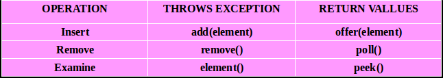
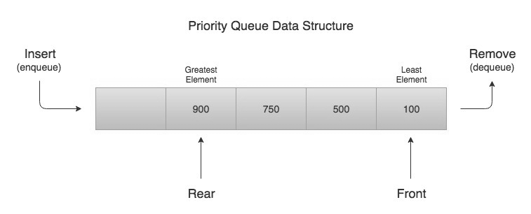
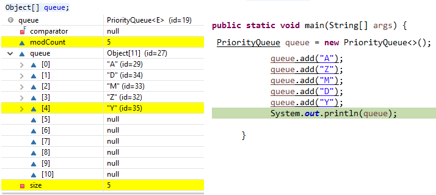
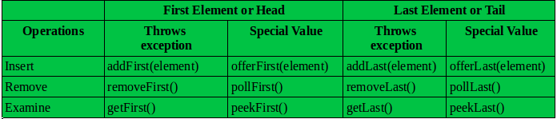
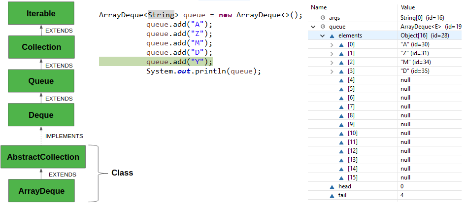

Queue
========

-   The Queue is used to insert elements at the end of the queue and removes
    from the beginning of the queue. It follows FIFO concept.

-   **LinkedList**, **PriorityQueue** are the most frequently used
    implementations.



### PriorityQueue – Internal implementation

A Queue in Java is just an interface. We need a concrete implementation of the
Queue interface to work with, in our programs. LinkedList class implements the
Queue interface and therefore it can be used as a Queue.

The process of adding an element at the end of the Queue is called **Enqueue**,
and the process of removing an element from the front of the Queue is called
**Dequeue**.

A priority queue in Java is a special type
of [queue](https://www.callicoder.com/java-queue/) wherein all the elements
are **ordered** 

-   as per their **natural ordering** using Comparable or

-   based on a **custom Comparator** supplied at the time of creation.

The *front* of the priority queue contains the least element according to the
specified ordering, and the *rear* of the priority queue contains the greatest
element.



So when you remove an element from the priority queue, the least element
according to the specified ordering is removed first.
```java
public class Demo {
public static void main(String[] args) {
Queue<Integer> q = new PriorityQueue<>();
q.offer(400);
q.add(200);
q.add(700);
q.add(100);
q.add(500);
 while (!q.isEmpty()) {
	System.out.println(q.remove());
 }
}
}
-------------
100
200
400
500
700
```


Let’s say that we need to create a priority queue of String elements in which
the String with the smallest *length* is processed first.

We can create such a priority queue by passing a custom Comparator that compares
two Strings by their length

Since a priority queue needs to compare its elements and order them accordingly,
the user defined class must implement the Comparable interface, or you must
provide a Comparator while creating the priority queue. **Otherwise, the
priority queue will throw a ClassCastException when you add new objects to it.**

**Constructors of PriorityQueue class**

-   **PriorityQueue():** Creates with the default capacity (11) &natural
    ordering.

-   **PriorityQueue(int initialCapacity):** specified initial capacity & natural
    ordering.

-   **PriorityQueue(int initialCapacity, Comparator comparator)**

-   **PriorityQueue(PriorityQueue c):** Creates a PriorityQueue containing the
    elements in the specified priority queue.

-   **PriorityQueue(SortedSet c):** Creates a PriorityQueue containing the
    elements in the specified sorted set.

```java
public class PriorityQDemo {
    public static void main(String[] args) {
        PriorityQueue q = new PriorityQueue();
        System.out.println(q.peek());   //null      //System.out.println(q.element());//java.util.NoSuchElementException
        for (int i = 1; i <= 10; i++) {
            q.offer(i);
        }
        System.out.println(q);      //[1, 2, 3, 4, 5, 6, 7, 8, 9, 10]
        System.out.println(q.poll());// 1
        System.out.println(q);      //[2, 4, 3, 8, 5, 6, 7, 10, 9]
    }
}
---------------------------------
null
[1, 2, 3, 4, 5, 6, 7, 8, 9, 10]
1
[2, 4, 3, 8, 5, 6, 7, 10, 9]            //see Order Changed
[2, 4, 3, 8, 5, 6, 7, 10, 9]            //see Order Changed
```

<br>

<u>Internal implementation</u>

Priority queue represented as a balanced binary heap: the two children of
queue[n] are queue[2\*n+1] and queue[2\*(n+1)]. The priority queue is ordered by
comparator, or by the elements' natural ordering, if comparator is null: For
each node n in the heap and each descendant d of n, n <= d. The element with
the lowest value is in queue[0], assuming the queue is nonempty.
```java
private static final int DEFAULT_INITIAL_CAPACITY = 11;
transient Object[] queue;
```


If array Reaches maximum capacity
```java
queue = Arrays.*copyOf*(queue, newCapacity);
```


Establishes the heap invariant (described above) in the entire tree, assuming
nothing about the order of the elements prior to the call.

```java
@SuppressWarnings("unchecked")
private void heapify() {
    for (int i = (size >>> 1) - 1; i >= 0; i--)
        siftDown(i, (E) queue[i]);
}
```




<br>

Deque (Double Ended Queue)
--------------------------

 The Deque is related to the double-ended queue that supports addition or
removal of elements from either end of the data structure, it can be used as
a [queue (first-in-first-out/FIFO)](https://www.geeksforgeeks.org/queue/)** or
as a **[stack
(last-in-first-out/LIFO)](https://www.geeksforgeeks.org/stack/)**. **



###### ArrayDeque – Internal implementation

The ArrayDeque class provides the facility of using deque and resizable-array.
It inherits AbstractCollection class and implements the Deque interface.

The important points about ArrayDeque class are:

-   Unlike Queue, we can add or remove elements from both sides.

-   Null elements are not allowed in the ArrayDeque.

-   ArrayDeque is not thread safe, in the absence of external synchronization.

-   ArrayDeque has no capacity restrictions.

-   ArrayDeque is faster than LinkedList and Stack.


