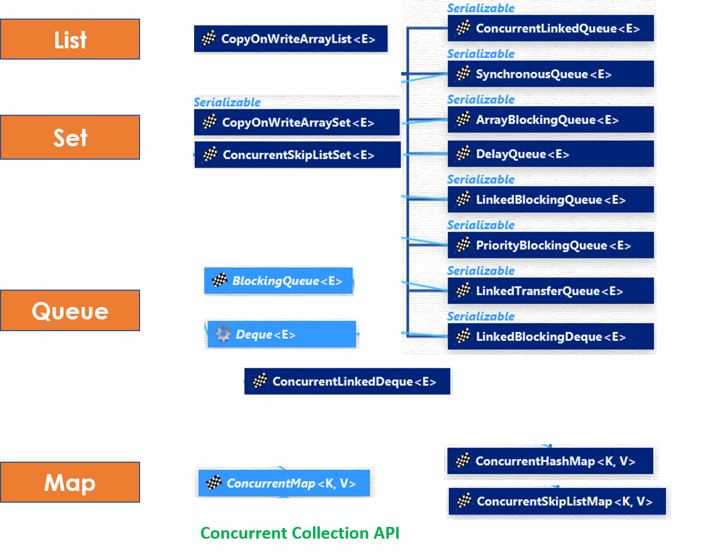
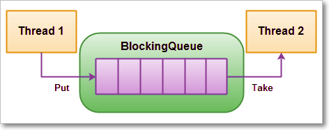

Concurrent Collections
=========================



###### List – CopyOnWriteArrayList

-   **CopyOnWriteArrayList** is a thread-safe variant of java.util.ArrayList.All
    mutative operations **(add, set, and so on)** are implemented by **making a
    fresh copy of the underlying array**.

-   As the name indicates, CopyOnWriteArrayList creates a Cloned copy of
    underlying ArrayList, for every update operation at certain point both will
    synchronized automatically which is takes care by JVM. So, there is no
    effect for threads which are performing read operation.

-   It is costly to use because for every update operation a cloned copy will be
    created. Hence CopyOnWriteArrayList is the best choice if our frequent
    operation is read operation.

-   The underlined data structure is grow-able array &

-   **It is thread-safe version of ArrayList.**

**Methods Summary:**
```java
public boolean addIfAbsent(Object obj)
public     int addAllAbsent(Collection C)
```
<br>

<u>Differences between ArrayList & CopyOnWriteArrayList</u>

**1.Synchronization**  
ArrayList is not synchronized . CopyOnWriteArrayList
is synchronized .

**2.Iterator**
-   Iterator
    of **CopyOnWriteArrayList** is [fail-safe](http://javarevisited.blogspot.sg/2012/02/fail-safe-vs-fail-fast-iterator-in-java.html) &
    doesn't throw **ConcurrentModificationException** even if underlying
    CopyOnWriteArrayList is modified once Iteration begins

-   Because, Iterator is operating on a separate copy of ArrayList.
    Consequently, all the updates made on CopyOnWriteArrayList is not available
    to Iterator

**3.Remove Operation**  
Iterator of CopyOnWriteArrayList doesn’t support remove operation while Iterator
of ArrayList supports remove() operation. 

**4.Performance**  
ArrayList is faster as it is not synchronized. That means
many threads can execute the same piece of code simultaneously. In comparison ,
 CopyOnWriteArrayList is slower.  
  
**5.Added in java version**  
ArrayList class was added in java version 1.2 ,
while CopyOnWriteArrayList class was added in java version 1.5 (or java 5) .  
  
**6.Package**  
ArrayList class is present in java.util package , while
CopyOnWriteArrayList class is present in java.util.concurrent package
```java
public class CopyOnWriteArrayListExample {

public static void main(String args[]) {

CopyOnWriteArrayList<String> list = new CopyOnWriteArrayList<String>();

list.add("Java");

list.add("J2EE");

list.add("Collection");

//add, remove operator is not supported by CopyOnWriteArrayList iterator

Iterator<String> itr = list.iterator();

while(itr.hasNext()){

System.*out*.printf("Read from CopyOnWriteArrayList : %s %n", itr.next());

// itr.remove(); //not supported in CopyOnWriteArrayList in Java

list.add("New");

}

System.*out*.println(list);

}

}
```

# Set – CopyOnWriteArraySet, ConcurrentSkipListSet


### CopyOnWriteArraySet

-   **CopyOnWriteArraySet** is a Set that uses an
    internal CopyOnWriteArrayList for all of its operations.

-   One of the most important thing to know about CopyOnWriteArraySet is that it
    is backed by CopyOnWriteArrayList, which means it also share all basic
    properties of CopyOnWriteArrayList.

-   Another important thing to remember is that Iterators of this collection
    class doesn't support remove() operation, trying to remove an element while
    iterating will result in UnSupportedOperationException.

-   it’s a little brother of CopyOnWriteArrayList, so if you understand one of
    them, you can use others. Only difference being these two are one is List
    and other is Set, but that brings all difference between Set and List in
    Java. For example, List is ordered, allows duplicate while Set is unordered,
    but doesn't allow duplicate.


### **ConcurrentSkipListSet**

-   ConcurrentSkipListSet maintains the behavior same as **TreeSet**.

-   Since ConcurrentSkipListSet implements **NavigableSet** in Java, it is a
    sorted set just like TreeSet with *added feature of being concurrent*. Which
    essentially means it is a sorted data structure which can be used by
    multiple [threads](http://netjs.blogspot.com/2015/06/can-we-start-same-thread-twice-in-java.html) where
    as TreeSet is not thread safe.

-   The elements of the ConcurrentSkipListSet are kept sorted according to
    their **natural ordering**, or by
    a [Comparator](http://netjs.blogspot.com/2015/10/difference-between-comparable-and-comparator-java.html) provided
    at set creation time, depending on
    which [constructor](http://netjs.blogspot.com/2015/04/constructor-in-java.html) is
    used.

-   ConcurrentSkipListSet provides a constructor that takes a comparator as a
    parameter.

-   **ConcurrentSkipListSet(Comparator<? super E> comparator)** - Constructs a
    new, empty set that orders its elements according to the specified
    comparator.

-   **ConcurrentSkipListSet** implementation provides expected average log(n)
    time cost for the **contains**, **add**, and **remove** operations and their
    variants. Insertion, removal, and access operations safely execute
    concurrently by multiple threads.

<br>


# Map – ConcurrentMap ConcurrentHashMap, ConcurrentSkipListMap

### ConcurrentMap:

ConcurrentMap is an interface, which is introduced in JDK 1.5 represents a Map
which is capable of handling concurrent access

It extends [map interface in
Java](https://www.geeksforgeeks.org/map-interface-java-examples/). Below are
specific methods of ConcurrentMap interface:

-   **Object putIfAbsent(K key, V value)**:If the specified key is not already
    associated with a value, associate it with the given value.

-   **boolean remove(Object key, Object value)** Removes the entry for a key
    only if currently mapped to a given value.

-   **boolean replace(K key, V oldValue, V newValue)** Replaces the entry for a
    key only if currently mapped to a given value

### ConcurrentHashMap

1.  ConcurrentHashMap only locks a portion of the collection on update.

2.  ConcurrentHashMap is better than Hashtable and synchronized Map.

3.  ConcurrentHashMap is failsafe does not throws
    **ConcurrentModificationException**.

4.  null is not allowed as a key or value in ConcurrentHashMap.

5.  Level of concurrency can be chosen by the programmer on a ConcurrentHashMap
    while initializing it.

**ConcurrentHashMap(int initialCapacity, float loadFactor, int
concurrencyLevel)**

By default ConcurrentHashMap allows 16 number of concurrent threads. We can
change this number using the concurrencyLevl argument.

### ConcurrentSkipListMap

Since ConcurrentSkipListMap implements ConcurrentNavigableMap, it is a sorted
map just
like[TreeMap](http://netjs.blogspot.com/2015/11/treemap-in-java.html) (Which
also implements NavigableMap interface).

ConcurrentSkipListMap is sorted according to the natural ordering of its keys,
or by a Comparatorprovided at map creation time, depending on
which [constructor](http://netjs.blogspot.com/2015/04/constructor-in-java.html) is
used.

ConcurrentSkipListMap in Java provides four constructors, out of those 2
relevant ones are -

-   **ConcurrentSkipListMap()** - Constructs a new, empty map, sorted according
    to the natural ordering of the keys.

-   **ConcurrentSkipListMap(Comparator<? super K> comparator)** - Constructs a
    new, empty map, sorted according to the specified comparator.

ConcurrentSkipListMap class in Java implements a concurrent variant
of **SkipLists** data structure providing expected average log(n) time cost for
the containsKey, get, put and remove operations and their variants. Insertion,
removal, update, and access operations safely execute concurrently by multiple
threads.

All **Map.Entry** pairs returned by methods in ConcurrentSkipListMap class and
its views represent snapshots of mappings at the time they were produced.

# Queue – BlockingQueue PriorityBlockingQueue ,ArrayBlockingQueue, 


### BlockingQueue

A **BlockingQueue** is typically used when one thread will produce objects,
another thread consumes those Objects.



>   A BlockingQueue with one thread putting into it, and another thread taking
>   from it.

|             | **Throws Exception** | **Special Value** | **Blocks** | **Times Out**               |
|-------------|----------------------|-------------------|------------|-----------------------------|
| **Insert**  | add(o)               | offer(o)          | put(o)     | offer(o, timeout, timeunit) |
| **Remove**  | remove(o)            | poll()            | take()     | poll(timeout, timeunit)     |
| **Examine** | element()            | peek()            |            |                             |

-   **BlockingQueue** in **Java doesn't allow null elements**, various
    implementations like ArrayBlockingQueue, LinkedBlockingQueue throws
    NullPointerException when you try to add null on queue

 **two types of BlockingQueue:**

1.**Bounded queue** – with maximal capacity defined  
```java
BlockingQueue<String> blockingQueue = new LinkedBlockingDeque<>(10);
```


2.**UnBounded queue** –no maximum capacity, can grow almost indefinitely
```java
BlockingQueue<String> blockingQueue = new LinkedBlockingDeque<>();
```

<br>

<u>Producer-Consumer Example</u>

BlockingQueue provides a **put()** method to store the element
and **take()** method to retrieve the element. Both are blocking method, which
means **put()** will block if the queue has reached its capacity and there is no
place to add a new element.

Similarly `take()` method will block if blocking queue is empty. So, you can
see that critical requirement of the producer-consumer pattern is met right
there, you don't need to put any thread synchronization code.
```java
class Producer extends Thread {
	private BlockingQueue<Integer> sharedQueue;
	public Producer(BlockingQueue<Integer> aQueue) {
 super("PRODUCER");
 this.sharedQueue = aQueue;
	}
	public void run() { // no synchronization needed
 for (int i = 0; i < 10; i++) {
 	try {
  System.out.println(getName() + " produced " + i);
  sharedQueue.put(i);
  Thread.sleep(200);	
            // if we remove sleep, put will execute 10 times, then take will execute 
             } catch (InterruptedException e) {
  e.printStackTrace();
 	}
 }
	}
}
class Consumer extends Thread {
	private BlockingQueue<Integer> sharedQueue;

	public Consumer(BlockingQueue<Integer> aQueue) {
 super("CONSUMER");
 this.sharedQueue = aQueue;
	}

	public void run() {
 try {
 	while (true) {
  Integer item = sharedQueue.take();
  System.out.println(getName() + " consumed " + item);
 	}
 } catch (InterruptedException e) {
 	e.printStackTrace();
 }
	}
}

public class BlockingQueueDemo {
	public static void main(String[] args) {
 	BlockingQueue<Integer> sharedQ = new LinkedBlockingQueue<Integer>();
 	Producer p = new Producer(sharedQ); 
 	Consumer c = new Consumer(sharedQ); 
 	p.start(); 
 	c.start(); 	
 }
}
```

-   [ArrayBlockingQueue](https://javapapers.com/java/java-arrayblockingqueue/) –
    a blocking queue class based on bounded Java Array. Once instantiated,
    cannot be resized.

-   **PriorityBlockingQueue** – a priority queue based blocking queue. It is an
    unbounded concurrent collection.

-   **LinkedBlockingQueue** – an optionally bounded Java concurrent collection.
    Orders elements based on FIFO order.  
<br>

### Deque - ConcurrentLinkedDeque

ConcurrentLinkedDeque in Java is an **unbounded** thread-safe **Deque** which
stores its elements as linked nodes. Since it implements deque
interface **ConcurrentLinkedDeque** supports element *insertion and removal at
both ends*. You will find methods
like **addFirst()**, **addLast()**, **getFirst()**, **getLast()**, **removeFirst()**, **removeLast()** to
facilitate operations at both ends.

<u>Usage of ConcurrentLinkedDeque</u>  
A ConcurrentLinkedDeque is an appropriate choice when many threads will share
access to a common collection as concurrent insertion, removal, and access
operations execute safely across multiple threads.

Note that it **doesn't block** operations as done in the implementation
of BlockingDequeue interfacelike LinkedBlockingDeque. So there are no
putFirst(), takeFirst() or putLast(), takeLast() methods which will wait if
required.
