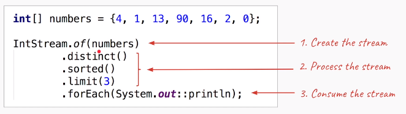
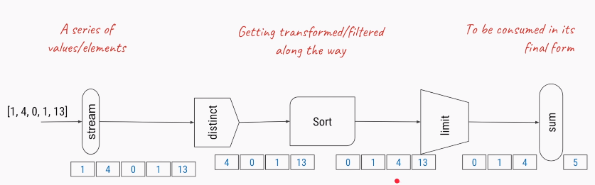
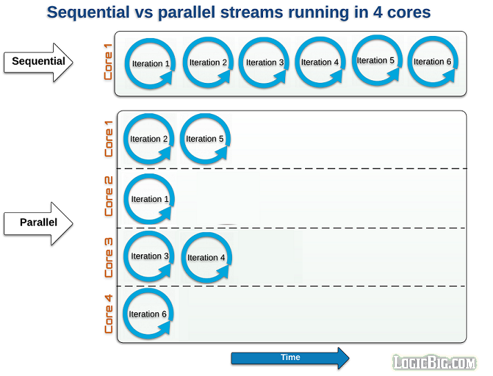

Java Streams
==========
All of us have watched online videos on **Youtube**. When we start watching a
video, a small portion of the video file is first loaded into our computer and
starts playing. we don’t need to download the complete video before we start
watching it. This is called **video streaming**.

At a very high level, we can think of that small portion of the video file as a
**Stream** and the whole video as a **Collection**

In Java, `java.util.Stream` interface represents a stream on which one or more
operations can be performed. **Stream operations are either intermediate or
terminal.**

-   **Intermediate** operations return a **stream.** so we can chain multiple
    intermediate operations without using semicolons.

-   **Terminal** operations are either void or return a non-stream result

Streams are created on a source, e.g. a `java.util.Collection` like **List** or
**Set**. The **Map** **is not supported** directly, we can create stream of map
keys, values or entries. Stream operations can either be executed
**sequentially** or **parallel**. when performed parallelly, it is called a
**parallel stream**.

How Stream Work



```java
List<String> myList =  Arrays.asList("a1", "a2", "b1", "c2", "c1");

myList.stream()
    .filter(s -> s.startsWith("c"))
    .map(String::toUpperCase)
    .sorted()
    .forEach(System.out::println);
```

In above filter, map and sorted are intermediate operations whereas forEach is a
terminal operation.

Streams can be created from various data sources, especially collections. Lists
and Sets support new methods **stream()** and **parallelStream()** to either
create a sequential or a parallel stream.**Parallel streams** **can operate on
multiple threads**.

**The features of Java stream are**

-   A stream is not a data structure.

-   it takes input from the **Collections, Arrays** or **I/O** channels.

-   **Streams don’t change original data structure**; they only provide the
    result as per the pipelined methods.

-   Do not support indexed access

-   Lazy access supported

-   Parallelizable

-   Each intermediate operation is lazily executed and returns a stream as a
    result. hence various intermediate operations can be pipelined. Terminal
    operations mark the end of the stream and return the result.

1\. Creating Streams

**XxxStream.of()** : Create Steam using **Primitive types (int, char, byte,
double)**

```java
IntStream is = IntStream.of(3, 4, 5, 6);
DoubleStream is = DoubleStream.of(3.1, 4.0, 5.7, 6.0);
```

**Stream.of()** : Create Steam using **Primitive Object types (Int, String,
Wrapper types )**

```java
//Primitive Types
Stream<Integer>  intStream= Stream.of(1,2,3,4,5,6,7,8);

Stream<Character> charStream = Stream.of('A','B','C','D','E');

Stream<String> strStream = Stream.of("Aaa", "Bbbb", "Cccc", "Dddd");
```

[IntStream](https://docs.oracle.com/en/java/javase/15/docs/api/java.base/java/util/stream/IntStream.html)
is a stream of *primitive* int values.

[Stream\<Integer\>](https://docs.oracle.com/en/java/javase/15/docs/api/java.base/java/util/stream/Stream.html)
is a stream of Integer *objects*

**Stream.of(array)** : Create Steam using **Array types (Int, String)**

```java
Stream<Integer> intArraystream = Stream.of( new Integer[]{1,2,3,4,5,6,7,8,9} );

Stream<Character> charArraystream = Stream.of( new Character[]{'A','B','C','D','E'} );

Stream<String> strArraystream = Stream.of( new String[]{"Aaa", "Bbbb", "Cccc", "Dddd"} );
```

**List.stream()** : Create Steam from **Collection types (List, Set, Not MAP)**

```java
		//Collection types
		List<String> list = new ArrayList<String>();
		list.add("a");
		list.add("b");
		list.add("c");			
		Stream<String> strListStream = list.stream();
		
		List<Integer> list2 = new ArrayList<Integer>();
		list2.add(1);
		list2.add(2);
		list2.add(3);		
		Stream<Integer> intListStream = list2.stream();
```

**Ex: Create Steam by Splitting String**

Stream\<String\> splitStream = Stream.*of*("A\$B\$C\$D".split("\\\\\$"));

2\. Stream Operations

Stream Operations: Intermediate

| **filter(Predicate\<T\>)**             | The elements of the stream matching the predicate (Condition)                                                                 |
|----------------------------------------|-------------------------------------------------------------------------------------------------------------------------------|
| **map(Function\<T, U\>)**              | Performs some operation on each element & return something (add, multiply, convert)                                           |
| **flatMap(Function\<T, Stream\<U\>\>** | The elements of the streams resulting from applying the provided stream-bearing function to the elements of the stream        |
| **distinct()**                         | The elements of the stream, with duplicates removed                                                                           |
| **sorted()**                           | The elements of the stream, sorted in natural order                                                                           |
| **Sorted(Comparator\<T\>)**            | The elements of the stream, sorted by the provided comparator                                                                 |
| **limit(long)**                        | The elements of the stream, truncated to the provided length                                                                  |
| **skip(long)**                         | The elements of the stream, discarding the first N elements                                                                   |
| **takeWhile(Predicate\<T\>)**          | (The elements of the stream, truncated at the first element for which the provided predicate is not true                      |
| **dropWhile(Predicate\<T\>)**          | (Java 9 only) The elements of the stream, discarding the initial segment of elements for which the provided predicate is true |

Terminal Operations

| **forEach(Consumer\<T\> action)**       | Apply the provided action to each element of the stream.               |
|-----------------------------------------|------------------------------------------------------------------------|
| **toArray()**                           | Create an array from the elements of the stream.                       |
| **reduce(...)**                         | Aggregate the elements of the stream into a summary value.             |
| **collect(...)**                        | Aggregate the elements of the stream into a summary result container.  |
| **min(Comparator\<T\>)**                | Return the minimal element of the stream according to the comparator.  |
| **max(Comparator\<T\>)**                | Return the maximal element of the stream according to the comparator.  |
| **count()**                             | Return the size of the stream.                                         |
| **{any,all,none}Match(Predicate\<T\>)** | Return any/all/none of the elements of the stream match the predicate. |
| **findFirst()**                         | Return the first element of the stream, if present.                    |
| **findAny()**                           | Return any element of the stream, if present.                          |

#### Collectors & collect method

```java
java.util.stream
|
Interface Collector
|	
class Collectors
```

**Collectors class** : Implementations of
[Collector](https://docs.oracle.com/javase/8/docs/api/java/util/stream/Collector.html)
that implement various useful reduction operations, such as gathering elements
into collections, summarizing elements according to various criteria, etc.

Some of Useful methods:

| To Collections                                                                                                                         | Math Operations                                                                                                                                                       | Map Grouping                                                                                            |
|----------------------------------------------------------------------------------------------------------------------------------------|-----------------------------------------------------------------------------------------------------------------------------------------------------------------------|---------------------------------------------------------------------------------------------------------|
| toCollection(Supplier) toList() toSet() toMap(Function, Function)  joining() mapping(Function, Collector) filtering(Predct, Collector) | counting() minBy(Comparator) maxBy(Comparator) summingInt(ToIntFunction),  summingLong(ToLongFunction),   averagingInt(ToIntFunction),  averagingLong(ToLongFunction) | groupingBy(Function) groupingByConcurrent(Function)  partitioningBy(Predicate) reducing(BinaryOperator) |

Finally, most commonly used Operations

Following are Country names as List – common for all below Operations

```java
			List<String> list = new ArrayList<String>();
			list.add("America");
			list.add("China");
			list.add("Japan");
			list.add("Germany");
			list.add("India");
			list.add("Italy");
			list.add("Russia");
			list.add("Sweden");
			list.add("Ukraine");
			list.add("India");
			list.add("Italy");
```

**Intermediate Operations:**

#### **1. Stream.forEach(consumer):**

Printing list using foreach

```java
list.stream().forEach(System.out::println);
```

#### 2. Stream.filter()

The **filter()** method accepts a
[Predicate](https://howtodoinjava.com/java8/how-to-use-predicate-in-java-8/) to
filter all elements of the stream. This operation is intermediate which enables
us to call another stream operation (e.g.
[forEach()](https://howtodoinjava.com/java8/java-stream-foreach/)) on the
result.

```java
	System.out.println("\n \nPrint Countries name Start with I");
	    list.stream()
		.filter((n)->n.startsWith("I"))
		.forEach(System.out::println);
Print Countries name Start with I
India
Italy
India
Italy
```

#### 3. Stream.map()

The **map()** intermediate operation converts each element in the stream into
another object via the given function. The following example converts each
string into an UPPERCASE string. But we can use map() to transform an object
into another type as well.

```java
System.out.println("\n \n Convert to Upper case");
    list.stream()
		.filter((n) -> n.startsWith("I"))
		.map((n) -> n.toUpperCase())
		.map((String::toUpperCase))	//Using reference <RETURN TYPE> :: Opration
		.forEach(System.out::println);
```

#### 4. Stream.sorted()

The **sorted()** method is an intermediate operation that returns a sorted view
of the stream. The elements in the stream are sorted in natural order unless we
pass a custom
[**Comparator**](https://howtodoinjava.com/java/collections/java-comparator/).

```java
	System.out.println("\n \n Convert to Upper case & Sort");
	list.stream()
	    .map(String::toUpperCase)
	    .sorted()
	    .forEach(System.out::println);
	
	list.stream()
	    .map(String::toUpperCase)
	    .sorted(Comparator.reverseOrder())
	    .forEach(System.out::println);
```

To Sort User Object based on Age

```java
List<User> sortedList = users.stream()
		.sorted(Comparator.comparingInt(User::getAge)
		.reversed())
		.collect(Collectors.toList());
    sortedList.forEach(System.out::println);
```

To Sort User Object based on Name

```java
List<User> sortedList = users.stream()
		.sorted(Comparator.comparing(User::getName))
		.collect(Collectors.toList());
```

#### 5. Stream.distinct()

To Remove duplicate items from Stream.
[Javadocs](https://docs.oracle.com/javase/8/docs/api/java/util/stream/Stream.html#distinct--)
say that distinct() - Returns a stream consisting of the distinct elements
(according to Object.equals(Object)) of this stream. In case of object types we
need to generate hashcode to made objects equal.

```java
System.out.println("\n \n List of Strings Start with I");
List tempList =	list.stream()
	.filter((n)-> n.startsWith("I"))
	.distinct()
	.collect(Collectors.toList());
System.out.println(tempList);
```

**Terminal Operations:**

**forEach**: The forEach method is used to iterate through every element of the
stream.  
**List number = Arrays.asList(2,3,4,5);  
number.stream().map(x-\>x\*x).forEach(y-\>System.out.println(y));**

#### 5. Stream.collect() :: Collection

The **collect()** method is used to receive elements from a steam and store them
in a **collection**.

| To Collections                                                                                                                         | Math Operations                                                                                                                                                       | Map Grouping                                                                                            |
|----------------------------------------------------------------------------------------------------------------------------------------|-----------------------------------------------------------------------------------------------------------------------------------------------------------------------|---------------------------------------------------------------------------------------------------------|
| toCollection(Supplier) toList() toSet() toMap(Function, Function)  joining() mapping(Function, Collector) filtering(Predct, Collector) | counting() minBy(Comparator) maxBy(Comparator) summingInt(ToIntFunction),  summingLong(ToLongFunction),   averagingInt(ToIntFunction),  averagingLong(ToLongFunction) | groupingBy(Function) groupingByConcurrent(Function)  partitioningBy(Predicate) reducing(BinaryOperator) |

```java
System.out.println("\n \n List of Strings Start with I");
List tempList =	list.stream()
		    .filter((n)-> n.startsWith("I"))
		    .collect(Collectors.toList());
System.out.println(tempList);
```

#### 6. Stream.match() :: boolean

Various matching operations can be used to check whether a given predicate
matches the stream elements. All of these matching operations are terminal and
return a boolean result.

```java
boolean matchedResult = memberNames.stream()
        .anyMatch((s) -> s.startsWith("A")); 
System.out.println(matchedResult);     //true
 
matchedResult = memberNames.stream()
        .allMatch((s) -> s.startsWith("A")); 
System.out.println(matchedResult);     //false
 
matchedResult = memberNames.stream()
        .noneMatch((s) -> s.startsWith("A")); 
System.out.println(matchedResult);     //false
```

#### 7. Stream.count() :: Integer/Any Number

The **count()** is a terminal operation returning the number of elements in the
stream as a long value.

```java
long totalMatched = memberNames.stream()
    .filter((s) -> s.startsWith("A"))
    .count(); 
System.out.println(totalMatched);     //2
```

#### 8. Stream.reduce()

The **reduce()** method performs a reduction on the elements of the stream with
the given function. The result is an
[Optional](https://howtodoinjava.com/java8/java-8-optionals-complete-reference/)
holding the reduced value.

In the given example, we are reducing all the strings by concatenating them
using a separator \#.

```java
Optional<String> reduced = memberNames.stream()
        .reduce((s1,s2) -> s1 + "#" + s2);
 
reduced.ifPresent(System.out::println);
```

#### 9. Stream.anyMatch() :: Boolean

The **anyMatch()** will return true once a condition passed as predicate
satisfies. Once a matching value is found, no more elements will be processed in
the stream.

In the given example, as soon as a String is found starting with the letter 'A',
the stream will end and the result will be returned.

```java
boolean matched = memberNames.stream()
        .anyMatch((s) -> s.startsWith("A")); 
System.out.println(matched);    //true
```

#### 10. Stream.findFirst()

The **findFirst()** method will return the first element from the stream and
then it will not process any more elements.

```java
String firstMatchedName = memberNames.stream()
            .filter((s) -> s.startsWith("L"))
            .findFirst().get(); 
System.out.println(firstMatchedName);    //Lokesh
```

#### 11. flatMap()

**flattening is referred to as merging multiple collections/arrays into one**

flatMap() = Flattening + map()

**Stream.flatMap()** helps in converting Stream\<Collection\<T\>\> to
**Stream\<T\>.**

Flattening example 1

Before flattening : [[1, 2, 3], [4, 5], [6, 7, 8]]

After flattening : [1, 2, 3, 4, 5, 6, 7, 8]

```java
		 List <Integer> list1 = Arrays.asList(1, 2, 3);
		 List <Integer> list2 = Arrays.asList(4, 5, 6);
		 List <Integer> list3 = Arrays.asList(7, 8, 9);

		 List <List <Integer >> listOfLists = Arrays.asList(list1, list2, list3);

		 List < Integer > listOfAllIntegers = listOfLists.stream()
		   .flatMap(x -> x.stream())
		   .collect(Collectors.toList());

		 System.out.println(listOfAllIntegers);
```

#### 12. toArray

```java
    Employee[] employeesArray = employeeList.stream()
            .filter(e -> e.getSalary() < 400)
            .toArray(Employee[]::new);
```

Example

```java
class Product{  
    int id;  
    String name;  
    float price;  
    public Product(int id, String name, float price) {  
        this.id = id;  
        this.name = name;  
        this.price = price;  
    }  
}  

public class Streams {
	public static void main(String[] args) {
		
		List<Product> productsList = new ArrayList<Product>();  
        //Adding Products  
        productsList.add(new Product(1,"HP Laptop",25000f));  
        productsList.add(new Product(2,"Dell Laptop",30000f));  
        productsList.add(new Product(3,"Lenevo Laptop",28000f));  
        productsList.add(new Product(4,"Sony Laptop",28000f));  
        productsList.add(new Product(5,"Apple Laptop",90000f));  
        
        List<Float> productPriceList2 =productsList.stream()  
                      .filter(p -> p.price > 30000)// filtering data  
                      .map(p->p.price)        // fetching price  
                      .collect(Collectors.toList()); // collecting as list  
        System.out.println(productPriceList2);  //[90000.0]
      

		
        // This is more compact approach for filtering data  
        productsList.stream()  
                    .filter(product -> product.price == 30000)  
                    .forEach(product -> System.out.println(product.name));  //  Dell Laptop
        
        // count number of products based on the filter  
        long count = productsList.stream()  
                    .filter(product->product.price<30000)  
                    .count();  
        System.out.println(count);  //3
        
        // Converting product List into Set  
        Set<Float> productPriceList =    productsList.stream()  
            .filter(product->product.price < 30000)   // filter product on the base of price  
            .map(product->product.price)  //get the price
            .collect(Collectors.toSet());   // collect it as Set(remove duplicate elements)  
        System.out.println(productPriceList);  //[25000.0, 28000.0]		
		
	}
}
```

3\. Parallel Streams

-   Sequential or Normal streams just work like for-loop using a single core.
    Parallel streams divide the provided task(like fork& join) into many and run
    them in different threads, utilizing multiple cores of the computer.

-   In parallel execution, if number of tasks are more than available cores at a
    given time, the remaining tasks are queued waiting for currently running
    task to finish.

-   In above-listed stream examples, anytime we want to do a particular job
    using multiple threads in parallel cores, all we have to call
    parallelStream() method instead of **stream()** method.

```java
//For ArrayTypes
Stream<Integer> parllelStream =Stream.of(nums).parallel();

//For List Types
Stream<String> stream = list.parallelStream();
```



```java
	Integer[] nums = {1,1, 2, 3,3, 4, 5, 6, 7, 8, 9, 10};
	System.out.println("\n \n Print Strings using normal Stream");
	Stream<Integer> seqStream =Stream.of(nums);			
	seqStream.distinct()
		  .sorted(Comparator.reverseOrder())
		  .forEach((n)-> {
			  System.out.println(Thread.currentThread().getName()+" : "+n);
		
	  	});	
```

Print Strings using normal Stream
```java
main : 10
main : 9
main : 8
main : 7
main : 6
main : 5
main : 4
main : 3
main : 2
main : 1
```


```java
	System.out.println("\n \n Print Strings using Parllel Stream");			
	Stream<Integer> parllelStream =Stream.of(nums).parallel();			
	parllelStream.distinct()
		  .sorted(Comparator.reverseOrder())
		  .forEach((n)-> {
			  System.out.println(Thread.currentThread().getName()+" : "+n);		
	  	});
```
Print Strings using Parllel Stream
```java
main : 4
ForkJoinPool.commonPool-worker-7 : 6
ForkJoinPool.commonPool-worker-5 : 9
ForkJoinPool.commonPool-worker-9 : 2
ForkJoinPool.commonPool-worker-3 : 3
ForkJoinPool.commonPool-worker-15 : 1
ForkJoinPool.commonPool-worker-11 : 8
ForkJoinPool.commonPool-worker-13 : 5
ForkJoinPool.commonPool-worker-5 : 10
ForkJoinPool.commonPool-worker-7 : 7
```

In Above we are using parllelStream, So order is not correct, because the steam
is processed by many threads.

Examples

| **Creating Streams** | **Interamediate**                                                                | **Terminal Operations**                                                             |
|----------------------|----------------------------------------------------------------------------------|-------------------------------------------------------------------------------------|
| **concat()**         | [**filter()**](https://howtodoinjava.com/java8/java-stream-filter-example/)      | [**forEach()**](https://howtodoinjava.com/java8/java-stream-foreach/)               |
| **empty()**          | [**map()**](https://howtodoinjava.com/java8/stream-map-example/)                 | [**forEachOrdered()**](https://howtodoinjava.com/java8/java-stream-foreachordered/) |
| **generate()**       | [**flatMap()**](https://howtodoinjava.com/java8/stream-flatmap-example/)         | [**toArray()**](https://howtodoinjava.com/java8/convert-stream-to-array/)           |
| **iterate()**        | [**distinct()**](https://howtodoinjava.com/java8/java-stream-distinct-examples/) | **reduce()**                                                                        |
| **of()**             | [**sorted()**](https://howtodoinjava.com/java8/stream-sorted-method/)            | **collect()**                                                                       |
|                      | [**peek()**](https://howtodoinjava.com/java8/java-stream-peek-example/)          | [**min()**](https://howtodoinjava.com/java8/java-stream-min/)                       |
|                      | [**limit()**](https://howtodoinjava.com/java8/java-stream-limit-method-example/) | [**max()**](https://howtodoinjava.com/java8/java-stream-max/)                       |
|                      | [**skip()**](https://howtodoinjava.com/java8/stream-skip-example/)               | [**count()**](https://howtodoinjava.com/java8/stream-count-elements-example/)       |
|                      |                                                                                  | [**anyMatch()**](https://howtodoinjava.com/java8/stream-anymatch-example/)          |
|                      |                                                                                  | [**allMatch()**](https://howtodoinjava.com/java8/stream-allmatch-example/)          |
|                      |                                                                                  | [**noneMatch()**](https://howtodoinjava.com/java8/stream-nonematch-example/)        |
|                      |                                                                                  | [**findFirst()**](https://howtodoinjava.com/java8/stream-findfirst-findany/)        |
|                      |                                                                                  | [**findAny()**](https://howtodoinjava.com/java8/stream-findfirst-findany/)          |

#### 1.Count Occurrences of a Char in a String

```java
String someString = "elephant"; 
long count = someString
         .chars()
         .filter(ch -> ch == 'e')
         .count();
 
```

Using map:

-   Invoke the **chars()** method on the input string and which returns the
    IntStream instance. This int stream holds the integer representation of each
    character in the string.

-   Need to convert IntStream to CharStream using the **mapToObj()** method.

-   Last, need to group by characters by calling **Collectors.groupingBy()** and
    to count call **Collectors.counting()** method.

```java
String input = "success";

IntStream intStream = input.chars();
    Stream<Character> stream = intStream.mapToObj(ch -> (char) ch);
    Map<Character, Long> output = stream.collect(Collectors.groupingBy(ch -> ch, Collectors.counting()));
    System.out.println(output);
        
        //Single Line
        Map<Character, Long> output2 =  	input.chars()        										.mapToObj(ch -> (char) ch)        									.collect(Collectors.groupingBy(ch -> ch, Collectors.counting() ) );
        System.out.println(output2);
```

#### Counting Empty String

```java
	List<String> strList = Arrays.asList("abc", "", "bcd", "", "defg", "jk");
	long c1 = strList.stream()
                 .filter(s -> s.isEmpty())
                 .count();
	System.out.println(c1);//2
```

#### Map & joining

```java
	System.out.println("Count String whose length is more than three");
	 c1 = strList.stream().filter(s -> s.length()>3).count();
	System.out.println(c1);//1
	
	System.out.println("Remove all empty Strings from List");
	List l1 = strList.stream()
                     .filter(s -> !s.isEmpty())
                     .collect(Collectors.toList()); 
	
	System.out.println("Convert Strings in a list to uppercase and Join them with coma");
	String join = strList.stream()
                     .map(s -> s.toUpperCase())
                     .collect(Collectors.joining(",")); 
```

#### Statistics: Get count, min, max, sum, and the average for numbers

we will learn how to get some statistical data from Collection, e.g. [finding
the minimum or maximum number from
List](http://java67.blogspot.sg/2014/02/how-to-find-largest-and-smallest-number-array-in-java.html),
calculating the sum of all numbers from a numeric list, or calculating the
average of all numbers from List.

Since these statistics operations are numeric in nature, it's essential to call
the **mapToInt()** method. After this, we call the **summaryStatistics(),**
which returns an instance of an IntSummaryStatistics.  

It is this object which provides us utility method like getMin(), getMax(),
getSum() or getAverage().

```java
	List<Integer> primes = Arrays.asList(2, 3, 5, 7, 11, 13, 17, 19, 23, 29);
			c1 = primes.stream()
                           .mapToInt(s -> s)
                           .summaryStatistics()
                           .getSum();
			System.out.println(c1);
```

```java
		List<Integer> primes1 = Arrays.asList(2, 3, 5, 7, 11, 13, 17, 19, 23, 29);
		IntSummaryStatistics stats = primes1.stream().mapToInt((x) -> x).summaryStatistics();
		System.out.println("Highest prime number in List : " + stats.getMax());
		System.out.println("Lowest prime number in List : " + stats.getMin());
		System.out.println("Sum of all prime numbers : " + stats.getSum());
		System.out.println("Average of all prime numbers : " + stats.getAverage());
```

### Ref.

<https://howtodoinjava.com/java/stream/java-streams-by-examples/>

<https://www.java67.com/2014/04/java-8-stream-examples-and-tutorial.html>

<https://javabypatel.blogspot.com/2018/06/java-8-stream-practice-problems.html>
