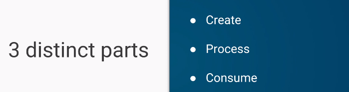

Java Streams
==========

A stream represents a sequence of elements and supports different kind of
operations to perform computations upon those elements.

Stream operations are either intermediate or terminal.

-   **Intermediate** operations return a **stream** so we can chain multiple
    intermediate operations without using semicolons.

-   **Terminal** operations are either void or return a non-stream result

How Stream Work




```java
List<String> myList =  Arrays.asList("a1", "a2", "b1", "c2", "c1");

myList
    .stream()
    .filter(s -> s.startsWith("c"))
    .map(String::toUpperCase)
    .sorted()
    .forEach(System.out::println);
```

In the above example filter, map and sorted are intermediate operations
whereas forEach is a terminal operation.

Streams can be created from various data sources, especially collections. Lists
and Sets support new methods **stream()** and **parallelStream()** to either
create a sequential or a parallel stream.

<br>


**Parallel streams are capable of operating on multiple threads**

**The features of Java stream are**

-   A stream is not a data structure instead it takes input from the
    Collections, Arrays or I/O channels.

-   **Streams don’t change the original data structure**; they only provide the
    result as per the pipelined methods.

-   Each intermediate operation is lazily executed and returns a stream as a
    result, hence various intermediate operations can be pipelined. Terminal
    operations mark the end of the stream and return the result.

**1.Obtaining a Stream**
```java
//1.Stream of Collection
Collection<String> collection = Arrays.asList("a", "b", "c");
Stream<String> streamOfCollection = collection.stream();

//2.Stream of Arrays
Stream<String> streamOfArray = Stream.of("a", "b", "c");
```

<u>Stream Operations: `Intermediate`</u>

| **Operation**                          | Contents                                                                                                                      |
|----------------------------------------|-------------------------------------------------------------------------------------------------------------------------------|
| **filter(Predicate<T>)**             | The elements of the stream matching the predicate                                                                             |
| **map(Function<T, U>)**              | The result of applying the provided function to the elements of the stream                                                    |
| **flatMap(Function<T, Stream<U>>** | The elements of the streams resulting from applying the provided stream-bearing function to the elements of the stream        |
| **distinct()**                         | The elements of the stream, with duplicates removed                                                                           |
| **sorted()**                           | The elements of the stream, sorted in natural order                                                                           |
| **Sorted(Comparator<T>)**            | The elements of the stream, sorted by the provided comparator                                                                 |
| **limit(long)**                        | The elements of the stream, truncated to the provided length                                                                  |
| **skip(long)**                         | The elements of the stream, discarding the first N elements                                                                   |
| **takeWhile(Predicate<T>)**          | (Java 9 only) The elements of the stream, truncated at the first element for which the provided predicate is not true         |
| **dropWhile(Predicate<T>)**          | (Java 9 only) The elements of the stream, discarding the initial segment of elements for which the provided predicate is true |

<br>

<u>Terminal Operations</u>

| **forEach(Consumer<T> action)**       | Apply the provided action to each element of the stream.                                |
|-----------------------------------------|-----------------------------------------------------------------------------------------|
| **toArray()**                           | Create an array from the elements of the stream.                                        |
| **reduce(...)**                         | Aggregate the elements of the stream into a summary value.                              |
| **collect(...)**                        | Aggregate the elements of the stream into a summary result container.                   |
| **min(Comparator<T>)**                | Return the minimal element of the stream according to the comparator.                   |
| **max(Comparator<T>)**                | Return the maximal element of the stream according to the comparator.                   |
| **count()**                             | Return the size of the stream.                                                          |
| **{any,all,none}Match(Predicate<T>)** | Return whether any/all/none of the elements of the stream match the provided predicate. |
| **findFirst()**                         | Return the first element of the stream, if present.                                     |
| **findAny()**                           | Return any element of the stream, if present.                                           |


<br>

<u>Finally most commonly used Operations</u>

**Intermediate Operations:**

- `map`: The map method is used to map the items in the collection to other objects according to the Predicate passed as argument.
    ```java
    List<Integer> number = Arrays.asList(2, 3, 4, 5);
     List square = number.stream()
          .map(x -> x * x)
          .collect(Collectors.toList());
     System.out.println(square);
     ------------------
    [4, 9, 16, 25]
    ```


- `filter`: The filter method is used to select elements as per the Predicate passed as argument.	
    ```java
    public static void main(String[] args) throws Exception {
     List<String> names = Arrays.asList("Reflection", "Collection", "Stream");
     List result = names.stream().
                                        .filter(s -> s.startsWith("S"))
                                        .collect(Collectors.toList());
     System.out.println(result);
    	}
    ----------------------	
    [Stream]
    ```


- `sorted`: The sorted method is used to sort the stream.
    ```java
    List<String> names = Arrays.asList("Reflection","Collection","Stream");
     List result = names.stream().sorted().collect(Collectors.toList());
     System.out.println(result);
    --------------------------------------- 
    [Collection, Reflection, Stream]
    ```


<br>

**Terminal Operations:**


- `collect`: The collect method is used to return the result of the intermediate operations performed on the stream.
    ```java
    List number = Arrays.asList(2,3,4,5,3);
    Set square = number.stream().map(x->x*x).collect(Collectors.toSet());
    ```

- `forEach`: The forEach method is used to iterate through every element of the stream.
    ```java
    List number = Arrays.asList(2,3,4,5);
    number.stream().map(x->x*x).forEach(y->System.out.println(y));
    ```
-	`reduce`: The reduce method is used to reduce the elements of a stream to a single value.
The reduce method takes a BinaryOperator as a parameter.
    ```java
    List number = Arrays.asList(2,3,4,5);
    int even = number.stream().filter(x->x%2==0).reduce(0,(ans,i)-> ans+i);
    ```

