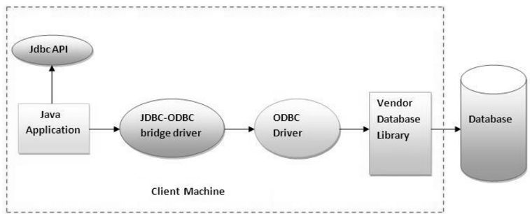
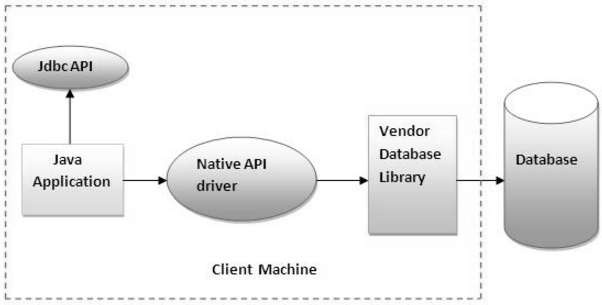
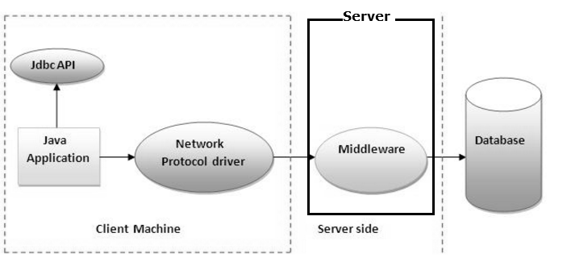
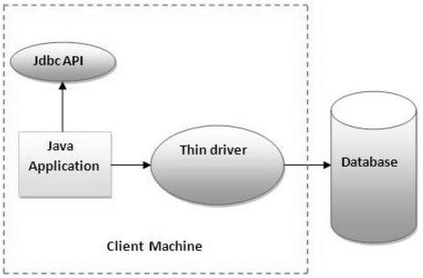

JDBC- Introduction
====================

Before JDBC, ODBC API was the database API to connect and execute query with the
database. But, ODBC API uses ODBC driver which is written in C language (i.e.
platform dependent and unsecured).

That is why Java has defined its own API (JDBC API) that uses JDBC drivers
(writtn in Java).

There are 4 types of JDBC drivers:

1.  **JDBC-ODBC bridge driver**

2.  **Native-API driver (partially java driver)**

3.  **Network Protocol driver (fully java driver)**

4.  **Thin driver (fully java driver)**

 

<u>1. JDBC-ODBC bridge driver (Type-1)</u>

-   The JDBC-ODBC bridge driver uses **ODBC driver to connect to the database**.

-   The JDBC-ODBC bridge driver converts JDBC method calls into the ODBC
    function calls.

-   Can be easily connected to **ANY database.**

-   Performance degraded because **JDBC method call is converted into the ODBC
    calls**

-   **ODBC driver needs** to be installed on the **client machine**

-   Sun provided ODBC driver name : **sun.jdbc.odbc.JdbcOdbcDriver**

    

 

<u>2. Native API driver (Type-1)</u>

-   The Native API driver uses the client-side libraries of the database.

-   For **MySQL they have own Native API Driver, similarly for ORACLE, Postgres
    etc,**

-   The driver converts JDBC (Java) method calls into native calls (MySQL,
    Oracle) of the database API.

-   It is **NOT FULLY written entirely in java**

-   The Native driver needs to be installed on the each client machine.

    

 

<u>3. Network Protocol driver (Type-3)</u>

-   The Network Protocol driver uses middleware (application server) that
    converts JDBC calls directly or indirectly into the vendor-specific database
    protocol.

-   It is fully written in java.

-   Used in **Connection Pooling**

-   **Network support is required on client machine.**

-   Maintenance of Network Protocol driver becomes costly because it requires
    database-specific coding to be done in the middle tier.

    

 

<u>4. Thin driver (Type -4)</u>

-   The thin driver converts JDBC calls directly into the vendor-specific
    database protocol.

-   It is **fully written in Java language**

-   Better performance than all other drivers.

-   **No software is required at client side or server side**.

-   **com.mysql.jdbc.Driver** (MySQL),
    **oracle.jdbc.driver.OracleDriver**(ORACLE)

    
