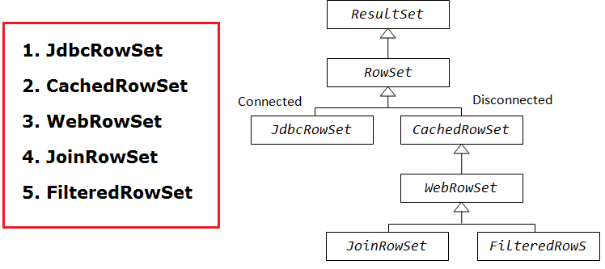
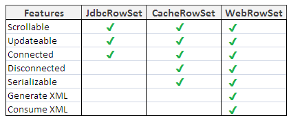

RowSet Interface
===================

**ResultSet Disdavantages**

-   ResultSet Object is not serilaizable , because it is always maintains a
    connection with DB

-   We can’t pass theResultset object from one class to other class across the
    network.

**Rowset**

-   **RowSet extends the ResultSet interface** so it has all the methods of
    ResultSet

-   RowSet **can be serialized** because it doesn’t have a connection to any
    database

-   RowSet **Object can be sent from one class to another across the network**.

We have following types of RowSets







```java
JdbcRowSet rowSet = RowSetProvider.newFactory().createJdbcRowSet();  
rowSet.setUrl("jdbc:oracle:thin:@localhost:1521:xe");  
rowSet.setUsername("system");  
rowSet.setPassword("oracle");             
rowSet.setCommand("select * from emp400");  
rowSet.execute();
```
