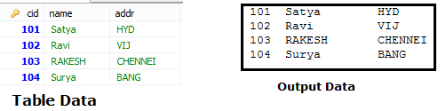

Steps to connect to the database
==================================

There are 5 steps to connect...

1.**Register the driver class**    
```java
    Class.forName ("oracle.jdbc.driver.OracleDriver");
```


2.**Creating connection**  
```java
Connection con=DriverManager.getConnection ("url","system","password");
Connection con=DriverManager.getConnection ("url "); //2nd Way
```


3.**Creating statement**  
```java
Statement stmt=con.createStatement ();
```


4.**Executing queries**  
```java
ResultSet rs=stmt.executeQuery("select * from emp");
```


5.**Closing connection**  
```java
con.close();
```



```java
public class JDBC {
	public static void main(String[] args) throws Exception {
 Class.forName("com.mysql.jdbc.Driver");
 Connection con = DriverManager.getConnection
("jdbc:mysql://localhost:3306/mydb", "root", "123456");

 Statement stmt = con.createStatement();
 ResultSet rs = stmt.executeQuery("SELECT * FROM customer");
 while (rs.next())
System.out.println(rs.getInt(1)+":"+rs.getString(2)+ "  " + rs.getString(3));
 con.close();
	}
}
```

In above Example we use getConnection(“URL","UNAME","PWD") to connect with
database.we can use directly without giving username/pwd also

<br>

There are two ways to connect java application with the access database.

-   **Without DSN (Data Source Name) above**

-   **With DSN** jdbc:odbc:mydsn (mydsn is DSN)

**Creating DSN**

Start > Administrative Tools > Data Sources (ODBC). Add (.mdb)
