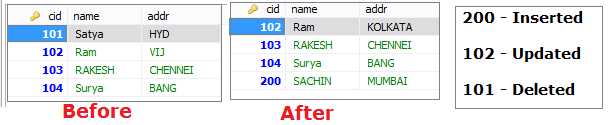

JDBC CURD Operations
======================

### executeQuery (String sql) example

We use this method to execute SELECT queries

```java
public class JDBC {
	public static void main(String[] args) throws Exception {
 Class.forName("com.mysql.jdbc.Driver");
 Connection con = DriverManager.getConnection
("jdbc:mysql://localhost:3306/mydb", "root", "123456");

 Statement stmt = con.createStatement();
 ResultSet rs = stmt.executeQuery("SELECT * FROM customer");
 while (rs.next()) {
System.out.println(rs.getInt(1)+""+rs.getString(2)+" "+ rs.getString(3));
 }
 con.close();
	}
}
-----------------------
101  Satya  HYD
102  Ravi  VIJ
103  RAKESH  CHENNEI
104  Surya  BANG
```


### executeUpdate (String sql) example

We use this method to **NON-SELECT** Queries like UPDATE, DELETE, etc
- Returns 1 if success
- Returns 0 if Failure

```java
public class JDBC {
	public static void main(String[] args) throws Exception {
 String url = "jdbc:mysql://localhost:3306/mydb";
 Class.forName("com.mysql.jdbc.Driver");
	Connection con = DriverManager.getConnection(url, "root", "123456");
 Statement stmt = con.createStatement();

	String qry = "UPDATE `customer` SET `name`='Ram' WHERE  `cid`=102";
 int res = stmt.executeUpdate(qry);
 if (res > 0)
 	System.out.println("Success is :" + res);
 else
 	System.out.println("Failure is :" + res);
 con.close();
	}
}
---------------------
Success is :1
Failure is :0
```

<br>

### Boolean `execute()` example

We can use **execute()** method in **both SELECT & NON-SELECT queries.**

**1. SELECT**  
It returns TRUE on SELECT queres we can get ResultSet by calling below method
```java
ResultSet rs = statement.getResultSet ()
```


**2. NON-SELECT**  
It returns FALSE on NON-SELECT queres. we can get **Int** value by calling below
method
```java
int i 	= statement.getUpdateCount();
```

```java
public class JDBC {
	public static void main(String[] args) throws Exception {
	String url = "jdbc:mysql://localhost:3306/mydb";
	Class.forName("com.mysql.jdbc.Driver");
	Connection con = DriverManager.getConnection(url, "root", "123456");
	Statement stmt = con.createStatement();

	// String qry = "SELECT * FROM customer";
	String qry = "UPDATE `customer` SET `name`='Ram' WHERE `cid`=102";

 boolean flag = stmt.execute(qry);
 if (flag == true) {
 	System.out.println("SELECT QUERY\n --------");
 	ResultSet rs = stmt.getResultSet();
 	while (rs.next()) {
 System.out.println(rs.getString(1) + ":" + rs.getString(2));
 	}
 }
 else {
 	System.out.println("NON-SELECT QUERY\n --------");
 	int i = stmt.getUpdateCount();
 	System.out.println("Result is : " + i);
 }
	}
}
SELECT QUERY
 --------
101:Satya
102:Ram
103:RAKESH
104:Surya

NON-SELECT QUERY
 --------
Result is : 1
```
<br>

### executeBatch(String sql) example
```java
public class BatchDemo {
	public static void main(String[] args) throws Exception {

 String url = "jdbc:mysql://localhost:3306/mydb";
 Class.forName("com.mysql.jdbc.Driver");
	Connection con = DriverManager.getConnection(url, "root", "123456");

 Statement st = con.createStatement();
 st.addBatch("insert into  student	values(81, 'Syam', 'mtm')");
 st.addBatch("insert into  student	values(11, 'ram', 'mum')");
 st.addBatch("insert into  student	values(14, 'bam', 'kuk')");
 st.addBatch("insert into  student	values(44, 'pram', 'secu')");

 int rs[] = st.executeBatch();
 int sum = 0;
 for (int i = 0; i < rs.length; i++) {
 	sum = sum + i;
 }
 System.out.println(sum + "Record are UPDATED using BATCH");
	}
}
```

<br>

### Scrollabe Resultset(String sql) example

By Default ResultSet Object is not SCROLLABLE & NOT UPDATABLE.to make ResultSet
Object to move both Directions we need to configure TYPE & MODE Values

<u>Possible TYPE Values</u>
-   **ResultSet.TYPE_SCROLL_SENSITIVE (Update Possible)**
-   **ResultSet.TYPE_SCROLL_INSENSITIVE (Default)**

<u>Possible MODE Values</u>
-   **ResultSet.CONCUR_READ_ONLY (Update Possible)**
-   **ResultSet.CONCUR_UPDATABLE (Default)**

Methods applicable on Scrolable ResultSet Object

-   **int getRow()** Returns ROW INDEX

-   **boolean first()** Keep CURSOR at 1st Record

-   **boolean last()** Keep CURSOR at LAST Record

-   **boolean next()** Moves Cursor to Forward

-   **boolean previous()** Moves Cursor to Backword

-   **boolean absolute(int +/-**) Moves Cursor to given Index on ResultSet

-   **boolean relative**(int +/-) Moves Cursor to given Index, based on current
    Row

```java
public class JDBC {
	public static void main(String[] args) throws Exception {
	String url = "jdbc:mysql://localhost:3306/mydb";
	Class.forName("com.mysql.jdbc.Driver");
	Connection con = DriverManager.getConnection(url, "root", "123456");	Statement st = con.createStatement
               (ResultSet.TYPE_SCROLL_SENSITIVE, ResultSet.CONCUR_READ_ONLY);
 
ResultSet rs = st.executeQuery("select * from customer");
  System.out.println("From Using Next\n------");

 while (rs.next()) {
 	System.out.println(rs.getString(1)+":"+rs.getString(2));
 }

 System.out.println("\nFrom Using Previous	");
 while (rs.previous()) {
 	System.out.println(rs.getString(1)+":"+rs.getString(2));
 }

 System.out.println("randomly...................	");

rs.first();
System.out.println(rs.getRow()+"First:"+rs.getString(1)+":"+rs.getString(2));

 
rs.last();
System.out.println(rs.getRow()+"Last: "+rs.getString(1)+":"+rs.getString(2));

rs.absolute(4);//from starting point to 4 records
System.out.println(rs.getRow()+"Absolute:"+rs.getString(1)+":"+rs.getString(2));

rs.relative(-2); //from here to 2 points back
System.out.println(rs.getRow()+"relative:"+rs.getString(1)+":"+rs.getString(2));
	}
}
From Using Next
------
101:Satya
102:Ram
103:RAKESH
104:Surya

From Using Previous	
104:Surya
103:RAKESH
102:Ram
101:Satya
randomly...................	
1First: 101:Satya
4Last: 104:Surya
4Absolute Record : 104:Surya
2relative Record : 102:Ram
```

In above example we used on for `SCROLLING` resultset on both ditections using
`ResultSet.TYPE_SCROLL_SENSITIVE`, `ResultSet.CONCUR_READ_ONLY.`

If we want perform `UPDATE` operations & `SCROLLING` also, we have to use
`ResultSet.TYPE_SCROLL_SENSITIVE, ResultSet.CONCUR_UPDATABLE`

<br>

**Steps to Perform Insert/ UPDATE /Delete Operations on ResultSet**

**1. Select the Records**
```java
while (rs.next()) 
{
    System.out.println(rs.getRow()+""+rs.getString(1)+","+ rs.getString(2));
}
```

**2. Perform INSERT Operation**
```java
System.out.println("1.INSERT OPERATION\n-----");
rs.moveToInsertRow(); // creates Empty Record
rs.updateInt(1, 200);
rs.updateString(2, "SACHIN");
rs.updateString(3, "MUMBAI");
rs.insertRow(); // Inserts Row
```

**3. Perform UPDATE Operation**
```java
System.out.println("\n2.UPDATE OPERATION\n-----");
rs.absolute(2); // move to row to update
rs.updateString(3, "KOLKATA");
rs.updateRow();
```

**4. Perform DELETE Operation**
```java
System.out.println("\n3.DELTE OPERATION\n-----");
rs.absolute(1); // move to row to DELETE
rs.deleteRow();
```
<br>

<u>Example</u>

```java
public class JDBC {
	public static void main(String[] args) throws Exception {
 String url = "jdbc:mysql://localhost:3306/mydb";
 Class.forName("com.mysql.jdbc.Driver");
 Connection con = DriverManager.getConnection(url, "root", "123456");
 Statement st = con.createStatement
      ResultSet.TYPE_SCROLL_SENSITIVE, ResultSet.CONCUR_UPDATABLE);
 ResultSet rs = st.executeQuery("select * from customer");

 while (rs.next()) {
            System.out.println(rs.getRow() + "->" + rs.getString(1) + "," + rs.getString(2));
 }

 System.out.println("1.INSERT OPERATION\n-----");
 rs.moveToInsertRow(); // creates Empty Record
 rs.updateInt(1, 200);
 rs.updateString(2, "SACHIN");
 rs.updateString(3, "MUMBAI");
 rs.insertRow(); // Inserts Row

 System.out.println("\n2.UPDATE OPERATION\n-----");
 rs.absolute(2); // move to row to update
 rs.updateString(3, "KOLKATA");
 rs.updateRow();

 System.out.println("\n3.DELTE OPERATION\n-----");
 rs.absolute(1); // move to row to DELETE
 rs.deleteRow();
	}
}
```


