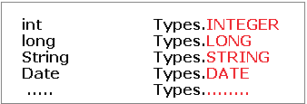

CallableStatement
===================

>   CallableStatement interface is used to call the **stored procedures and
>   functions**.

We can have business logic on the database by the use of stored procedures and
functions that will make the performance better because these are precompiled.

Suppose you need the get the age of the employee based on the date of birth, you
may create a function that receives date as the input and returns age of the
employee as the output.

| **Stored Procedure**                                                       | **Function**                                                                |
|----------------------------------------------------------------------------|-----------------------------------------------------------------------------|
| is used to perform business logic.                                         | is used to perform calculation.                                             |
| must not have the return type.                                             | must have the return type.                                                  |
| may return 0 or more values.                                               | may return only one values.                                                 |
| We can call functions from the procedure.                                  | Procedure cannot be called from function.                                   |
| It supports input and output parameters.                                   | Function supports only input parameter.                                     |
| Exception handling using try/catch block can be used in stored procedures. | Exception handling using try/catch can't be used in user defined functions. |

We use following method on Connection object to get CallableStatement Object
```java
public CallableStatement prepareCall("{ call procedurename(?,?...?)}");
CallableStatement cs=con.prepareCall("{call myprocedure(?,?)}");
```
<BR>

<u>Example procedeure</u>
```java
create or replace function sum (n1 in number,n2 in number)  
return number  
is   
temp number(8);  
begin  
        temp :=n1+n2;  
     return temp;  
end;  
/
```

In above example n1, n2 are Input Paramaters & temp is the Output parameter

**To set Input Paramaters** we use setXXX(int index, Value) methods
```java
cs.setInt(1, 10);
cs.setInt(2, 20);
```


**To set Output Paramaters** we use registerOutParameter(int index, Type.TYPE)
method
```java
cs.registerOutParameter(1, Types.INTEGER);
```



**To excute CallableStatement** we use **execute()** method
```java
cs.execute();
```


**To Get results** we use **getXXX(int outputParamIndex)** method
```java
cs.getInt(1);
```

<br>

```java
public class FuncSum {  
public static void main(String[] args) throws Exception{  
  
Class.forName("oracle.jdbc.driver.OracleDriver");  
Connection con=DriverManager.getConnection(  
"jdbc:oracle:thin:@localhost:1521:xe","system","oracle");  
  
CallableStatement stmt=con.prepareCall("{?= call sum4(?,?)}");  
stmt.setInt(2,10);  
stmt.setInt(3,43);  
stmt.registerOutParameter(1,Types.INTEGER);  
stmt.execute();  
  
System.out.println(stmt.getInt(1));  
          
}  
}  
Output: 53
```
