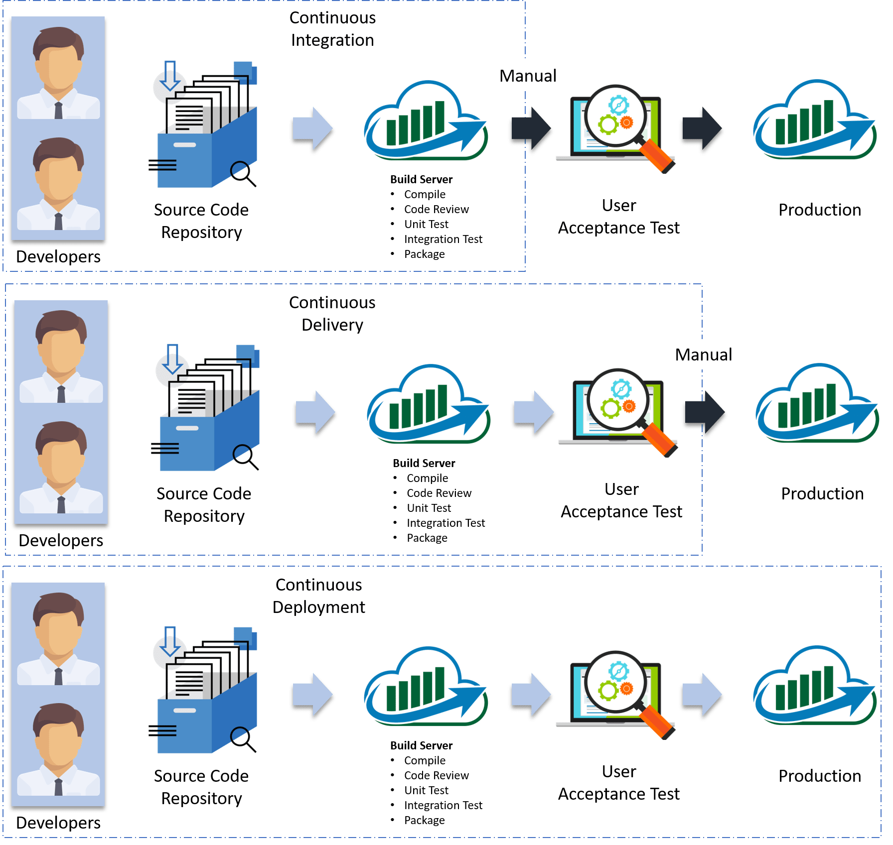
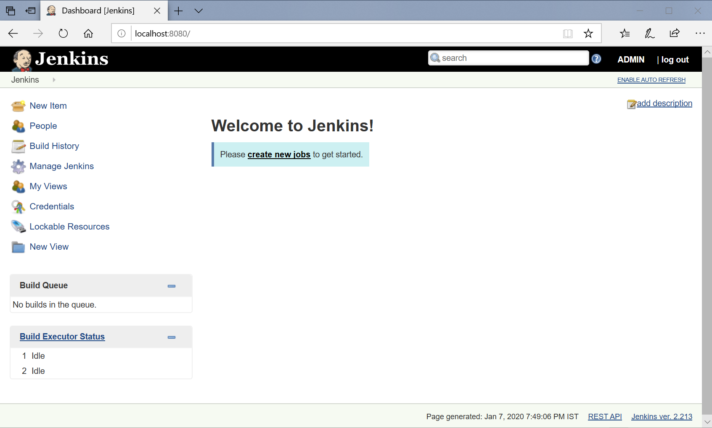

Jenkins – Introduction
======================

Jenkins is an open source automation tool written in Java programming language
that allows continuous integration.

### What Is Continuous Integration.



**Continuous Integration**, every code commit is built and tested, but, is not
in a condition to be released. I mean the build application is not automatically
deployed on the test servers in order to validate it using different types of
Blackbox testing like - User Acceptance Testing (UAT).

**Continuous Delivery**, the application is continuously **deployed on the test
servers for UAT**. Or, you can say the application is ready to be released to
production anytime. So, obviously Continuous Integration is necessary for
Continuous Delivery.

**Continuous Deployment** is the next step past Continuous Delivery, where you
are not just creating a deployable package, but you are actually deploying it in
an automated fashion.

### Continuous Integration Tools


**Bamboo**  
This is available with **free trial license**. Bamboo is written in Java and it
is easily works with JIRA & Bitbucket. It’s also allow you to import jenkins
data to Bamboo easily. Bamboo also supports others tools like AWS, Amazon S3,
Ant, Docker, codeDeploy, Maven, Git & SVN.

<https://www.atlassian.com/software/bamboo>


**TeamCity**  
java based continuous integration server which is belongs to JetBrains labs. It
is available **in free and paid license for users**. It’s free version offers
almost all the features but for up to 20 build configurations and 3 free Build
Agents. Teamcity also supports different tools and frameworks and also it’s
available with wide variety of plugins. It’s also support .Net features which
makes it suitable for .Net projects.

<https://www.jetbrains.com/teamcity/>


**Travis CI**  
**Travis CI** is an open source continuous integration tool which is written in
RUBY. It’s easily get sync with GitHub. It’s supports platforms like Linux, Mac
or iOS and also supports many languages in which Node js, php, Xcode, python,
java, are few of them. It also performs parallel test runs using their great
APIs and command line tools. **Free for open repositories, Enterprise for
private.**  
<https://travis-ci.org/getting_started>

**UrbanCode**  
UBuild-UDeploy-URelease is also known as Urbancode deploy is a collaborative
product of IBM. UrbanCode from IBM is built.So its Paid.  
<https://developer.ibm.com/urbancode/>  


**CruiseControl**  
Open Source. Very old. <http://cruisecontrol.sourceforge.net/>

## Types of Environments

1. **Development**

2. **QA** -only Functional testing of the system

3. **Integration Testing** -Tests the system from end to end

4. **User Acceptance Testing(UAT**) -user will validate the functionality over
time.

5. **CERT** -CERT is Certification environment! It’s just where you certify your
product so that it can move to production

6. **Production** - Production

7. **Production Parallel** -A parallel of production to replicate production
issues

# How Jenkins works


-   developer commits the code to the source code repository. Meanwhile, the
    Jenkins checks the repository at regular intervals for changes.

-   Soon after a commit occurs, the Jenkins server finds the changes that have
    occurred in the source code repository. Jenkins will draw those changes and
    will start preparing a new build.

-   If the build fails, then the concerned team will be notified.

-   If built is successful, then Jenkins server deploys the built in the test
    server.

-   After testing, Jenkins server generates a feedback and then notifies the
    developers about the build and test results.

-   It will continue to verify the source code repository for changes made in
    the source code and the whole process keeps on repeating.  

<br>

Jenkins Architecture
--------------------

Jenkins architecture has two components:

-   Jenkins Master/Server

-   Jenkins Slave/Node


<br>

Jenkins Installation
--------------------

### Windows

1.[Download & Install
Java](https://www.oracle.com/technetwork/java/javase/downloads/index.html)

[2.Download Jenkins war File](https://jenkins.io/download/)

3.Open Command Line as **Administrator** & Run below cmd by navigate to
downloaded location

```python
java -jar Jenkins.war

#By changing Port number
java -jar jenkins.war --httpPort=2222

```


Copy the password from console

4.Accessing Jenkins by <http://localhost:8080> , it will ask for the
Administrator password – Paste above copied password.


5.Next, select plug-ins to install.


6.Create admin user.


7.After that’s just click finish, I will navigate to Dashboard page.



# Ubuntu -vagrant

**Installing Java**

-   Open a terminal window on your Ubuntu server.

-   Issue the command below & Allow the installation to complete.

```python
sudo add-apt-repository ppa:webupd8team/java
sudo -E add-apt-repository ppa:openjdk-r/ppa

sudo apt-get update
sudo apt-get install openjdk-8-jdk
```
  

To verify Java has been installed, issue the command:
```python
java --version
```
<br>

**Jenkins Install**

```python
wget -q -O - https://pkg.jenkins.io/debian/jenkins-ci.org.key | sudo apt-key add -

sudo sh -c 'echo deb http://pkg.jenkins.io/debian-stable binary/ >
/etc/apt/sources.list.d/jenkins.list'

sudo apt-get update
sudo apt-get install Jenkins -y
```


**Check Status**
```python
service jenkins status
systemctl status jenkins
```


**jenkins restart**
```python
# Usage: /etc/init.d/jenkins {start\|stop\|status\|restart\|force-reload}
sudo /etc/init.d/jenkins restart

# Jenkins Install location
/etc/init.d/jenkins

# Port Change
edit the /etc/default/jenkins to replace HTTP_PORT=8081
```
<br>

**To Access Jenkins VIA Browser**

-   Open the vagrant file (should be in the directory where you specified to
    create a new vagrant machine).

-   Search for config.vm.network.  
`config.vm.network "private_network", ip: "192.168.33.10"`

-   Here ip address (192.168.33.10) can be any ip address you want.

-   Now logout from the vagrant machine and reload your vagrant machine by this
    command vagrant reload.

Access Jenkins : <http://192.168.33.10:8080/login?from=%2F>


In the terminal window, we’ll use the **cat** command to display the password:
`sudo cat /var/lib/jenkins/secrets/initialAdminPassword`


> Follow same steps as windows Installation from now on wards.

## CentOS – Vagrant 

**Installing Java**  
`sudo yum install java-1.8.0-openjdk-devel`

To verify Java has been installed, issue the command:
```python
java --version
```


**Install Jenkins**

To enable Jenkins repository, import the GPG key using the following curl
command:
```python
curl --silent --location http://pkg.jenkins-ci.org/redhat-stable/jenkins.repo|
sudo tee /etc/yum.repos.d/jenkins.repo

sudo rpm --import https://jenkins-ci.org/redhat/jenkins-ci.org.key
```


install the latest stable version of Jenkins  
`sudo yum install jenkins`

Start Jenkins  
`sudo systemctl start jenkins`

Check Status  
`systemctl status Jenkins`  
`service jenkins status`

Finally enable the Jenkins service to start on system boot.
`sudo systemctl enable jenkins`

Update Vagrant file with Private IP to able to access with host system browser  
`config.vm.network "private_network", ip: "192.168.33.11"`

Reload vagrant CentOS box  
`vagrant reload`

Access Jenkins <http://192.168.33.11:8080> , for the first time enter password by doing  
```python
sudo cat /var/lib/jenkins/secrets/initialAdminPassword
O/p : 576f5d4d5e6a45b68061ba22c08eb27a
```
Select Plugins to install > Done!!!  


Manage Jenkins
--------------

**Configure System**

Configure global settings and paths.

-   **Home directory** -where Jenkins stores all of its data in file system.

-   **Maven Configuration** - Installation location, MAVEN_HOME, .m2 location,

-   **Jenkins URL** - Custom Jenkins URL

-   **SonarQube** - Servers Details

-   **E-mail Notification** - SMTP servers

-   **Artifactory servers**

-   **Subversion**

**Configure Global Security**  
Secure Jenkins; define who can access/use the system.

**Configure Credentials**  
Configure the credential providers and types – LDAP servers.

**Global Tool Configuration**  
Configure tools, their locations and automatic installers.

-   Maven installations

-   JDK installations

-   Ant installations

-   SonarQube Scanner installations

**Reload Configuration from Disk**  
Discard all the loaded data in memory and reload everything from file system.
Useful when you modified config files directly on disk.

**Manage Plugins**  
Add, remove, disable or enable plugins that can extend the functionality of
Jenkins.

**System Information**  
Displays various environmental information to assist trouble-shooting.

**System Log**  
System log captures output from java.util.logging output related to Jenkins.

**Load Statistics**  
Check your resource utilization and see if you need more computers for your builds.

**Jenkins CLI**  
Access/manage Jenkins from your shell, or from your script.

**Script Console**  
Executes arbitrary script for administration/trouble-shooting/diagnostics.

**Manage Nodes and Clouds**  
Add, remove, control and monitor the various nodes that Jenkins runs jobs on.

**Manage Users**  
Create/delete/modify users that can log in to this Jenkins

**Prepare for Shutdown**  
Stops executing new builds, so that the system can be eventually shut down
safely.
