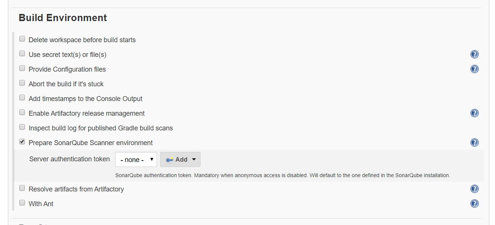

Jenkins - SonarQube Integration
===============================

**Add SonarQube Plug-in**

Go to Jenkins dashboard -\> Manage Jenkins -\> Manage Plugins -\> Available -\>
[SonarQube Scanner](https://plugins.jenkins.io/sonar)-\> Install without
restart.

**Configure SonarQube Server in Jenkins**

Manage Jenkins \> Configure System \> **SonarQube servers \>** Check : Enable
Injection & Add SonarQube

**Create a Job to Configure SonarQube integration**

-   Go to Jenkins dashboard \> New Item (Maven-SonarQube) \> Maven project.

-   Provide the repository URL (e.g.
    [github](https://github.com/shivajivarma/bus-reservation-system)) in the SCM
    section of the project configuration window.

**Build Environment** : [Tick] - Prepare SonarQube Scanner environment

**Build** : Normal maven build

**Post-build Actions** \> Add post-build action \> Select : **SonarQube analysis
with Maven**

**Save & Build Now**

it will publish results to SonarQube Server once scan complete.

Click on SonarQube link , it will navigate to Sonarqube Server ,Shows Project
Results

