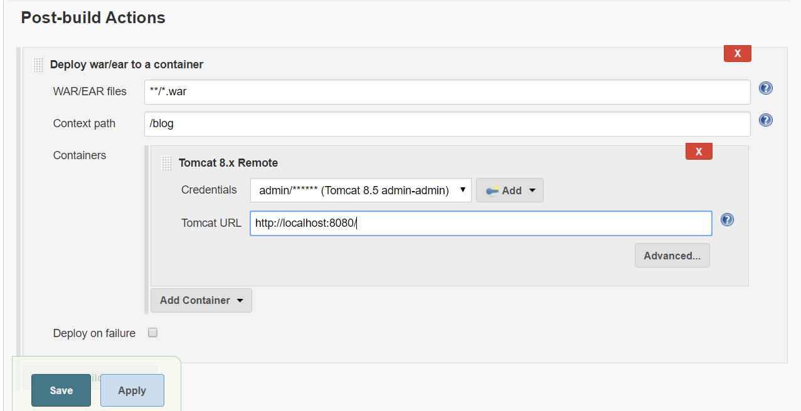
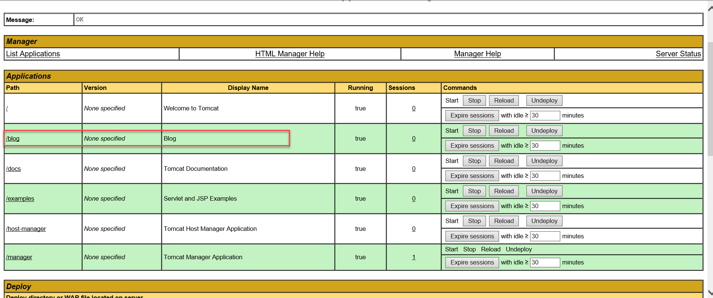
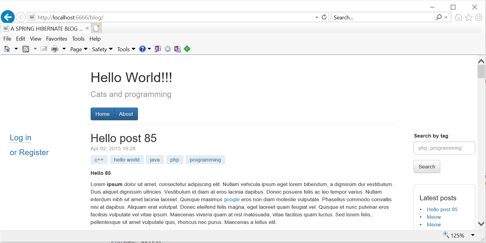

Jenkins - Automated Deployment
==============================

Transfer the build files after a successful build to the respective
application/web server. We will use **Deploy to container Plugin** to perform
this.

**\`Deploy to container\` Plugin**  
This plugin takes a war/ear file and deploys that to a running remote
application server at the end of a build.

-   Tomcat

-   JBoss

-   Glassfish

**Add Plugin : \`Deploy to container\`**  


**Configure Job**  
Add **post-build** action \> **Deploy war/ear to a container** option.


Provide Server Details.



Note : In tomact : By default the Manager is only accessible from a browser
running on the same machine as Tomcat. If you wish to modify this restriction,
you'll need to edit the Manager's context.xml file


```xml
#tomcat>/webapps/manager/META-INF/context.xml -comment the Valve:

<Context antiResourceLocking="false" privileged="true" >
    <!--
    <Valve className="org.apache.catalina.valves.RemoteAddrValve"
         allow="127\.\d+\.\d+\.\d+|::1|0:0:0:0:0:0:0:1" />
    -->
</Context>

Add role & user
- add roles "manager-script" to the user,
- Users with the manager-gui role should not be granted either the manager-script or manager-jmx roles.
```


Save & Trigger Build.  


Open Tomcat GUI: <http://localhost:6666/manager/html> see ‘\\blog’ deployed.  


Access Application by Clicking on it.  

