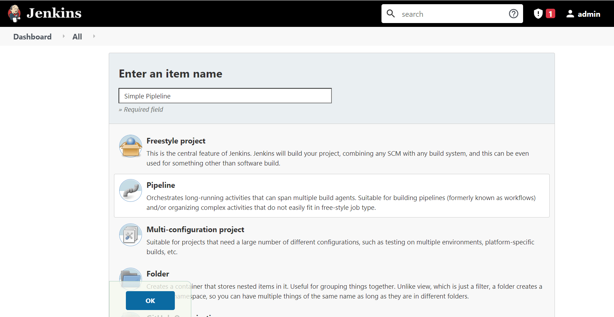

# Jenkins - Declarative Pipeline

All valid Declarative Pipelines must be enclosed within a `pipeline` block, for example:

```vbscript
pipeline {
    /* insert Declarative Pipeline here */
}
```

## Terms

**Pipeline**	The pipeline is a set of instructions given in the form of code for continuous delivery and consists of instructions needed for the entire build process. With pipeline, you can build, test, and deliver the application.

**Node**	The machine on which Jenkins runs is called a node. A node block is mainly used in scripted pipeline syntax.

**Stage**	A stage block contains a series of steps in a pipeline. That is, the build, test, and deploy processes all come together in a stage. Generally, a stage block is used to visualize the Jenkins pipeline process.

**Step**	A step is nothing but a single task that executes a specific process at a defined time. A pipeline involves a series of steps.


Pipeline contains agenst & Stages


Each Stage have a series of steps can be defined.


## Example #1 


Write below code on Pipeline step
```go
pipeline {
    agent any
    tools {
        jdk 'JDK 8'
        maven 'Maven6'
    }
    stages {
        stage('test java installation') {
            steps {
                bat 'java -version'
               
            }
        }
        stage('test maven installation') {
            steps {
               bat 'mvn -version'
                
            }
        }
    }
}
```

Build Pipeline


## Example #2 
Build Maven Project 
```go
pipeline {
    agent any

    tools {
        jdk 'JDK 8'
        maven 'Maven6'
    }

    stages {
        stage('Install') {
            steps {
                bat "mvn clean test"
            }
            post {
                always {
                    junit '**/target/*-reports/TEST-*.xml'
                }
            }
        }
    }
}
```
