Jenkins – Manage users
======================

We can manage users & their access in 3 ways

1.  Users & Role Management – Using Jenkins plugin

2.  Using LDAP

3.  Using SSO

Users & Role Management 
------------------------

By default, when you create a user in Jenkins, it can access almost everything.
In this, you can create multiple users and assign different roles and privileges
to different users. For doing that we need to install **"Role-based
Authorization Strategy** ".

**Jenkins \>Manage Jenkins\> Available tab**\>filter - search "**Role-based
Authorization Strategy**" , install the plugin.

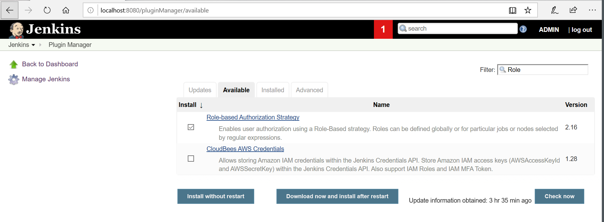

After Plugin installation, go to the **'Manage Jenkins**' and then click on
**'Configure Global Security'**.

-   Check on **Enable security** option.

-   On the Security Realm section, select **'jenkins' own user database**'.

-   On Authorization section, select **'Role-Based Strategy'**.

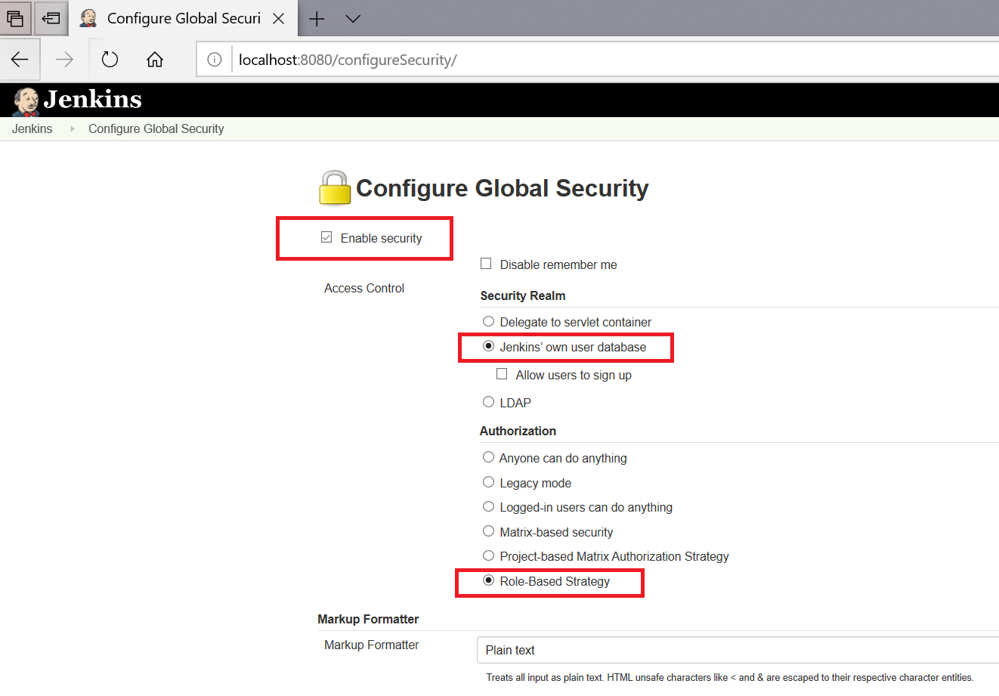

### Now add users

**Dashboard\> Manage Jenkins \> Manage Users \> Create User**

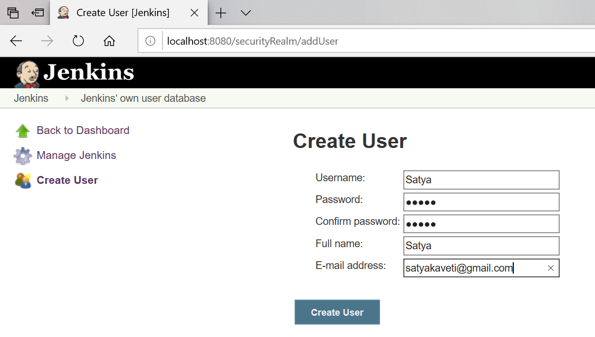

Add required no. of users

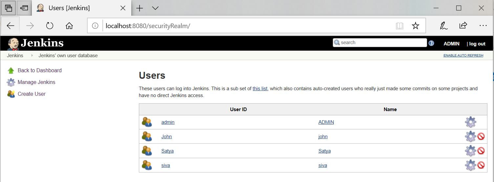

### Adding Roles

**Manage Jenkins\> Manage and Assign Roles\> Manage Roles\> Role to add** -
Provide details& Save

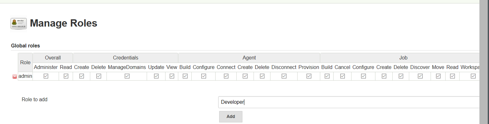

Provide Access levels for that role. Ex: only Build & configure jobs

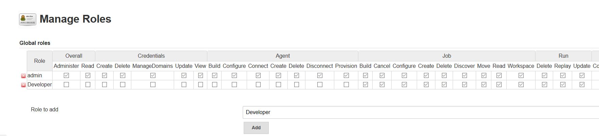

### Assign Roles to Users

Manage Jenkins\> Manage and Assign Roles\> Manage Roles\> Assign Roles

-   Add the User name on **User/group to add** option.

-   Click on **Add** button.

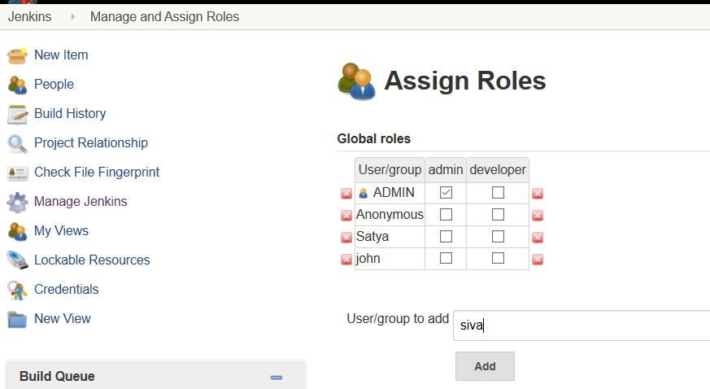

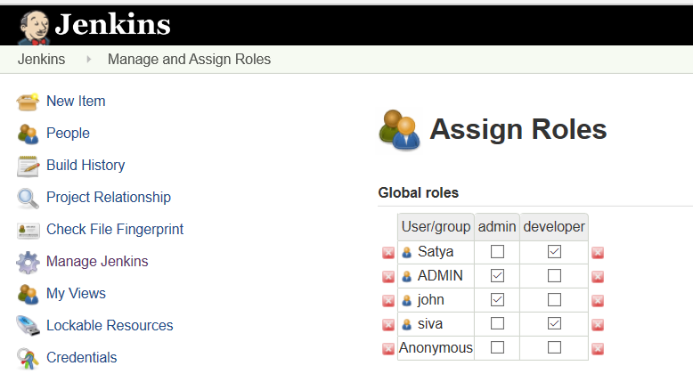

LDAP Configuration
------------------

If we configure Jenkins with LDAP Integration, it will allow users to login with
their Domain accounts, and manage permissions using the **Role Based Security
plugin**.

For doing this we need to install below two plug-ins

-   [The Active Directory
    Plugin](https://wiki.jenkins.io/display/JENKINS/Active+Directory+Plugin)**(**only
    for AD accounts integration**)**

-   [The Role-based Authorization Strategy
    Plugin](https://wiki.jenkins.io/display/JENKINS/Role+Strategy+Plugin)

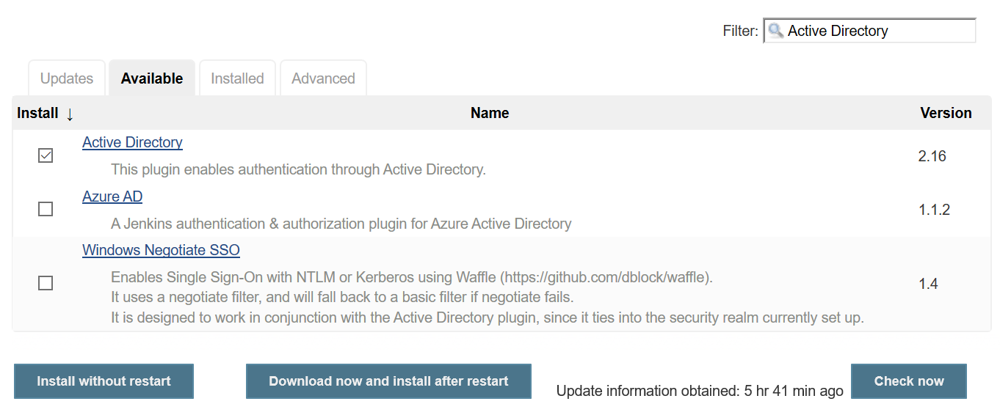

Once above plugins got install follow below steps to move forward.

**Manage Jenkins \> Configure Global Security \>**Check "Enable Security"
checkbox is ticked.

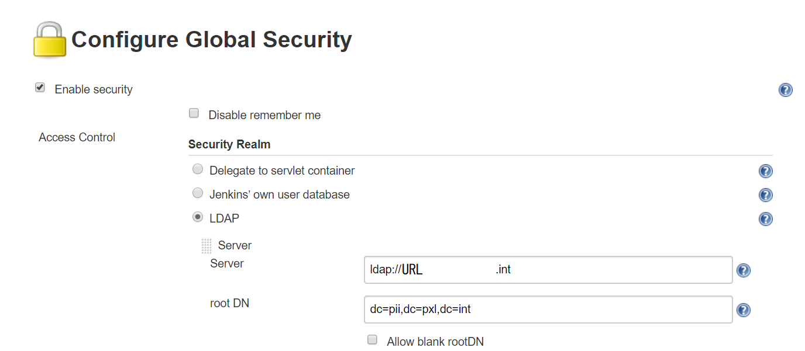

Under **Security Realm \> select LDAP** radio button

Provide required details & save

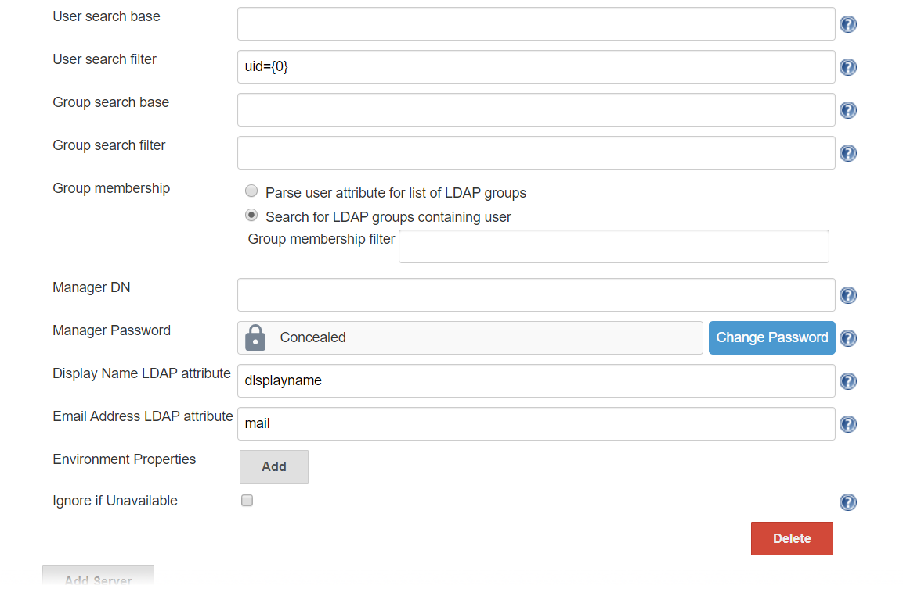

To Test the LDAP Configuration, click on Test LADP settings

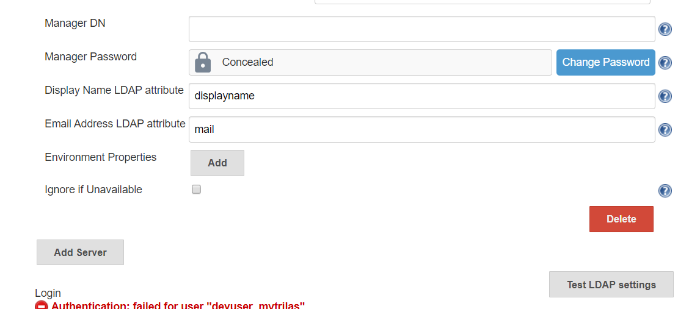

SSO Configuration
-----------------

To provide SSO Services in our environment, we do use Keycloak as the central
service. To use this in [Jenkins](http://www.jenkins.io/), we do use the OpenId
Connect Plugin.

For this to work, a new client has to be created in the Keycloak System, and a
couple of endpoints have to be configured in the Jenkins Security Settings.

**Keycloak Settings**

All Settings done in the Keycloak Server are described in this section.

**Keycloak Client**

The Keycloak client needs to get configured in the following way. The Client
needs to have a unique name (in this case 'jenkins') and the 'Access Type' needs
to get defined as 'confidential'. Please note especially the 'Valid Redirect
URIs', which needs to get set to the URL of the Jenkins System
(http://loccalhost:3000 in the screenshot).

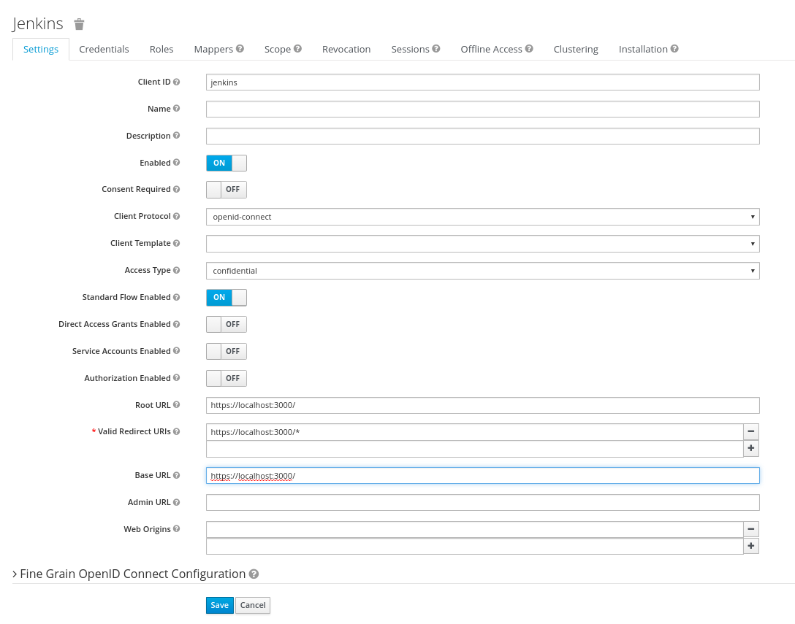

**Keycloak Credentials**

Because we have set the 'Access Type' to 'confidential' we do get offered the
Credentials Tab. On this tab, we get a secret, which needs to get put into the
corresponding Setting of the Jenkins OpenId Connect plugin. This secret allows
to initiate a secure connection between the Keycloak System and your client
application (Jenkins in this case).

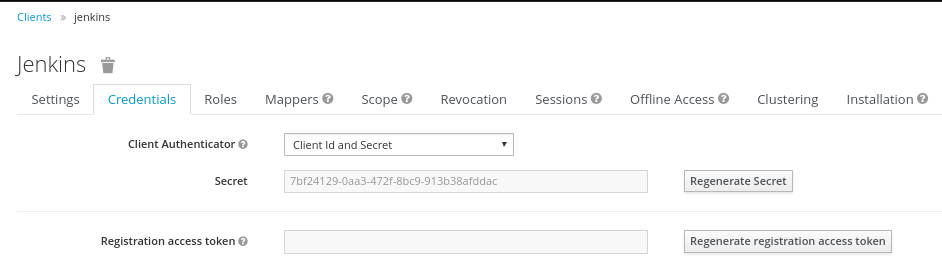

**Keycloak Mappers**

In order to provide some necessary user information to the Redmine System, the
standard Keycloak Mappers have to be adopted and a new Mapper has to get
created.

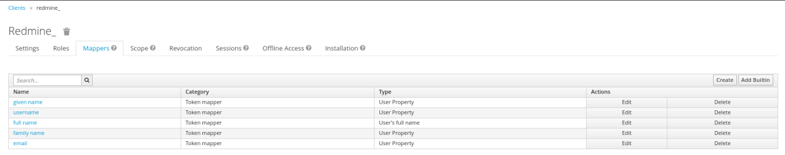

**Jenkins OpenId Connect Settings**

-   The Settings done in the OpenId Connect Plugin Settings page are described
    in here.

-   The most relevant settings are the 'Client ID', the 'Client Secret' and the
    'Urls'.

-   The 'Client ID' is the name of the client in your Keycloak System (jenkins
    in our case). By Specification, this should be a URI, but a plain name is
    working as well, and seems to be easier IMHO.

-   The 'Urls' have to be set to the Keycloak Server with the path
    /auth/realms/. Please adopt the REALMNAME (devopskube in the picture), to
    your own needs.

-   The 'Client Secret' is the secret found in the Keycloak Credentials page
    (see above), and should be copied from there.

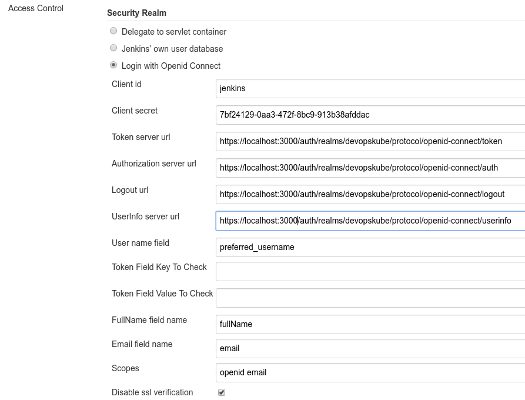
