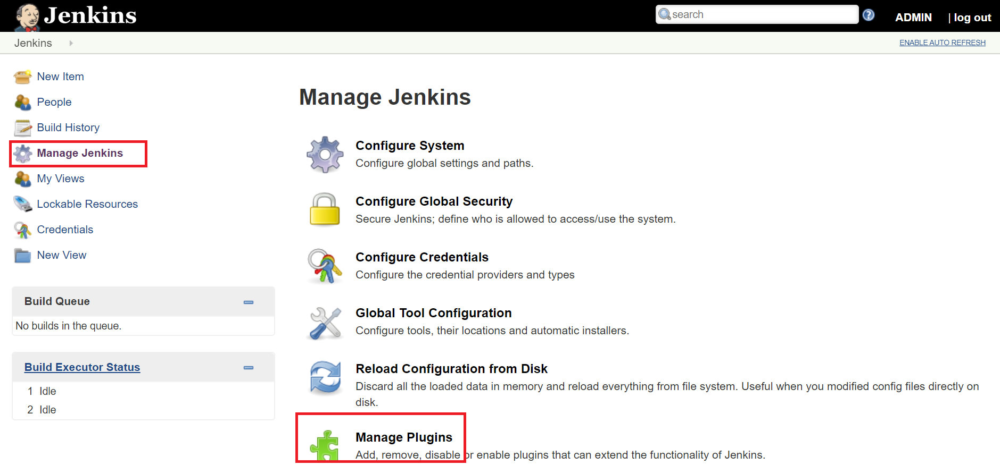
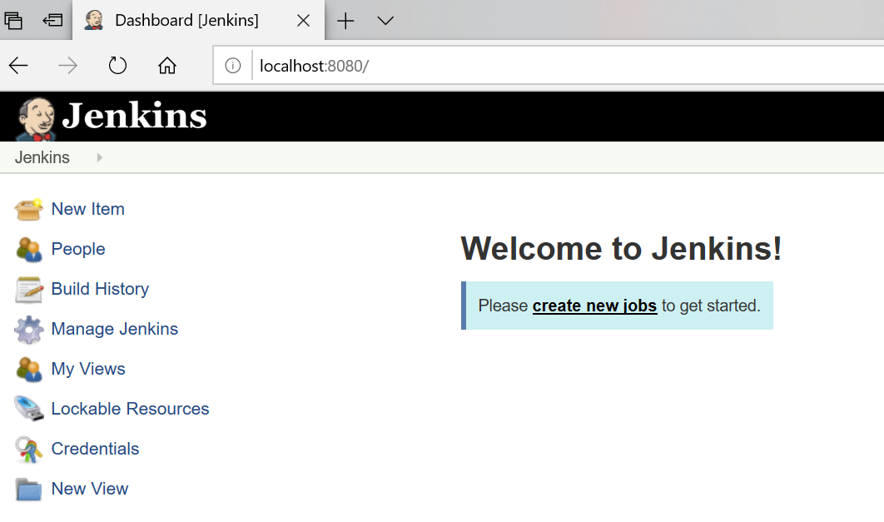
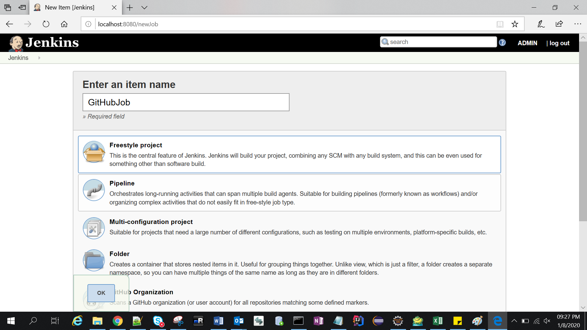
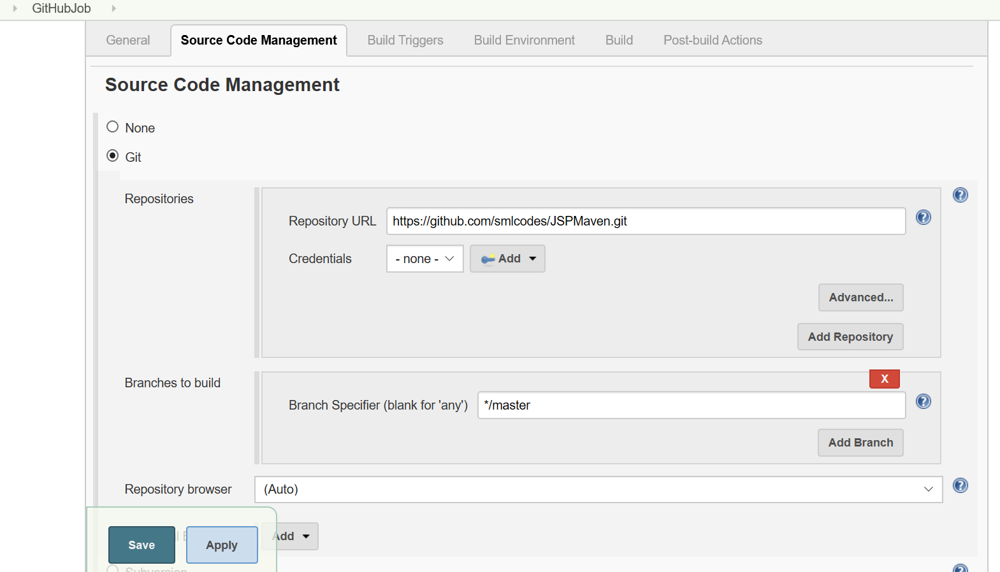
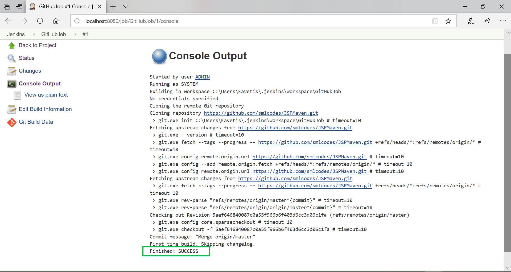

Jenkins – GitHub Integration 
=============================

Jenkins is a Continuous Integration Tool; it needs to check out source code from
a repository and build code.

### Install GitHub Plugin

Jenkins Dashboard\> Manage Jenkins\> Manage Plugins.

Next page – click on the "Available tab”. Search for "Git Plugin", Install it.
Installed plug-ins can be shown in "installed" tab.

­­

### Integrating Jenkins with GitHub

We must have Git installed in your system

Jenkins Dashboard \> Create new job

Now enter the item name and select the job type. For example, item name is
"GithubJob" and job type is "Freestyle project". Then OK

Go to -Source Code Management” Tab \> Select Git \> Provide Github Repo URL
\>Save / Apply

Example : <https://github.com/smlcodes/JSPMaven.git>

To Check Integration just Build it.

If build Success, it is integrated propetly.

