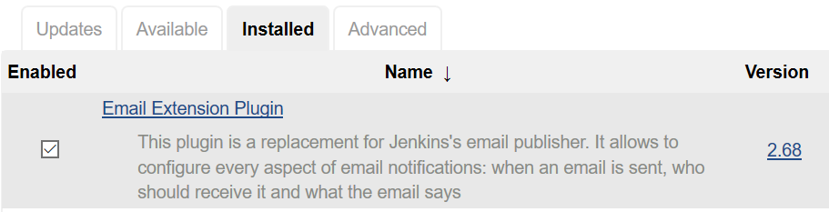
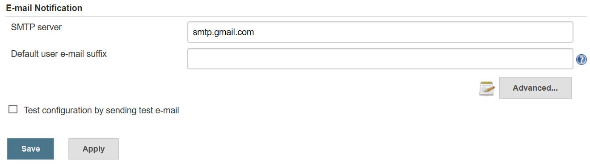
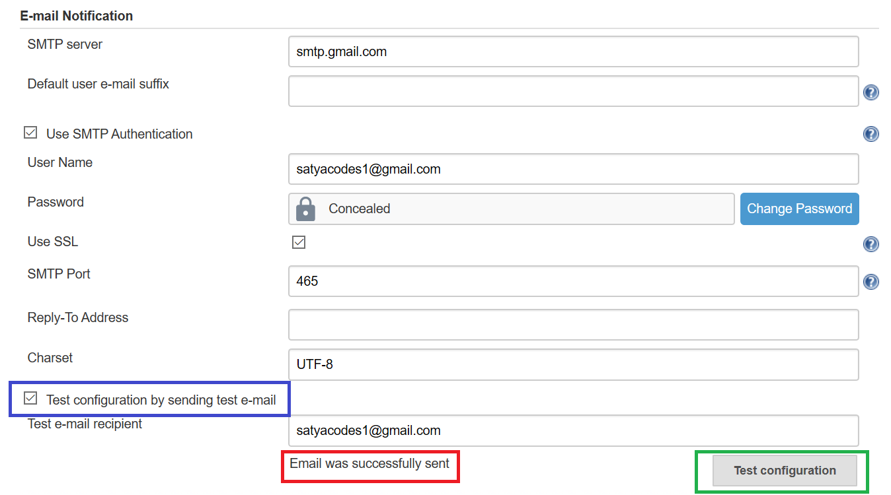
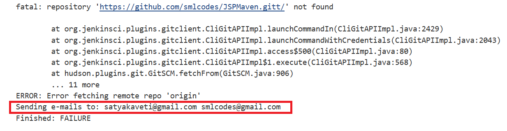
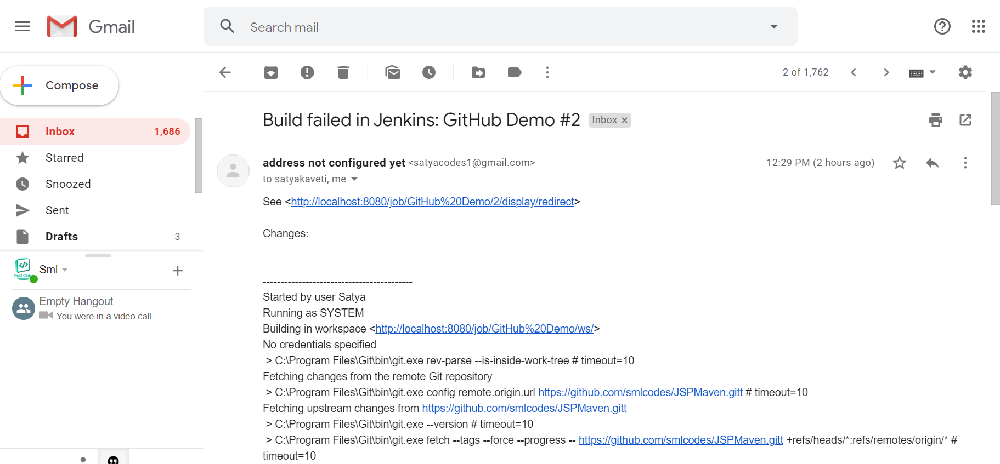

Jenkins -Email Notification
===========================

Manage Jenkins \> Manage Plugins \> install "[Email Extension
Plugin](https://plugins.jenkins.io/email-ext)" and "Email Extension template
Plugin".

**Manage Jenkins \> Configure System \> E-mail Notification**

Provide SMTP Server Details. for Example, here I’m using Gmail, for that
configure below things

Gmail SMTP server name: smtp.gmail.com

Check [ ] - **Use SMTP Authentication** & provide below details

Save & Test Email

**For any Issues, please do below things**

-   Update mailer plugin to 1.1 in Jenkins. Update jenkins to latest
    version(optional )

-   In Google Account Settings : Allow less secure app access:
    click <https://www.google.com/settings/security/lesssecureapps> and select
    Turn on.

-   Unlock captcha: click <https://accounts.google.com/DisplayUnlockCaptcha> and
    select continue

### Configure mail notification on Build failure/Success

Open already Created Job \> **configure option**.

**Post-build actions \> E-mail Notification** section. Enter the receipt email
id and select **'send e-mail for every unstable build**' option.

Try to fail the Build. See Console output & Check mentioned emails

