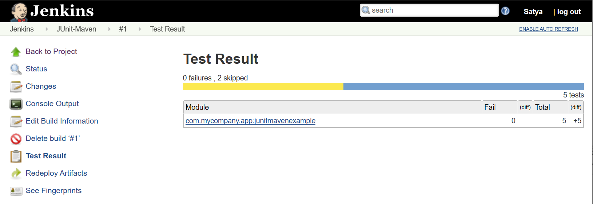

Jenkins Testing
===============

Jenkins – Junit Reporting using ANT
-----------------------------------

Create Job \> Free Style

**Build >Add Build Step> Invoke Ant** : provide below details

Next, **Post-build Step \> choose “Publish Junit test result report”**

Test report XMLs - location of reports xmls

-   For maven projects it will automatically generates the JUnit Reports.

    

-   For selenium, we need to add **“Hudson Selenium Plugin”**
