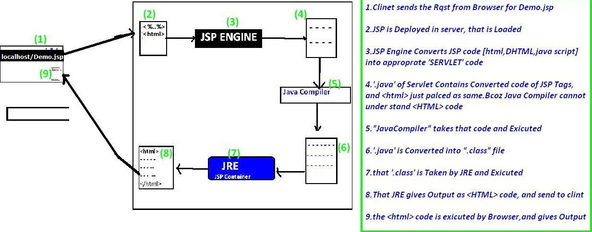
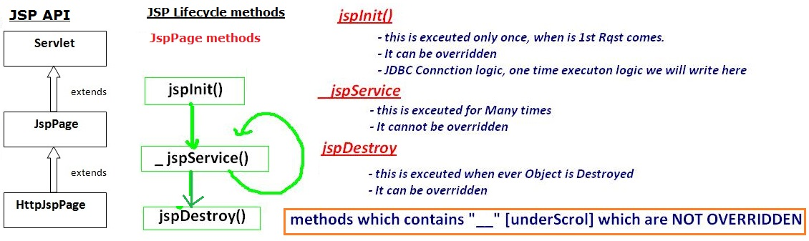

JSP Introduction
===================

**Features of JSP**

-   Extension to Servlet

-   Easy to maintain

-   Fast Development: No need to recompile and redeploy

-   Less code than Servlet

### JSP Architecure

### JSP Lifecycle

