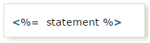

JSP Scriptlets
=================

In JSP, java code can be written inside the jsp page using the scriptlet tag

The scripting elements provides the ability to insert java code inside the jsp.
There are three types of scripting elements:


1.  **scriptlet tag**

2.  **expression tag**

3.  **declaration tag**


<br>

**1. Scriptlet tag**

A scriptlet tag is used to execute java source code in JSP. Syntax is as
follows:
```html
<% java source code %>
```


```java
<html>
<body>
	<%
 out.print("welcome to jsp");
	%>
</body>
</html>
Output: welcome to jsp
```

It is placed in **_JspService ()** method. So method declarations not possible

<br>

**2. Expression tag**

It is mainly used for **printing calculations, print the values of variable or
method**. The code placed within JSP expression tag is written to the output
stream of the response. So **you need not write out.print () to write data.**
Below is the syntax



```java
<html>
<body>
	Date:<%=java.util.Calendar.getInstance().getTime()%>
</body>
</html>
Date:Thu Sep 22 19:10:14 IST 2016
```
It is placed in **JspInit()** method.  
**: Do not end your statement with semicolon in case of expression tag.**

<br>

**3. Declaration tag**

-   The JSP declaration tag is used to **declare fields and methods.**

-   Code written inside the jsp declaration tag is placed **outside the
    service()** method

    

```java
------------------------------
Variable Declaration
------------------------------
<html>
<body>
	<%!int data = 50;%>
	<%="Value of the variable is:" + data%>
</body>
</html>


---------------------------
Method Declaration
----------------------------
<html>
<body>
<%!
	int cube(int n){  
 return n*n*n;  
	}
%>
	
<%="Cube of 3 is:" + cube(3)%>
</body>
</html
```
