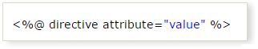
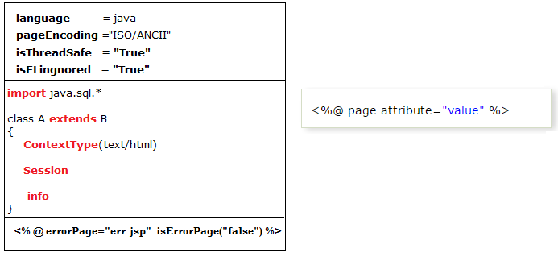
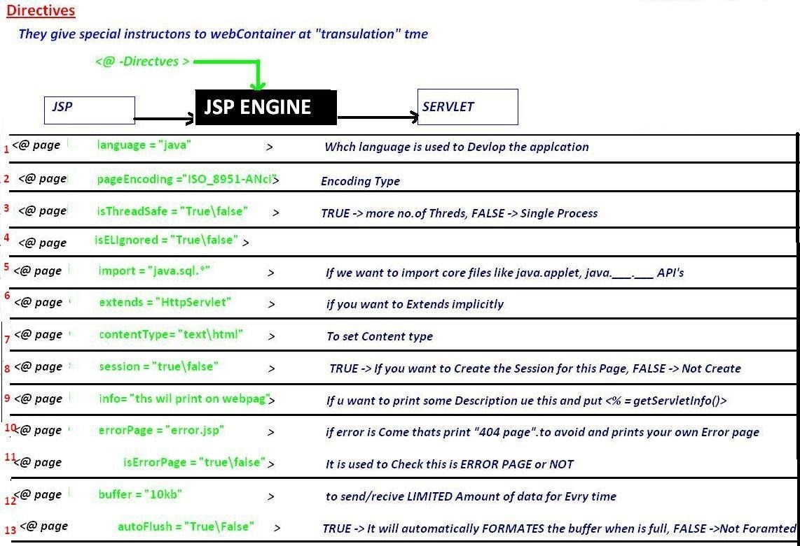
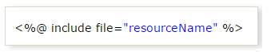
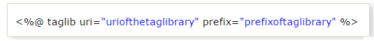

JSP Directives
=================

The jsp directives are messages that tells the web container how to translate a
JSP page into the corresponding servlet.

There are three types of directives:

1.  **page directive**

2.  **include directive**

3.  **taglib directive**

    

<br>

### 1.Page Directive





```html
<%@ page language="java" %>  
<%@ page pageEncoding="ISO-8859-1"%>  
<%@ page isELIgnored="false"%>  
<%@ page isThreadSafe="true"%>  
<%@ page errorPage="err.jsp" isErrorPage="false"%>  
<%@ page import="java.lang.*"%>  
<%@ page extends="java.lang.Object"%>  
<%@ page contentType="text/html"%>  
<%@ page session="true"%>  
<%@ page info="Some Info Print on web page"%>  
<%@ page buffer="8kb"%>  
<%@ page autoFlush="true"%>
```


### 2.include directive

The include directive is used to include the contents of any resource it may be
jsp file, html file or text file. The include directive includes the original
content of the included resource at page translation time (The jsp page is
translated only once so it will be better to include static resource).



In this example, we are including the content of the header.html file. To run
this example you must create a header.html file.
```html
<html>  
<body>  
  
<%@ include file="header.html" %>  
  
Today is: <%= java.util.Calendar.getInstance().getTime() %>  
  
</body>  
</html>  
```
The include directive includes the original content, so the actual page size
grows at runtime.

<br>

### 3.TagLib directive

-   The JSP taglib directive is used to define a tag library that defines many
    tags.

-   We use the TLD (Tag Library Descriptor) file to define the tags.

-   We can insert custom tags by using this.

    
    
```html
<html>  
<body>    
<%@ taglib uri="http://www.javatpoint.com/tags" prefix="mytag" %>    
<mytag:currentDate/>    
</body>  
</html>  
```
