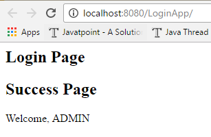

JSP Action Tags
==================

The action tags are used to control the flow between pages and to use Java Bean.
The Jsp action tags are given below.

| JSP Action Tags     | Description                                                                       |
|---------------------|-----------------------------------------------------------------------------------|
| **jsp:forward**     | Forwards the request and response to another resource.                            |
| **jsp:include**     | Includes another resource.                                                        |
| **jsp:param**       | Sets the parameter value. It is used in forward and include mostly.               |
| **jsp:useBean**     | Creates or locates bean object.                                                   |
| **jsp:setProperty** | Sets the value of property in bean object.                                        |
| **jsp:getProperty** | Prints the value of property of the bean.                                         |
| **jsp:plugin**      | Embeds another components such as applet.                                         |
| **jsp:fallback**    | Can be used to print the message if plugin is working. It is used in jsp: plugin. |


### Forward, include, param example

```html
Login.jsp
------------------------
<h2>Login Page</h2>

<jsp:include page="Success.jsp">
	<jsp:param name="uname" value="ADMIN" />
	<jsp:param name="pwd" value="admin" />
</jsp:include>


Success.jsp
------------------------
<h2>Success Page</h2>   
 Welcome, <%= request.getParameter("uname")  %>
```



Similarly we can use for <jsp:forward> also


### UserBean Example

1.First we have choose the Input values for the Login page
```html
<form action="set.jsp" method="post">
	Email <input type="text" name="email"><br>
	Pass  <input type="text" name="pwd"><br>
	<input type="submit" value="Login"><br>
</form>
```


2.We have to create UserBean class as per Input page parameters (email, pwd)
```java
public class UserBean {
	String email;
	String pwd;
	public String getEmail() {
 return email;
	}
	public void setEmail(String email) {
 this.email = email;
	}
	public String getPwd() {
 return pwd;
	}
	public void setPwd(String pwd) {
 this.pwd = pwd;
	}
}
```

3.UserBean will set the values automatically by comparing property names
```html
<jsp:useBean id="user" class="demo.UserBean">     
   <jsp:setProperty name="user" property="email"/>
    <jsp:setProperty name="user" property="pwd"/>
</jsp:useBean>

<h3>getProperty Details</h3>
<jsp:getProperty name="user" property="email" /><br>  
<jsp:getProperty name="user" property="pwd" /><br>
```

Here **name** is Object of bean class. & **propery** is the userbean property
names

Output
```dos
getProperty Details
satyajohnny1@gmail.com
qw
```


### jsp:plugin, jsp:fallbacks

The **jsp:plugin** action tag is used to embed applet in the jsp file.
```html
<jsp:plugin  height="500" width="500"  type="applet"  code="MouseDrag.class"  />
```


**jsp:fallback** action tag is used to display some message if Applet is not
loading
```html
<jsp:fallback>
<p> Unable to start plugin </p>
</jsp:fallback>
```

