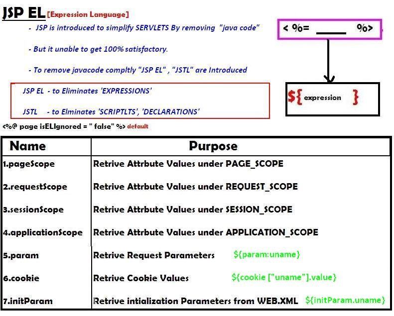
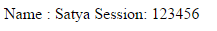

JSP EL (JSP Expression Language)
===================================



It simplifies for retrieving following types values mainly

1.  **Request Paramters req.getParamter(-")**

2.  **Init Patamter values getInitParameter(-")**

3.  **Attribute Values getAttribute(-") in 4 scopes**

4.  **Cookie values getCookie(-")**

```html
<form action="jspel.jsp" method="post">
	Name <input type="text" name="name"><br>	 
	<input type="submit" value="Login"><br>	
	<% 
	session.setAttribute("pwd", "123456");
	%>
</form>

Jspel.jsp
--
Name :    ${ param.name }
Session: ${sessionScope.pwd}
```


