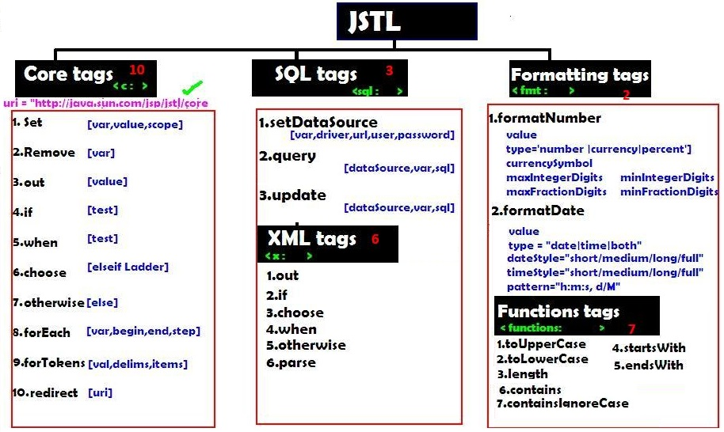

JSP Standard Tag Library (JSTL)
==================================

-   JSP Standard Tag Library (JSTL) is a standard library of readymade tags.

-   The JSTL contains several tags already implemented common functionalities.

-   JSTL is external tags it is not come by default with JDK.we have to download
    [jstl.jar](https://mvnrepository.com/artifact/javax.servlet/jstl/1.2)
    seperatly and placed in **lib/** folder

The JSTL tags can be classified, according to their functions, into following
JSTL tag library groups that can be used when creating a JSP page:

1.  **Core Tags :  used for import,if, foreach loops**

2.  **Formatting tags :  used for formatting text, Date,number,URLencoding**

3.  **SQL tags : Used for SQL operations like INSERT,SELECT., etc**

4.  **XML tags : provides support for XML processing**

5.  **JSTL Functions : provides support for string manipulation.**




## 1.core tags
we have to attach jstl/core url at the top of the jsp as below

```html
<%@ taglib uri="http://java.sun.com/jsp/jstl/core" prefix="c" %>
```


```html
<%@ taglib uri="http://java.sun.com/jsp/jstl/core" prefix="c" %>
<c:set var="salary" scope="session" value="${2000*2}"/>
Salary : <c:out value="${salary}"/>

<c:if test="${salary > 2000}">
   <p>My salary is: <c:out value="${salary}"/><p>
</c:if>
<!-- it is like if-else loop -->
<c:choose>
    <c:when test="${salary <= 0}">
       Salary is very low to survive.
    </c:when>
    <c:when test="${salary > 1000}">
        Salary is very good.
    </c:when>
    <c:otherwise>
        No comment sir...
    </c:otherwise>
</c:choose>

<!-- it is mainly used on Number prints[1,2,3,4,5]-->
<c:forEach var="i" begin="1" end="5">
   <c:out value="${i}"/><p>
</c:forEach>

<!-- it is mainly used on String-->
<c:forTokens items="Zara,nuha,roshy" delims="," var="name">
   <c:out value="${name}"/><p>
</c:forTokens>

<c:remove var="salary"/>
<br>Salary : <c:out value="${salary}"/>
```

## 2.SQL Tags
```html
<sql:setDataSource var="con" driver="com.mysql.jdbc.Driver"
     url="jdbc:mysql://localhost/TEST"
     user="root"  password="pass123"
<sql:setDataSource/>

<sql:update dataSource="${con}" var="count">
   INSERT INTO Employees VALUES (104, 2, 'Nuha', 'Ali');
</sql:update>

<sql:query dataSource="${snapshot}" var="result">
   SELECT * from Employees;
</sql:query>

<c:forEach var="row" items="${result.rows}">
	<tr>
	<td><c:out value="${row.id}"/></td>
	<td><c:out value="${row.first}"/></td>
	<td><c:out value="${row.last}"/></td>
	<td><c:out value="${row.age}"/></td>
	</tr>
</c:forEach>
```


## 3.Formatting Tags
```html
<h3> Format Number:</h3>
<c:set var="balance" value="120000.2309" />
<p>Cuurency <fmt:formatNumber value="${balance}" type="currency"/></p>
<p>Integr<fmt:formatNumber type="number" maxIntegerDigits="3" value="${balance}" />

<h3> Format Date:</h3>
<c:set var="now" value="<%=new java.util.Date()%>" />
<p>Only Time <fmt:formatDate type="time"  value="${now}" /></p>
<p>Only Date <fmt:formatDate type="date"  value="${now}" /></p>
<p>Time+Date <fmt:formatDate type="both"  value="${now}" /></p>
```


## 4.Function Tags (String Operations)
```html
<c:set var="str" value="I am a test String"/>
<c:set var="lowStr" value="${fn:toLowerCase(string1)}" />
<c:set var="uprStr" value="${fn:toUpperCase(string1)}" />
<p>Length: ${fn:length(str)}</p>
```
