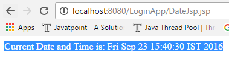

JSP Custom Tags
==================

For creating any custom tag, we need to follow following steps:

1.  **Create the Tag handler class** (.java)

2.  **Create the Tag Library Descriptor (TLD) file and define tags (.tld)**

3.  **Create the JSP file that uses the Custom tags (.JSP)**


<br>

**1.Create the Tag handler class (.java)**

-   To create the Tag Handler, we are inheriting the **TagSupport class**

-   And override **doStartTag().**

-   To write data for the jsp, we need to use the **JspWriter** class.its like
    res.getWriter()

-   **PageContext** class provides **getOut()** method that returns
    **JspWriter** instance

-   These classes are not Default with servlet-api.we have to download
    [jsp-api.jar](https://mvnrepository.com/artifact/javax.servlet.jsp/jsp-api/2.2)

```java
public class MyTag extends TagSupport{  

public int doStartTag() throws JspException 
{  
   	   JspWriter out=pageContext.getOut();//returns the instance of JspWriter  
    	   out.print(Calendar.getInstance().getTime());//printing date using JspWriter  
    	    return SKIP_BODY;//will not evaluate the body content of the tag  
}  
}
```

**2.Create the Tag Library Descriptor (TLD) file and define tags(.tld)**

**Tag Library Descriptor** (TLD) file contains information of tag and Tag Hander
classes. It must be contained inside the **WEB-INF** directory.
```xml
mytag.tld
---------------------
<?xml version="1.0" encoding="ISO-8859-1" ?>  
<!DOCTYPE taglib  
        PUBLIC "-//Sun Microsystems, Inc.//DTD JSP Tag Library 1.2//EN"  
    "http://java.sun.com/j2ee/dtd/web-jsptaglibrary_1_2.dtd">

<taglib>
	<tlib-version>1.0</tlib-version>
	<jsp-version>1.2</jsp-version>
	<short-name>simple</short-name>
	<uri>http://tomcat.apache.org/example-taglib</uri>
	<tag>
 <name>today</name>
 <tag-class>demo.MyTag</tag-class>
	</tag>
</taglib>
```


**3.Create the JSP file that uses the Custom tags (.JSP)**
```xml
DateJsp.jsp
-------------------
<%@ taglib uri="WEB-INF/mytag.tld" prefix="m" %>  
Current Date and Time is: <m:today/>
```



