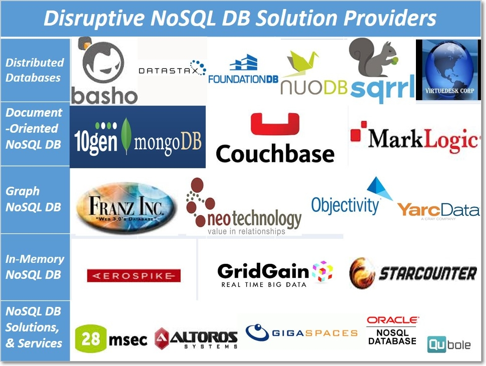

MongoDB -Introduction
======================

MongoDB is an open-source **NoSQL, Document Database** Written in **C++** that
provides high performance, high availability, and automatic scaling.

### 1.NoSQL (Not Only SQL)

It provides a mechanism for storage and retrieval of data other than tabular
relations model used in relational databases. NoSQL database doesn’t use tables
for storing data. It is generally used to store big data and real-time web
applications.

**NoSQL Database Types**

-   **Document databases:** Documents can contain many different key-value
    pairs, or key-array pairs.

-   **Graph stores:** are used to store networks of data, such as social
    connections.

-   **Key-value stores:** simplest NoSQL databases. Every single item in the
    database is stored as an attribute name (or 'key'), together with its value.

-   **Wide-column** stores such as Cassandra and HBase are optimized for queries
    over large datasets, and store columns of data together, instead of rows.



### 2.MongoDB Features & Advantages

-   **High Performance** : Indexes support faster queries

-   **Rich Query Language**: supports CRUD Operation, Data Aggregation, Text
    Search &Geospatial Queries.

-   **High Availability**: MongoDB’s replication facility, called replica set
    provide atomatic failover and Data redundancy.

-   **Horizontal Scalability**: Sharding (partitioning) distributes data across
    a cluster of machines.

### 3.MongDB Installation & Configuration

The MongoDB does not require installation, just download and extracts the zip
file, configure the data directory and start it with command **-mongod-**.

-   [Download](https://www.mongodb.org/dl/win32/x86_64-2008plus-ssl?_ga=1.58892013.1757468972.1486358241)
    MongoDB and extract into some folder, ex: **d:/mongodb**

-   Create following directories inside **d:/mongodb**

    -   **D:\\mongodb\\data**
    -   **D:\\mongodb\\log**

-   Configure Environmnet variables `MongoDB = D:\mongodb PATH=%MongoDB%\bin`

    

-   Create a mongodb config file under : 
    ```sql
    d:\mongodb\mongo.config
    ```

    ```dos
    ##store data here
    dbpath=D:\mongodb\data
    
    ##all output go here
    logpath=D:\mongodb\log\mongo.log
    
    ##log read and write operations
    diaglog=3
    ```

-   Start MongoDB using any of below commands
    ```dos
    	D:\mongodb\bin>mongod –dbpath=D:/mongodb
                    (or)
    	d:\mongodb\bin>mongod.exe --config="D:\mongodb\mongo.config"
    ```


-   Connect to MongoDB using **mongo** command

    


- once MongoDB Started, We need to create Admin User as below
```json
use admin

db.createUser(
  {
    user: "admin",
    pwd: "passw0rd",
    roles: [ { role: "userAdminAnyDatabase", db: "admin" } ]
  }
)
```

- Now, Authenticate as the user administrator.  
```powershell
mongo --port 27017 -u "admin" -p "passw0rd" --authenticationDatabase "admin"
```


<br>

### Use MongoDB as a Service

To start MongoDB Service
```dos
net start MongoDB
```
  


To stop MongoDB Service
```dos
net stop MongoDB
```
  
  

To remove MongoDB Service
```dos
c:\mongodb\bin>mongod --remove
```

