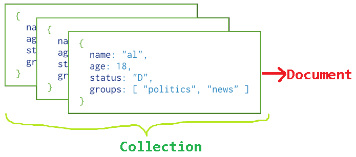

MongoDB -Operations
====================

### 1.Database – Collection – Documents

-   **Document**: is a single entry / record. i.e., **single row** in a table

-   **Collection**: Group of Documents are known as Collection. i.e., **Table**

-   **Database**: Group of Collections are known as **Database**




Database Operations
=====================
```sql
1. Show all Databases
Syntax: >show dbs
> show dbs
local     0.000GB
smlcodes  0.000GB


2. Create / Use Database
Syntax: use <database_name>
> use smlcodes
switched to db smlcodes
Here, your created database "smlcodes" is not present in the list, insert at least one document into it to display database

3. Check the currently selected database
Syntax: >db
> db
Smlcodes

4. Drop Database
Syntax: >db.dropDatabase()  
> db.dropDatabase()
{ "dropped" : "smlcodes", "ok" : 1 }
```
