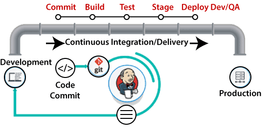
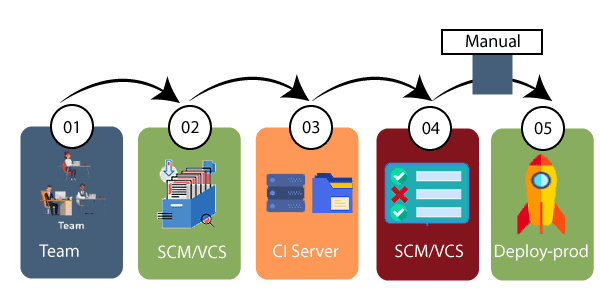
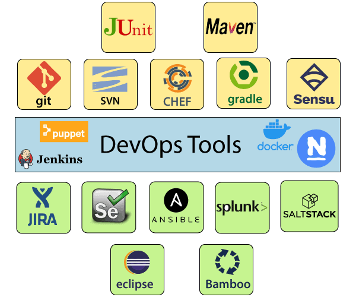

DevOps Lifecycle
----------------

<https://static.javatpoint.com/tutorial/devops/images/devops-tutorial-6.png>

**1.Continuous Development**

Involves planning and coding of the software. Developers begin developing the
code for the application.

**2.Continuous Integration**

developers require to commit changes to the source code more frequently. For
every commit is built, and **unit testing, integration testing, code review**,
and **packaging**.

Jenkins is a popular tool used in this phase. Whenever there is a change in the
Git repository, then Jenkins fetches the updated code and prepares a build of
that code, which is an executable file in the form of war or jar. Then this
build is forwarded to the test server or the production server.

**3.Continuous Testing**

Code continuously testing for bugs. For constant testing, automation testing
tools such as **TestNG, JUnit, Selenium**, etc are used.

**4.Continuous Deployment**

The new code is deployed continuously, and configuration management tools play
an essential role in executing tasks frequently and quickly. Here are some
popular tools which are used in this phase, such as **Chef, Puppet, Ansible**,
and **SaltStack.**

**5.Continuous Monitoring**

process for continuously measuring the performance of the environment and the
application.

Ex: Nagios

DevOps Tools
------------

### 1) Puppet

Puppet is the most widely used DevOps tool. It allows the delivery and release
of the technology changes quickly and frequently. It has features of versioning,
automated testing, and continuous delivery. It enables to manage entire
infrastructure as code without expanding the size of the team.

**Features**

-   Real-time context-aware reporting.

-   Model and manage the entire environment.

-   Defined and continually enforce infrastructure.

-   Desired state conflict detection and remediation.

-   It inspects and reports on packages running across the infrastructure.

-   It eliminates manual work for the software delivery process.

-   It helps the developer to deliver great software quickly.

### 2) Ansible

Ansible is a leading DevOps tool. Ansible is an open-source IT engine that
automates application deployment, cloud provisioning, intra service
orchestration, and other IT tools. It makes it easier for DevOps teams to scale
automation and speed up productivity.

Ansible is easy to deploy because it does not use
any **agents** or **custom** **security** infrastructure on the client-side, and
by pushing modules to the clients. These modules are executed locally on the
client-side, and the output is pushed back to the Ansible server.

**Features**

-   It is easy to use to open source deploy applications.

-   It helps in avoiding complexity in the software development process.

-   It eliminates repetitive tasks.

-   It manages complex deployments and speeds up the development process.

### 3) Docker

Docker is a high-end DevOps tool that allows building, ship, and run distributed
applications on multiple systems. It also helps to assemble the apps quickly
from the components, and it is typically suitable for container management.

**Features**

-   It configures the system more comfortable and faster.

-   It increases productivity.

-   It provides containers that are used to run the application in an isolated
    environment.

-   It routes the incoming request for published ports on available nodes to an
    active container. This feature enables the connection even if there is no
    task running on the node.

-   It allows saving secrets into the swarm itself.

### 4) Nagios

Nagios is one of the more useful tools for DevOps. It can determine the errors
and rectify them with the help of network, infrastructure, server, and log
monitoring systems.

**Features**

-   It provides complete monitoring of desktop and server operating systems.

-   The network analyzer helps to identify bottlenecks and optimize bandwidth
    utilization.

-   It helps to monitor components such as services, application, OS, and
    network protocol.

-   It also provides to complete monitoring of Java Management Extensions.

### 5) CHEF

A chef is a useful tool for achieving scale, speed, and consistency. The chef is
a cloud-based system and open source technology. This technology uses Ruby
encoding to develop essential building blocks such as recipes and cookbooks. The
chef is used in infrastructure automation and helps in reducing manual and
repetitive tasks for infrastructure management.

Chef has got its convention for different building blocks, which are required to
manage and automate infrastructure.

**Features**

-   It maintains high availability.

-   It can manage multiple cloud environments.

-   It uses popular Ruby language to create a domain-specific language.

-   The chef does not make any assumptions about the current status of the node.
    It uses its mechanism to get the current state of the machine.

### 6) Jenkins

Jenkins is a DevOps tool for monitoring the execution of repeated tasks. Jenkins
is a software that allows continuous integration. Jenkins will be installed on a
server where the central build will take place. It helps to integrate project
changes more efficiently by finding the issues quickly.

**Features**

-   Jenkins increases the scale of automation.

-   It can easily set up and configure via a web interface.

-   It can distribute the tasks across multiple machines, thereby increasing
    concurrency.

-   It supports continuous integration and continuous delivery.

-   It offers 400 plugins to support the building and testing any project
    virtually.

-   It requires little maintenance and has a built-in GUI tool for easy updates.

### 7) Git

Git is an open-source distributed version control system that is freely
available for everyone. It is designed to handle minor to major projects with
speed and efficiency. It is developed to co-ordinate the work among programmers.
The version control allows you to track and work together with your team members
at the same workspace. It is used as a critical distributed version-control for
the DevOps tool.

**Features**

-   It is a free open source tool.

-   It allows distributed development.

-   It supports the pull request.

-   It enables a faster release cycle.

-   Git is very scalable.

-   It is very secure and completes the tasks very fast.

### 8) SALTSTACK

Stackify is a lightweight DevOps tool. It shows real-time error queries, logs,
and more directly into the workstation. SALTSTACK is an ideal solution for
intelligent orchestration for the software-defined data center.

**Features**

-   It eliminates messy configuration or data changes.

-   It can trace detail of all the types of the web request.

-   It allows us to find and fix the bugs before production.

-   It provides secure access and configures image caches.

-   It secures multi-tenancy with granular role-based access control.

-   Flexible image management with a private registry to store and manage
    images.

### 9) Splunk

Splunk is a tool to make machine data usable, accessible, and valuable to
everyone. It delivers operational intelligence to DevOps teams. It helps
companies to be more secure, productive, and competitive.

**Features**

-   It has the next-generation monitoring and analytics solution.

-   It delivers a single, unified view of different IT services.

-   Extend the Splunk platform with purpose-built solutions for security.

-   Data drive analytics with actionable insight.

### 10) Selenium

Selenium is a portable software testing framework for web applications. It
provides an easy interface for developing automated tests.

-   **Features**

-   It is a free open source tool.

-   It supports multiplatform for testing, such as Android and ios.

-   It is easy to build a keyword-driven framework for a WebDriver.

-   It creates robust browser-based regression automation suites and tests.

Introduction
============

### What Is Continuous Integration.

Developers will push their code several times in a day to a central repository,
every time there is code change it should be pulled, built, tested and notify to
the user. **No deployment involved here**
