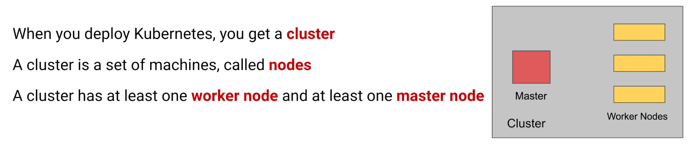
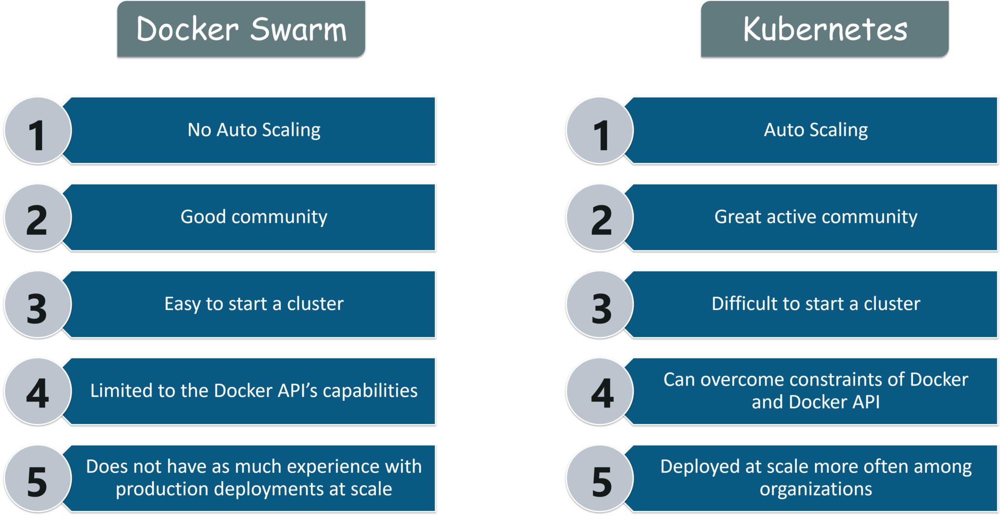
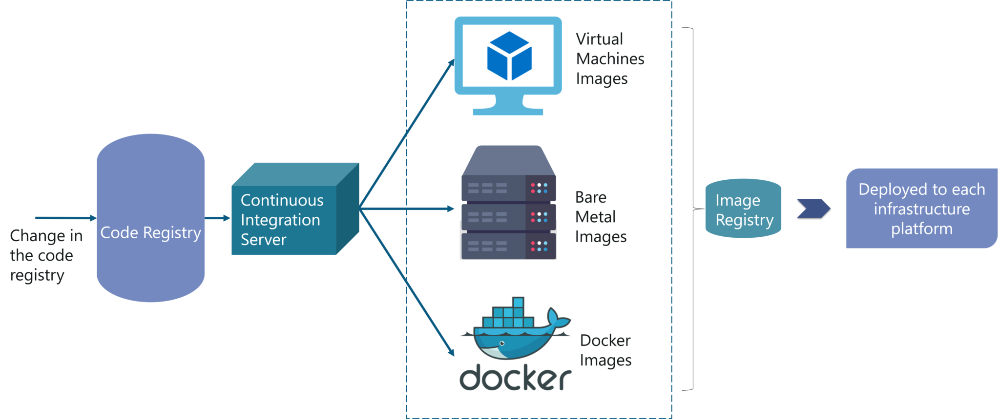
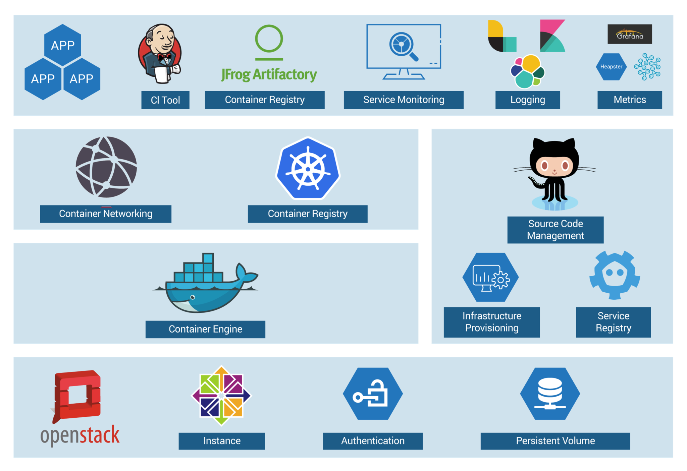
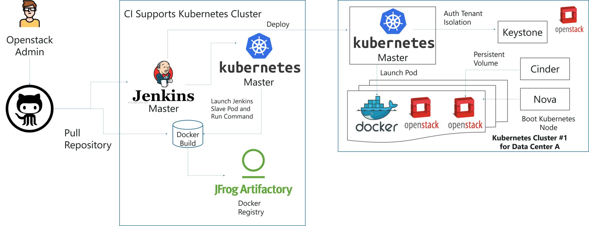
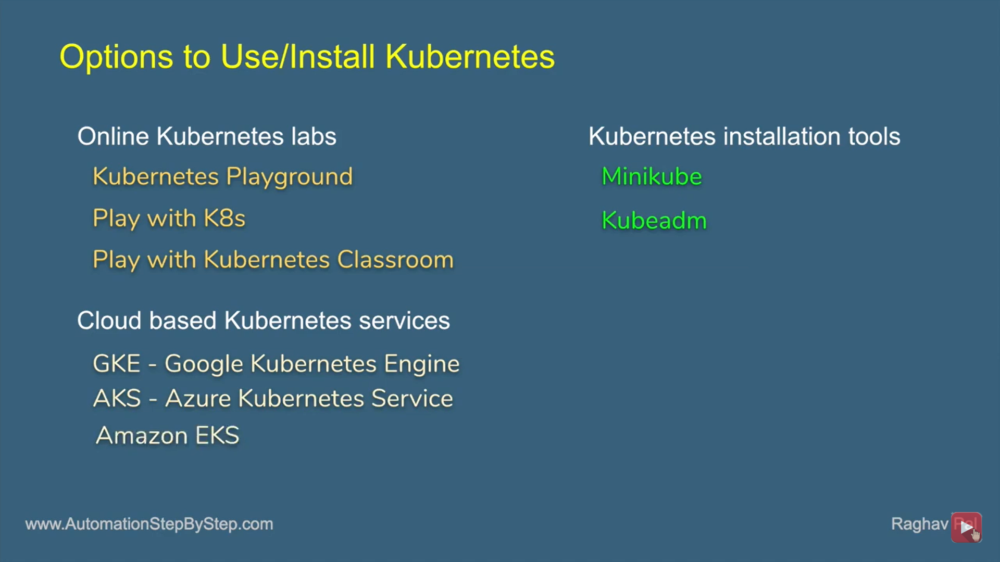

Introduction
============

Kubernetes is an open-source container management (orchestration) tool. It’s
container management responsibilities include container deployment, scaling &
descaling of containers & container load balancing.

-   Kubernetes is an open-source system for automating deployment, scaling, and
    management of containerized applications.

-   Kubernetes is originally developed by Google; it is open sourced since its
    launch and managed by a large community of contributors

-   Kubernetes (commonly referred to as K8s) is an orchestration engine for
    container technologies such as Docker and rkt that is taking over the DevOps
    scene in the last couple of years. It is already available on Azure and
    Google Cloud as a managed service.

-   Kubernetes can speed up the development process by making easy, automated
    deployments, updates (rolling-update) and by managing our apps and services
    with almost zero downtime.

-   It also provides self-healing. Kubernetes can detect and restart services
    when a process crashes inside the container.

## Before Kubernetes

before containers came into existence, the developersand the testers always had
a tiff between them. This usually, happened because what worked on the dev side,
would not work on the testing side. Both of them existed in different
environments. Now, to avoid such scenarioscontainers were introduced so that
both the Developers and Testers were on the same page.

Handling a large number of containers all together was also a problem. Sometimes
while running containers, on the product side, few issues were raised, which
were not present at the development stage. This kind of scenarios introduced the
Container Orchestration System.

**Challenges Without Container Orchestration**

## Why Kubernetes

If your application is in Container form, then we won’t use only 1 or 2
containers in Prod. But rather,**10’s or 100’s**of containers for load
balancing the traffic and ensuring high availability.

Keep in mind that, as the traffic increases, they even have to scale up the
number of containers to service the ‘n’ no of requests that come in every
second. And, they have to also scale down the containers when the demand is
less.

That is why, the need for container management tools is imminent. Both**Docker
Swarm**and**Kubernetes**are popular tools for Container management and
orchestration.

Features
--------

**1. Automatic Binpacking**  
Kubernetes automatically packages your application and schedules the containers
based on their requirements and available resources while not sacrificing
availability. To ensure complete utilization and save unused resources,
Kubernetes balances between critical and best-effort workloads.

**2. Service Discovery & Load balancing**  
With Kubernetes, there is no need to worry about networking and communication
because Kubernetes will automatically assign IP addresses to containers and a
single DNS name for a set of containers, that can load-balance traffic inside
the cluster.

**3. Storage Orchestration**  
With Kubernetes, you can mount the storage system of your choice. You can either
opt for local storage, or choose a public cloud provider such as GCP or AWS, or
perhaps use a shared network storage system such as NFS, iSCSI, etc.

**4. Self-Healing**  
Personally, this is my favorite feature. Kubernetes can automatically restart
containers that fail during execution and kills those containers that don’t
respond to user-defined health checks. But if nodes itself die, then it replaces
and reschedules those failed containers on other available nodes.

**5. Secret & Configuration Management**  
Kubernetes can help you deploy and update secrets and application configuration
without rebuilding your image and without exposing secrets in your stack
configuration.

**6.Batch Execution**  
In addition to managing services, Kubernetes can also manage your batch and CI
workloads, thus replacing containers that fail, if desired.

**7. Horizontal Scaling**  
Kubernetes needs only 1 command to scale up the containers, or to scale them
down when using the CLI. Else, scaling can also be done via the Dashboard
(kubernetes UI).

**8. Automatic Rollbacks & Rollouts**  
Kubernetes progressively rolls out changes and updates to your application or
its configuration, by ensuring that not all instances are worked at the same
instance. Even if something goes wrong, Kubernetes will rollback the change for
you.

# Architecture 

Kubernetes Architecture has the 3 main components

-   Master nodes

-   Worker/Slave nodes

-   Distributed key-value store(etcd.)

###### Kubernetes Cluster

Kubernetes Cluster is primarily made up of following components

-   Master

    -   Kube API Server

    -   Control Plane (kube-scheduler + kube-controller-manager +
        Cloud-controller Manager)

    -   Etcd

-   Node

    -   Kubelet

    -   Kube-proxy

    -   Container Runtime

-   Addons

    -   DNS

    -   WebUI

    -   Container Resource Monitoring

    -   Cluster Level Logging

###### Master Node

It is the entry point for all administrative tasks which is responsible for
managing the Kubernetes cluster. There can be more than one master node. If more
than one master node, one master node acts as a main master node other node will
just follows.

-   The main machine that controls the nodes

-   Main entry point for all administrative tasks

-   It handles the orchestration of the worker nodes

**API server**

-   Performs all the administrative tasks through the API server within the
    master node.

-   In this REST commands are sent to the API server which validates and
    processes the requests.

-   After requesting, the resulting state of the cluster is stored in the
    distributed key-value store.

**Scheduler**

-   The scheduler schedules the tasks to slave nodes. It stores the resource
    usage information for each slave node.

-   It schedules the work in the form of Pods and Services.

**Controller manager**

-   Basically, a controller watches thedesired state of the objects it
    managesand watches their current state through the API server.

-   If the current state of the objects it manages does not meet the desired
    state, then the control loop takes corrective steps to make sure that the
    current state is the same as the desired state

**ETCD**

-   etcd is a distributed key-value store which stores the cluster state.

-   It can be part of the Kubernetes Master, or, it can be configured
    externally.

-   itis also used to store configuration details such as subnets, ConfigMaps,
    Secrets, etc.

###### Worker Node

It is a physical server or you can say a VM which runs the applications using
Pods (**a pod scheduling unit**) which iscontrolled by the master node. On a
physical server (worker/slave node), pods are scheduled. For
accessingtheapplications from the external world, we connect to nodes.

-   It is a worker machine in Kubernetes (used to be known as minion)

-   This machine performs the requested tasks. Each Node is controlled by the
    Master Node

-   Runs containers inside pods

-   This is where the Docker engine runs and takes care of downloading images
    and starting containers

**Container runtime**

-   To run and manage a container’s lifecycle, we need a**container
    runtime**on the worker node.

-   Sometimes,Dockerisalso referred to as a container runtime, but to be
    precise, Docker is a platform which uses**containers**as a container
    runtime.

**Kubelet**

-   It is an agent which communicates with the Master node and executes on nodes
    or the worker nodes. It gets the Pod specifications through the API server
    and executes the containers associated with the Pod andensures that the
    containers described in those Pod are running and healthy.

**Kube-proxy**

-   Kube-proxy runs on each node to deal with individual host sub-netting and
    ensure that the services are available to external parties.

-   It serves as a network proxy and a load balancer for a service on a single
    worker node and manages the network routing for TCP and UDP packets.

-   It is the network proxy which runs on each worker node and listens to the
    API server for each Service endpoint creation/deletion.

-   For each Service endpoint, kube-proxy sets up the routes so that it can
    reach to it.

**Pods**

-   A pod is one or more containers that logically go together. Pods run on
    nodes. Pods run together as a logical unit. So they have the same shared
    content.

-   They all share the same IP address but can reach other Pods via localhost,
    as well as shared storage. Pods don’t need to all run on the same machine as
    containers can span more than one machine. One node can run multiple pods.

Kubernetes vs Docker Swarm
--------------------------

**Kubernetes**and**Docker Swarm**are leading container orchestration tools in
today’s market.

Use Case
--------

**Use Case How Luminis Technologiesused Kubernetes in production**

**Problem**Luminis, a software technology companyused AWS for deploying their
applications. For deploying the applications, it required custom scripts and
tools to automate which was not easyfor teams other than operations.
Theirsmall teams didn’t have the resources to learn all of the details about
the scripts and tools.

**Main Issue**There was no**unit-of-deployment**which created a gap between
the development and the operations teams.

**Solution**

**How did they Deploy in Kubernetes**

They used a[blue-green
deployment](https//martinfowler.com/bliki/BlueGreenDeployment.html)mechanism
toreduce the complexity of handling multiple concurrent versions. (As there’s
always only one version of the application running in the background)

In this, a component called -**Deployer**” that orchestrated the deployment was
created by their team by open sourcing theirimplementation under the Apache
License as part of theAmdatuumbrella project.This mechanism performed the
health checking on the pods before re-configuring the load balancer because they
wanted each component that was deployed to provide a health check.

**How did they AutomateDeployments?**

With the**Deployer**in place,they were able to engage up deployments to a
build pipeline.After a successful build, their build server pushed a new
Docker image to a registry on Docker Hub. Then the build server invoked
the**Deployer**to automatically deploy the new version to a test environment.
That same image was promoted to production by triggering the**Deployer**on the
production environment.

Use case -2
-----------

**Kubernetes Case-Study**

-   **Yahoo!JAPAN**is a web services provider headquartered in Sunnyvale,
    California. As the company aimed to virtualize the hardware, companystarted
    using**OpenStack**in 2012. Their internal environment changed very
    quickly. However, due to the progress of cloud and container technology, the
    company wanted the capability to launch services on various platforms.

-   **Problem**How to create images for all required platforms from one
    application code, and deploy those images onto each platform?

-   For your better understanding, refer to the below image. When the code is
    changed at the code registry, then bare metal images, Docker containers, and
    VM images are created by continuous integration tools, pushed into the image
    registry, and then deployed to each infrastructure platform.

-   Now, let us focus on container workflow to understand how they used
    Kubernetes as a deployment platform. Refer to the below image to sneak peek
    into platform architecture.

## Solution of Case Study - Kubernetes Tutorial - Edureka

-   OpenStack instances are used, with Docker, Kubernetes, Calico, etcd on top
    of it to perform various operations like Container Networking, Container
    Registry, and so on.

**DevOps Training**

-   When you have a number of clusters, then it becomes hard to manage them
    right?

-   So, they just wanted to create a simple, base OpenStack cluster to provide
    the basic functionality needed for Kubernetes and make the OpenStack
    environment easier to manage.

-   By the combination of Image creation workflow and Kubernetes, they built the
    below toolchain which makes it easy from code push to deployment.

>   Solution of Case Study - Kubernetes Tutorial - Edureka

>     
>   This kind of toolchain made sure that all factors for production deployment
>   such as multi-tenancy, authentication, storage, networking, service
>   discoverywere considered.

-   That’s how folks,**Yahoo! JAPAN**built an automation toolchain for
    -one-click” code deployment to Kubernetes running on OpenStack, with help
    from**Google**and**Solinea**.

Installation
------------

Ref.
====

<http//dockerlabs.collabnix.com/>

<https//collabnix.github.io/kubelabs/>
