Puppet – Introduction
=====================

Puppet is a Configuration Management tool that is used for deploying,
configuring and managing servers. It performs the following functions:

-   Defining distinct configurations for each and every host, and continuously
    checking and confirming whether the required configuration is in place and
    is not altered (if altered Puppet will revert back to the required
    configuration) on the host.

-   Dynamic scaling-up and scaling-down of machines.

-   Providing control over all your configured machines, so a centralized
    (master-server or repo-based) change gets propagated to all, automatically.

Puppet Introduction
-------------------

Puppet comes in two varieties, Puppet Enterprise and open source Puppet. It runs
on most Linux distributions, various UNIX platforms, and Windows.

**Puppet master(Puppet Server)** server—which runs the Puppet Server
software—can be used to control all your other servers, or **Puppet
agent** nodes.

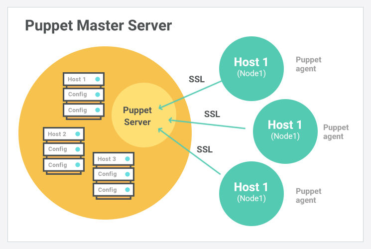

Puppet will always check the configuration from remote for every 30 minutes , if
any changes it will automatically update those.

### **The Puppet Environment** 

-   **Puppet Labs**- The Company behind Puppet

-   **Puppet**- The Opensource version

-   **Puppet Enterprise** - The commercial version

-   **Puppet Documentation** - Main and Official reference

-   **The Community** - Forums, User groups etc.

-   Puppet Modules on: Module Forge and GitHub

Architecture of Puppet
----------------------

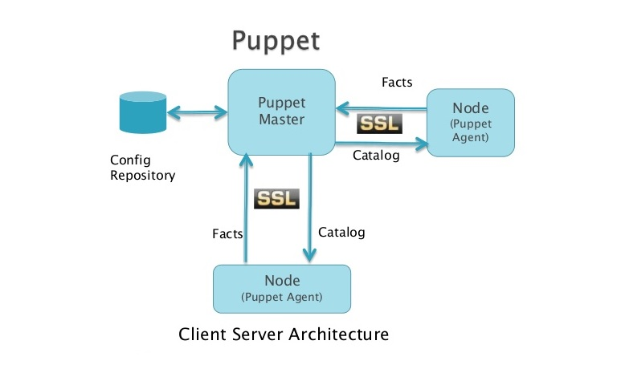

**Puppet Master**

Puppet Master is the key mechanism which handles all the configuration related
stuff. It applies the configuration to nodes using the Puppet agent.

**Puppet Agent**

Puppet Agents are the actual working machines which are managed by the Puppet
master. They have the Puppet agent daemon service running inside them.

**Config Repository**

This is the repo where all nodes and server-related configurations are saved and
pulled when required.

**Facts**

**Facts** are the details related to the node or the master machine, which are
basically used for analyzing the current status of any node. On the basis of
facts, changes are done on any target machine. There are pre-defined and custom
facts in Puppet.

**Catalog**

All the manifest files or configuration which are written in Puppet are first
converted to a compiled format called catalog and later those catalogs are
applied on the target machine.

How it Works

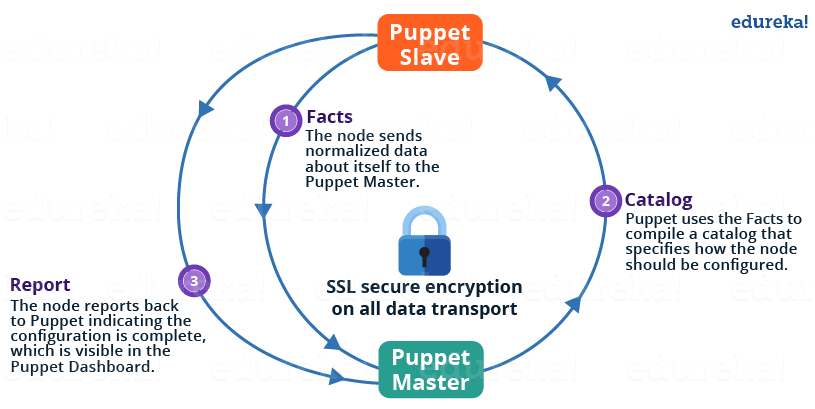

The following functions are performed in the above image:

-   The Puppet Agent sends the Facts to the Puppet Master. Facts are
    basically key/value data pair that represents some aspect of Slave state,
    such as its IP address, up-time, operating system, or whether it’s a virtual
    machine. I will explain Facts in detail later in the blog.

-   Puppet Master uses the facts to compile a Catalog that defines how the
    Slave should be configured. Catalog is a document that describes the desired
    state for each resource that Puppet Master manages on a Slave. I will
    explain catalogs and resources in detail later.

-   Puppet Slave reports back to Master indicating that Configuration is
    complete, which is visible in the Puppet dashboard.

Puppet Master and Slave Communication
-------------------------------------

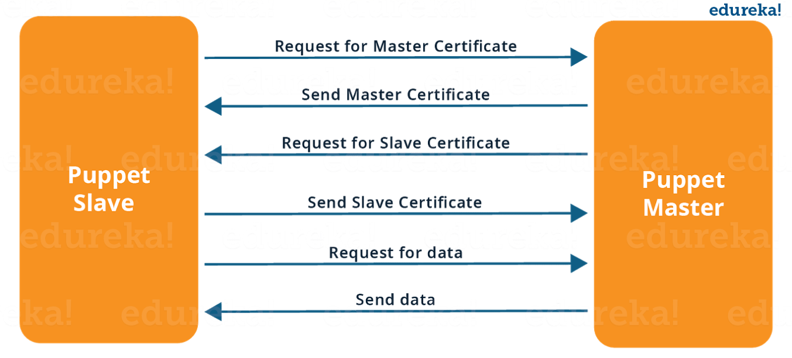

As you can see from the above Image:

-   Puppet Slave asks for Puppet Master certificate.

-   After receiving Puppet Master certificate, Master requests for Slave
    certificate.

-   Once Master has signed the Slave certificate, Slave requests for
    configuration/data.

-   Finally, Puppet Master will send the configuration to Puppet Slave.

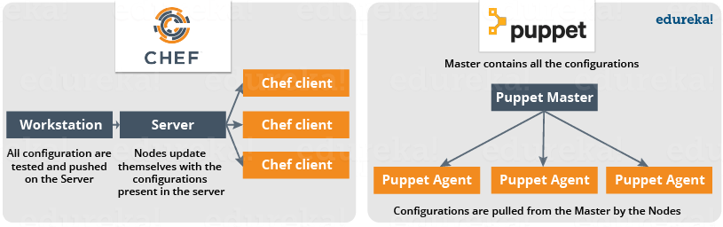

-   Puppet is used as either a local system command line tool or in a
    client-server relationship

-   Server acts as the **Puppet master** and applies configuration to multiple
    client systems using a **Puppet agent**

-   This provides a way to automatically configure newly provisioned systems,
    either individually or simultaneously to create a specific infrastructure

Puppet Terminology
------------------

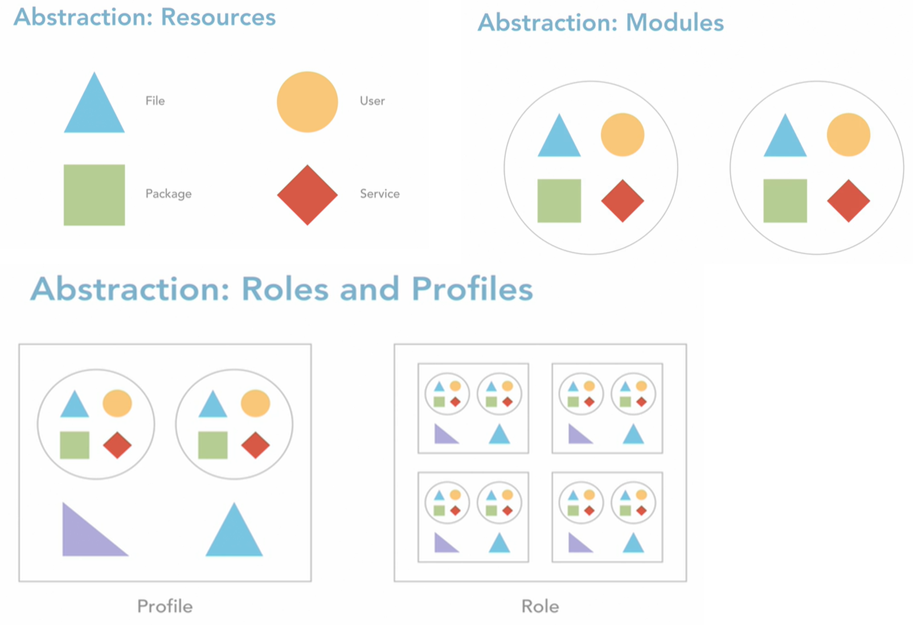

**Resources**

-   File

-   User

-   Service

-   Package

**Modules**

Group of Resources are called Modules

**Profiles**

Group of Modules are called as Profiles.

**Roles**

Group of Profiles are called as Roles

### Resources 

Puppet code is primarily composed of resource declarations

A resource describes about the state of the system, e.g. a certain user or file
should exist, or a package should be installed

Resource declarations can be formatted as follows:
```powershell
resource_type 
{
 'resource_name' 
 attribute => value 
 ...
}
```

Example for Resource declaration :
```powershell
user
{
 'mitchell':
  ensure => present,
  uid => '1000',
  gid => '1000',
  shell => '/bin/bash',
  home => '/home/mitchell' 
}
```
This resource declaration describes a user resource named 'mitchell', with the
specified attributes

To list all of the default resource types that are available to Puppet, enter
the following command:
```powershell
puppet resource --types
```


### Manifests

Puppet programs are called manifests. Manifests are composed of puppet code and
their filenames use the .pp extension

The default main manifest in Puppet installed via apt is :
```powershell
/etc/puppet/manifests/site.pp.
```


### Class

In Puppet, classes are code blocks that can be called in a code elsewhere. Using
classes allows you to reuse Puppet code, and can make reading manifests easier

Class Definition
```powershell
class example_class
{

    ...

    code

    ...

}
```


Class declaration occurs when a class is called in a manifest .A class
declaration tells Puppet to evaluate the code within the class .

Class declarations come in two different flavors: normal and resource-like

**A normal class declaration** occurs when the include keyword is used in Puppet
code, like:  
`include example_class`

**A resource-like** class declaration occurs when a class is declared like a
resource, like:  
`class { 'example_class': }`

### Modules

-   A module is a collection of manifests and data (such as facts, files, and
    templates), and they have a specific directory structure

-   Modules are useful for organizing your Puppet code, because they allow you
    to split your code into multiple manifests

-   It is considered best practice to use modules to organize almost all of your
    Puppet manifests

-   To add a module to Puppet, place it in the **/etc/puppet/modules directory**

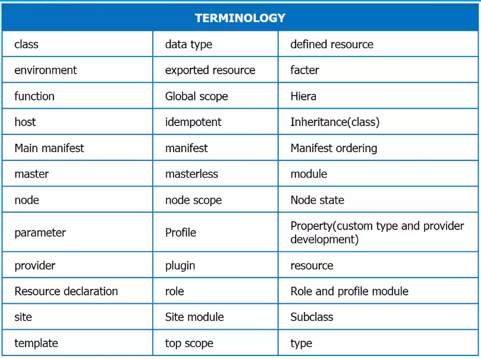

**Node**  
A node is an individual server or device managed by Puppet.

**Resources**  
Resources are individual units of configuration in Puppet.

-   **Built-in resource types** include things like files and system users.

-   **Custom resource types** that combine built-in types can also be defined.

**Class**

-   A class is a collection of Puppet code that makes sense as a logical group.

-   Classes group together resources under a name that can be included in other
    code.

**Manifest**

-   A Manifest is a text file for holding Puppet code.

-   Manifests use a .pp file extension.

-   A Manifest should contain a single class or defined resource type.

**Profile**

A Profile is a class that defines a specific set of configuration, generally
grouping together other classes with specific parameters. Profiles should be
limited in the scope of what they configure.

**Role**

-   A role is a class that defines the so-called business role of a node.

-   Roles are generally built of several profile classes.

-   Each node should have only one role.

-   If two nodes are nearly identical, they should still have unique roles
    defined.


# Installation


**Debian, Ubuntu**  
Available by default
```powershell
apt-get install puppet       # On clients (nodes)
apt-get install puppetmaster # On server (master)
```


**RedHat, Centos, Fedora** 
Add EPEL repository or RHN Extra channel
```powershell
yum install puppet        # On clients (nodes)
yum install puppet-server # On server (master)
```


## Puppet Master Installation 

**Install Puppet Server on CentOS**
```powershell
Hostname

#Add puppet repository 
rpm -Uvh https://yum.puppet.com/puppet6-release-el-7.noarch.rpm

#Install puppetserver 
yum install -y puppetserver git vim

vim /etc/sysconfig/puppetserver

git --version
vim --version
puppet –version

#Check Status puppetserver 
systemctl start puppetserver
systemctl status puppetserver
#to make puppetserver start with system boot
systemctl enable puppetserver

vi /etc/sysconfig/puppetserver
systemctl start puppetserver
vi /etc/sysconfig/puppetserver
```


## Configurations

**Open Firewall Ports on Machines**  
To make the Puppet server manage the client’s server centrally, one needs to
open a specified port on all the machines, i.e. **8140**

**Puppet Configuration File**  
The main configuration file for Puppet is **etc/puppet/puppet.conf**.

All Puppet related settings such as the definition of Puppet master, Puppet
agent, Puppet apply and certificates are defined in this file.

To this host as **puppetmaster** as well as **puppetnode** edit  
`vi /etc/puppetlabs/puppet/puppet.conf`


```powershell
vi /etc/puppetlabs/puppet/puppet.conf

# This file can be used to override the default puppet settings.
# See the following links for more details on what settings are available:
# - https://puppet.com/docs/puppet/latest/config_important_settings.html
# - https://puppet.com/docs/puppet/latest/config_about_settings.html
# - https://puppet.com/docs/puppet/latest/config_file_main.html
# - https://puppet.com/docs/puppet/latest/configuration.html
[master]
vardir = /opt/puppetlabs/server/data/puppetserver
logdir = /var/log/puppetlabs/puppetserver
rundir = /var/run/puppetlabs/puppetserver
pidfile = /var/run/puppetlabs/puppetserver/puppetserver.pid
codedir = /etc/puppetlabs/code

[agent]
server = master.puppet.vm
```

Install our first Gem, r10k
`gem install r10k`


### Puppet Agent Node Installation

If one wants to manage any server using the Puppet master, the **Puppet agent**
software needs to be installed on that particular server.

In general, the Puppet agent will be installed on all the machines excluding the
Puppet master machine on any given infrastructure.

Running Puppet agent
--------------------

Run below command to start puppet agent  
`puppet agent -t`

```powershell
[root@puppet vagrant]# puppet agent -t
Info: Using configured environment 'production'
Info: Retrieving pluginfacts
Info: Retrieving plugin
Info: Retrieving locales
Info: Caching catalog for puppet.master.vm
Info: Applying configuration version '1584098543'
Info: Creating state file /opt/puppetlabs/puppet/cache/state/state.yaml
Notice: Applied catalog in 0.13 seconds
```


Version Control System 
-----------------------

Puppet defines your infrastructure as code, so we can use version control to
track those changes.

To use version control for Puppet, we'll set up what's called a control
repository, or control repo. We'll configure an open source tool called r10k to
point at the control repo. 

And, when it runs, it will deploy the code to the Puppet master. The control
repo is a set of directories and files set up in a specific way that r10k
understands. 


### Create GitHub repository

Login into Github, create new Repository

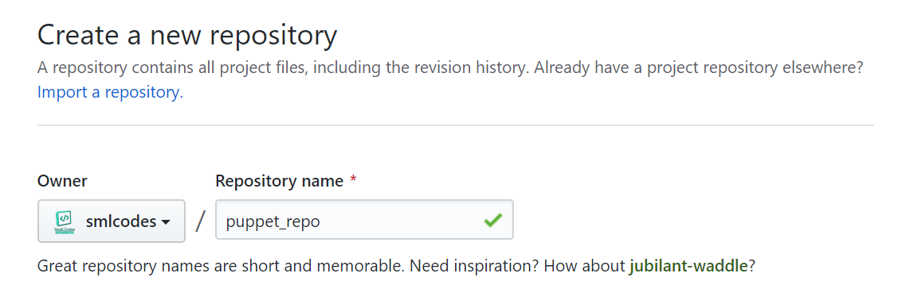

**Create new Brach “production” and make production as default branch.**

On Branches Menu, type \`production\` & create branch

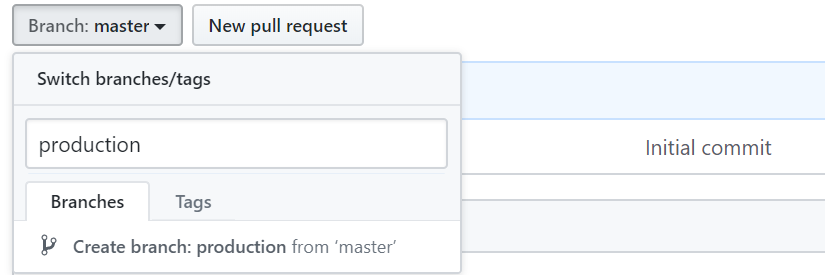

To make default branch, Go to Settings \> Branches \> select default Branch :
Production

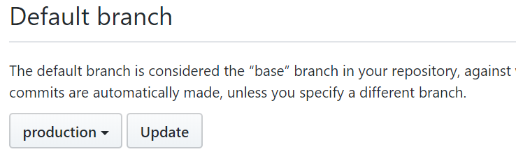

Delete master branch – to avoid confusion.

Go to Home Code Tab \> on Top select Branches \> Delete master branch

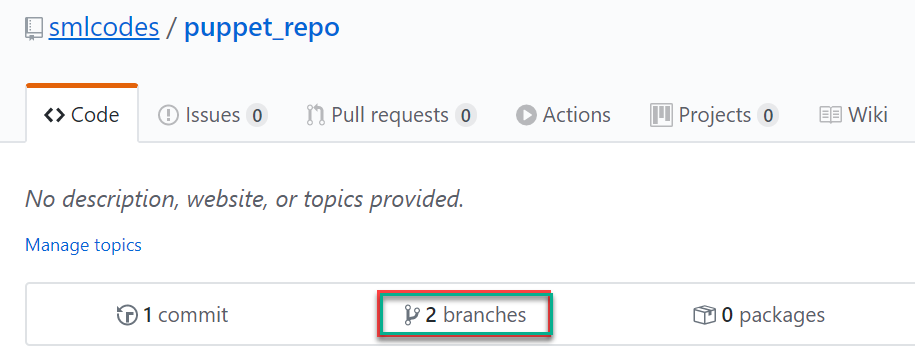

### Clone/Download code from Github

We are using r10k. We need to tell r10k where our puppet_repo is. For that we
need to provide some configuration on the master.

**Create Directory for saving code**  
`mkdir /etc/puppetlabs/r10k`

**Create yaml file, r10k.yaml**
```powershell
# vi /etc/puppetlabs/r10k/r10k.yaml
---
:cachedir: 'var/cache/r10k'

:sources:
	:my-org
		remote: 'https://github.com/smlcodes/puppet_repo.git'
		basedir: '/etc/puppetlabs/code/environments'
```


To deploy/download code we use below command  
`r10k deploy environment -p`

It will clone/download code from github to basedir,
i.e:`/etc/puppetlabs/code/environments`
```powershell
# check them
cd /etc/puppetlabs/code/environments
```
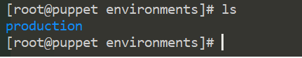


Puppet Directory
----------------

Directory Structure
```powershell
- manifests 
   \- site.pp 
- modules 
   \- your modules  
- test 
   \- update-puppet.sh 
   \- Vagrantfile 
- puppet.conf
```


Puppet – Resources
==================

Resources are a way of defining a specific unit of configuration. For example, a
file or a system user would be a single resource.

### Resource Syntx

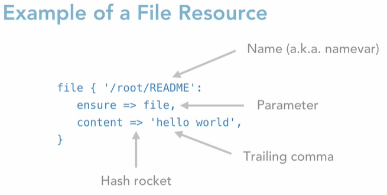

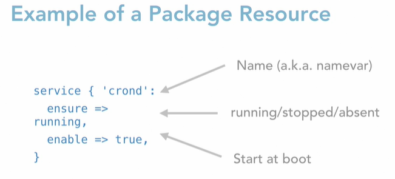

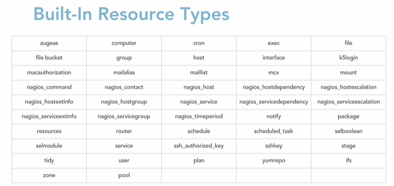

Hello world
-----------

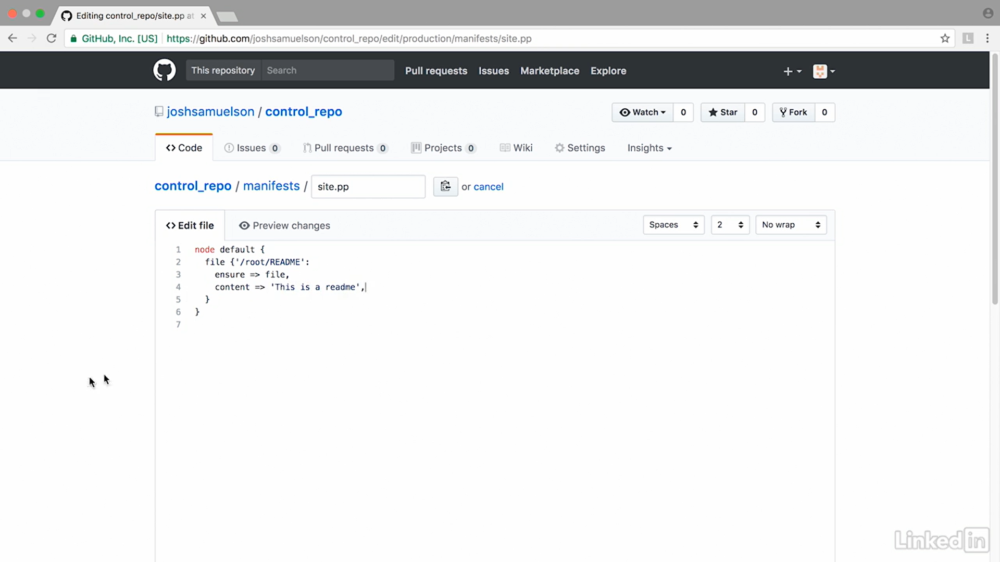

Push to master

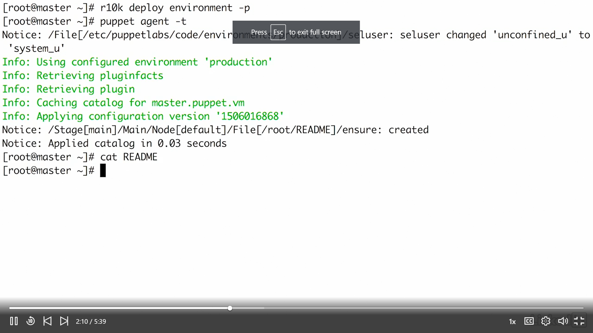

Class
-----

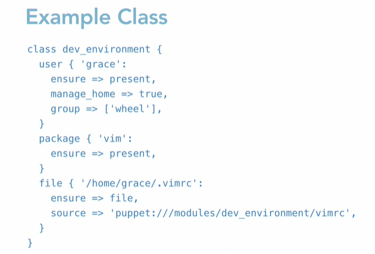

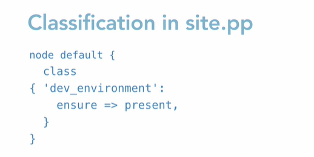

Puppet forge
------------

<https://forge.puppet.com/>

Puppet code can be packaged into modules in order to be shared with others on
the Puppet Forge.

Ref.
====

<https://www.linkedin.com/learning/learning-puppet/what-is-puppet?u=2057244>

<https://www.digitalocean.com/community/tutorials/getting-started-with-puppet-code-manifests-and-modules>

Errors
======

#### Job for puppetserver.service failed because the control process exited with error code

Changed memory to 250m (JAVA_ARGS="-Xms250m -Xmx250m). It worked.  
May be its 50% of free memory (free -m)

free memory was 440 initially. i kept 400 in JAVA_ARGS initially.

#### ubuntu systemctl: command not found

1.  First you need to check if **systemd** package is installed - sudo dpkg -l
    \| grep systemd.

2.  If not then install it by hands sudo apt-get install systemd. But if it does
    it might be damaged, so you may try to reinstall it sudo apt-get install
    --reinstall systemd.

3.  If the package is installed, even after reinstallation it does not work,
    list the full path of the files inside this package sudo dpkg -L systemd.
    Maybe binary files are located in a directory that is not included
    into **\$PATH** variable.

#### puppetserver.service: Loaded: error (Reason: No such file or directory)
