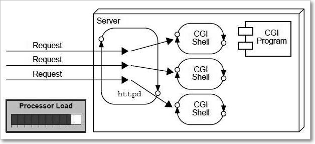

Servlets - Introduction
=========================

A web application is an application accessible from the web. A web application
is composed of web components like Servlet, JSP, Filter etc. and other
components such as HTML. The web components typically execute in Web Server and
respond to HTTP request.

 

**1. CGI**  
CGI technology enables the web server to call an external program and pass HTTP
request information to the external program to process the request. For each
request, it starts a new process.

>   problem in cgi and how servlet is better

<u>Disadvantages of CGI</u>

-   If number of client’s increases, it takes more time for sending response.

-   For each request, it starts a process and Web server is limited to start
    processes.

-   It uses platform dependent language e.g. C, C++, Perl.

 

**2. Servlet**

<u>advantages of servlet</u>  
The web container creates threads for handling the multiple requests to the
servlet.

-   **Better performance:** because it creates a thread for each request not
    process.

-   **Portability:** because it uses java language.

-   **Robust:** Servlets are managed by JVM, so we don't need to worry about
    memory leak, garbage collection etc.

-   **Secure:** because it uses java language..
