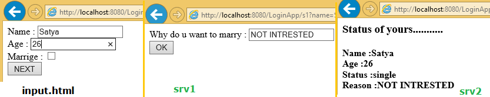
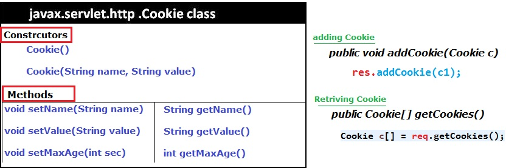

Session Tracking
===================

Session Tracking is a way of remembering client data across the multiple
requests during a session.

There are 4 techniques used in Session tracking:

1.  **Hidden Form Field**

2.  **Cookies**

3.  **HttpSession**

4.  **URL Rewriting**

<br>

# 1.Hidden Form Field


-   We store the information in the hidden field and get it from another servlet

-   <input type="hidden" name="uname" value="Satya">  

-   It easy to write

**Disadvantages**

-   Used only on Textboxes

-   If we see the view-source of html page, the hidden values can visible

-   Not secure


login.html
```html
<form action = "s1"  method = "get">
Name	 :	<input type = "text" name = "name"><br> 
Age 	 :	<input type = "text" name = "age"><br> 
Marrige  :  <input type = "checkbox" name = "mrg" value = "yes"><br>
<input type = "submit" name = "btn" value = "NEXT"> <br>
</form>
```

```java
public class srv1 extends HttpServlet {
	public void service(HttpServletRequest req, HttpServletResponse res) throws ServletException, IOException {
		res.setContentType("text/html");
		PrintWriter pw = res.getWriter();

		String name = req.getParameter("name");
		String age = req.getParameter("age");
		String mrg = req.getParameter("mrg");

if (mrg == null) {
 mrg = "single";
 pw.println("<form action = 's2'>");
 pw.println("Why do u want to marry	:<input type='text' name = 'why'><br>");
 pw.println("<input type = 'hidden' name = 'name' value = " + name + ">");
 pw.println("<input type = 'hidden' name = 'age' value = " + age + ">");
 pw.println("<input type = 'hidden' name = 'mrg' value = " + mrg + ">");
 pw.println("<input type = 'submit' name = 'btn' value = 'OK'><br>");
 pw.println("</form>");
}

else {
 mrg = "married";
 pw.println("<form action = 's2'>");
 pw.println("How Many Childrens:<input type = 'text' name = 'child'><br>");
 pw.println("<input type = 'hidden' name = 'name' value = " + name + ">");
 pw.println("<input type = 'hidden' name = 'age' value = " + age + ">");
 pw.println("<input type = 'hidden' name = 'mrg' value = " + mrg + ">");
 pw.println("<input type = 'submit' name = 'btn' value = 'OK'><br>");
 pw.println("</form>");
 }
}
}
----------------------------------------------------------
public class srv2 extends HttpServlet {
	public void doGet(HttpServletRequest req, HttpServletResponse res) throws ServletException, IOException {
		res.setContentType("text/html");
		PrintWriter pw = res.getWriter();
		pw.println("<h3>	Status of yours...........</h1>");
		pw.println("<h4> Name :" + req.getParameter("name"));
		pw.println("<br> Age  :" + req.getParameter("age"));
		pw.println("<br> Status  :" + req.getParameter("mrg"));
		
		if (req.getParameter("mrg").equals("single")) {			
			pw.println("<br> Reason  :" + req.getParameter("why"));
		}else{
		pw.println("<br> No.of Childrents :"+ req.getParameter("child"));
		}
	}
}
```



# 2.Cookies
A cookie is a small piece of information saved in the browser between the
multiple client requests.

There are 2 types of cookies in servlets.

1.  **Non-persistent cookie**

2.  **Persistent cookie**

    

**Advantage of Cookies**

-   Simplest technique of maintaining the state.

-   Cookies are maintained at client side.

**Disadvantage of Cookies**

-   It will not work if cookie is disabled from the browser.

-   Only textual information can be set in Cookie object.



```java
public class srv1 extends HttpServlet {
	public void service(HttpServletRequest req, HttpServletResponse res) throws ServletException, IOException {
		res.setContentType("text/html");
		PrintWriter pw = res.getWriter(); 
		Cookie c1 = new Cookie("name", "Satya");
		Cookie c2 = new Cookie("age", "28");
		c1.setMaxAge(5000); //max 5 sec alive
		res.addCookie(c1);
		res.addCookie(c2);
		pw.write("<h3>Cookies Added!"); 
	}
}

-----------------------------------------
public class srv2 extends HttpServlet {
	public void doGet(HttpServletRequest req, HttpServletResponse res) throws ServletException, IOException {
		res.setContentType("text/html");
		PrintWriter pw = res.getWriter();
		Cookie c[] = req.getCookies();
		pw.println("<h4> Cookie Name  : Cookie Value   </h4>");
		for (int i = 0; i < c.length; i++) {
			pw.println(c[i].getName() + " : " + c[i].getValue());
		}
	}
}
```


# 3.Http Session


-   HttpSession Object memory **allocates in Server**

-   it remembers the client data across the multiple requests in the form of
    **Session Attribute values**

-   Every Session object contains **SessionID, & stored in browser.**

-   Session of a browser can be identified by SessionID.

**Constructors**

1.**public HttpSession getSession():**

-   Returns the current session associated with this request

-   If the request does not have a session, creates one.

2.**public HttpSession getSession(boolean create**

-   Returns the current session associated with this request

-   **True** request does not have a session, creates new session.

-   **False** request does not have a session, it wont create new session

<br>

**Methods**

-   **public String getId()** Returns a string containing the unique identifier
    value.

-   **public long getCreationTime()** Returns the time when this session was
    created

-   public long **getLastAccessedTime()** Returns the last time the client sent
    a

-   **public void invalidate():** Invalidates this session then unbinds any
    objects bound to it.

```java
public class srv1 extends HttpServlet {
	public void service(HttpServletRequest req, HttpServletResponse res) throws ServletException, IOException {
		res.setContentType("text/html");
		PrintWriter pw = res.getWriter(); 
		HttpSession ses = req.getSession();
		ses.setAttribute("name", "Ravi");
		ses.setAttribute("city", "HYD");
		pw.write("<h3>Session Added!"); 
	}
}
--------------------------------------
public class srv2 extends HttpServlet {
	public void doGet(HttpServletRequest req, HttpServletResponse res) throws ServletException, IOException {
		res.setContentType("text/html");
		PrintWriter pw = res.getWriter();
		HttpSession sess =	req.getSession();
		pw.write("Name : "+sess.getAttribute("name"));
		pw.write("City : "+sess.getAttribute("city")); 
	}
}
-----------------------------------------
Output :  Name : Ravi , City : HYD
```


# 4.URL Rewriting
In URL rewriting, we append a token or identifier to the URL of the next Servlet
or the next resource.

We can send parameter name/value pairs using the following format:
```java
url?name1=value1&name2=value2&??
```


**Advantage of URL Rewriting**

-   It will always work whether cookie is disabled or not (browser independent).

-   Extra form submission is not required on each pages.

**Disadvantage of URL Rewriting**

-   It will work only with links.

-   It can send only textual information.

-   Not Secure, user can read the information what we are sending


```html
<form action="servlet1">  
Name:<input type="text" name="userName"/><br/>  
<input type="submit" value="go"/>  
</form>
```


```java
public class FirstServlet extends HttpServlet {  
  
public void doGet(HttpServletRequest request, HttpServletResponse response){  
 
        response.setContentType("text/html");  
        PrintWriter out = response.getWriter();  
          
        String n=request.getParameter("userName");  
        out.print("Welcome "+n);  
  
        //appending the username in the query string  
        out.print("<a href='servlet2?uname="+n+"'>visit</a>");  
                  
        out.close();
    }  
}
```


```java
public class SecondServlet extends HttpServlet {  
  
public void doGet(HttpServletRequest request, HttpServletResponse response)  
        response.setContentType("text/html");  
        PrintWriter out = response.getWriter();  
          
        //getting value from the query string  
        String n=request.getParameter("uname");  
        out.print("Hello "+n);  
        out.close();
    }        
}
```
